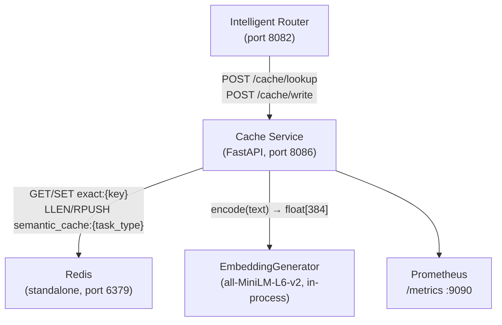
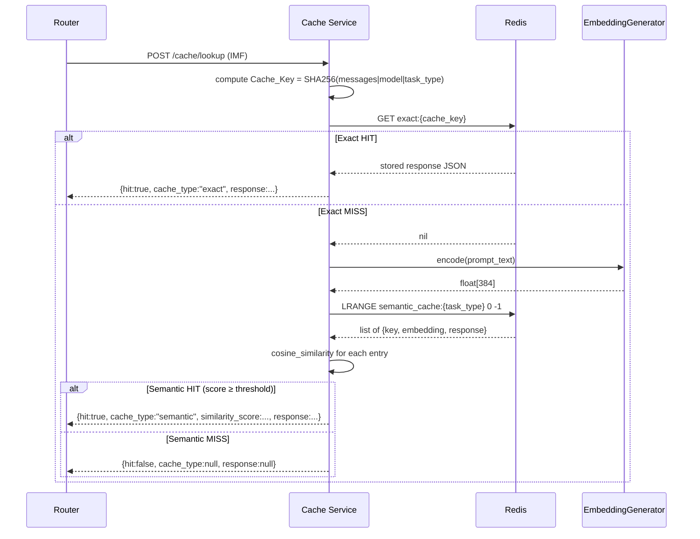
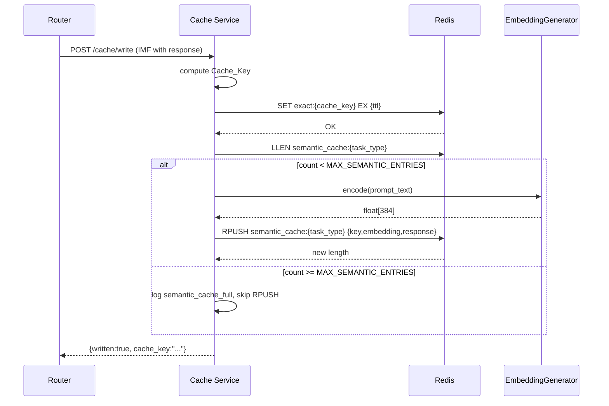

# Design Document: Cache Layer (Layer 4)

## Overview

The Cache Layer is a FastAPI microservice (port **8086**) that sits between the Intelligent Router and the Inference Layer in the platform request pipeline. It eliminates redundant GPU calls by returning previously computed responses for byte-identical or semantically equivalent prompts.

The POC demonstrates two complementary strategies:

1. **Exact-match caching** — a SHA-256 keyed Redis `SET`/`GET` for requests whose normalized prompt text, model, and task type are identical.
2. **Semantic caching** — a linear cosine-similarity scan over sentence-transformer embeddings stored as a Redis List per `task_type`, returning the best-matching stored response when similarity ≥ `SIMILARITY_THRESHOLD` (default 0.90).

The service is stateless from the application tier's perspective — all durable state lives in Redis. It exposes two domain endpoints (`POST /cache/lookup`, `POST /cache/write`), a health endpoint (`GET /health`), and a Prometheus metrics endpoint on port 9090. All behavior is governed by the IMF (Internal Message Format) contract and the platform master contract.

### Position in the Request Pipeline

```
Router → POST /cache/lookup
            │
            ├─ HIT  → return cached response (skip inference)
            │
            └─ MISS → Router calls Inference Layer
                          │
                          └─ Router → POST /cache/write → store result
```

### POC Scope

| In Scope | Out of Scope (Phase 2) |
|---|---|
| Single-instance Redis | Redis Sentinel / Cluster |
| Linear cosine scan in-process | Milvus / Qdrant ANN index |
| CPU-only embeddings (`all-MiniLM-L6-v2`) | GPU embeddings, BGE-M3 |
| TTL-based invalidation | Model-version event invalidation |
| HTTP/JSON transport | gRPC |
| Stdout JSON logs | OTel distributed tracing |

---

## Architecture

### Component Diagram



### Request Flow — Lookup



### Request Flow — Write



### Deployment Architecture (Kubernetes / Helm)

```
llm-platform namespace
┌────────────────────────────────────────────────────────┐
│  Pod: cache-service                                    │
│    container: cache-service  (port 8086, 9090)        │
│                                                        │
│  Pod: redis-master                                     │
│    container: redis           (port 6379)             │
│                                                        │
│  NetworkPolicy: allow ingress only from router pods   │
│                 allow egress only to redis pods        │
└────────────────────────────────────────────────────────┘
```

---

## Components and Interfaces

### Module Structure

```
cache_service/
├── main.py                      # FastAPI app factory, lifespan, middleware wiring
├── config.py                    # Pydantic BaseSettings (all env vars)
├── routers/
│   ├── cache.py                 # POST /cache/lookup, POST /cache/write
│   └── health.py                # GET /health
├── schemas/
│   ├── imf.py                   # IMF request/response Pydantic models
│   └── cache.py                 # LookupResponse, WriteResponse, CacheBlock
├── services/
│   ├── exact_cache.py           # ExactCacheService (Redis GET/SET)
│   ├── semantic_cache.py        # SemanticCacheService (LRANGE + cosine scan + RPUSH)
│   └── embedding.py             # EmbeddingGenerator (sentence-transformers wrapper)
└── middleware/
    └── logging.py               # LoggingMiddleware (one JSON line per request)
```

### `cache_service/config.py`

All configuration is read from environment variables via Pydantic `BaseSettings`. No hardcoded values.

| Setting | Env Var | Default | Validation |
|---|---|---|---|
| `redis_url` | `REDIS_URL` | `redis://redis:6379` | non-empty string |
| `similarity_threshold` | `SIMILARITY_THRESHOLD` | `0.90` | float in [0.0, 1.0] |
| `max_semantic_entries` | `MAX_SEMANTIC_ENTRIES` | `500` | positive int |
| `embedding_model` | `EMBEDDING_MODEL` | `all-MiniLM-L6-v2` | non-empty string |
| `log_level` | `LOG_LEVEL` | `INFO` | one of DEBUG/INFO/WARNING/ERROR/CRITICAL; invalid → INFO |
| `port` | `PORT` | `8086` | int in [1, 65535]; invalid → startup error |
| `ttl_chat` | `TTL_CHAT` | `3600` | positive int |
| `ttl_code` | `TTL_CODE` | `7200` | positive int |
| `ttl_summarization` | `TTL_SUMMARIZATION` | `86400` | positive int |

### `cache_service/services/embedding.py` — `EmbeddingGenerator`

```python
class EmbeddingGenerator:
    def __init__(self, model_name: str): ...
    def load(self) -> None: ...          # called once in lifespan startup
    def encode(self, text: str) -> list[float]: ...  # returns float[384]
```

- Wraps `sentence_transformers.SentenceTransformer(model_name)`.
- `load()` is called exactly once during application startup in the lifespan context manager.
- The loaded model instance is stored on `app.state.embedding_generator`.
- CPU-only inference; no GPU dependency.
- Raises `EmbeddingLoadError` on failed load; raises `EmbeddingEncodeError` on failed encode.

### `cache_service/services/exact_cache.py` — `ExactCacheService`

```python
class ExactCacheService:
    def __init__(self, redis_client: redis.Redis): ...
    async def get(self, cache_key: str) -> dict | None: ...
    async def set(self, cache_key: str, response: dict, ttl: int) -> None: ...
```

- `get()` returns the deserialized IMF response dict or `None` on miss/key-not-found.
- `set()` calls Redis `SET exact:{cache_key} <json> EX <ttl>`.
- Both methods catch `redis.RedisError` and raise `RedisUnavailableError`.

### `cache_service/services/semantic_cache.py` — `SemanticCacheService`

```python
class SemanticCacheService:
    def __init__(self, redis_client: redis.Redis, settings: Settings): ...
    async def lookup(self, task_type: str, query_embedding: list[float]) -> tuple[dict, float] | None: ...
    async def write(self, task_type: str, cache_key: str, embedding: list[float], response: dict) -> bool: ...
    async def get_entry_count(self, task_type: str) -> int: ...
    @staticmethod
    def _cosine_similarity(a: list[float], b: list[float]) -> float: ...
```

- `lookup()` loads all entries from `semantic_cache:{task_type}` with `LRANGE 0 -1`, computes cosine similarity for each, and returns `(response_dict, score)` for the highest-scoring entry above threshold, or `None`.
- `write()` checks `LLEN` before `RPUSH`; returns `False` (and logs `semantic_cache_full`) if limit reached.
- `_cosine_similarity()` is a pure static method — no I/O.

### `cache_service/routers/cache.py` — Cache Router

Mounts under `/cache` prefix.

| Endpoint | Method | Request body | Response |
|---|---|---|---|
| `/cache/lookup` | POST | IMF document | `LookupResponse` |
| `/cache/write` | POST | IMF document with non-null `response` | `WriteResponse` |

**Cache key derivation** (shared helper `make_cache_key`):
```python
def make_cache_key(messages: list[dict], model: str, task_type: str) -> str:
    content = " ".join(m["content"].strip() for m in messages).lower().strip()
    raw = f"{content}|{model}|{task_type}"
    return hashlib.sha256(raw.encode("utf-8")).hexdigest()
```

### `cache_service/routers/health.py` — Health Router

Module-level `_ready: bool = False` flag; set `True` by lifespan after successful startup.
Module-level `_startup_failure_reason: str | None = None`; set if Redis or embedding load fails.

| State | HTTP | Body |
|---|---|---|
| Not yet ready | 503 | `{"status": "starting"}` |
| Ready, Redis reachable, model loaded | 200 | `{"status": "ok"}` |
| Redis unreachable at health-check time | 503 | `{"status": "unavailable", "reason": "redis_unreachable"}` |
| Embedding model failed to load | 503 | `{"status": "unavailable", "reason": "embedding_model_load_failed"}` |

### `cache_service/middleware/logging.py` — `LoggingMiddleware`

Mirrors the `model_registry` `LoggingMiddleware` exactly, with these additions specific to the cache service:

- Extracts `request_id` with priority: IMF body field → `X-Request-ID` header → `"unknown"`.
- Emits `INFO` for 2xx/3xx/4xx; `ERROR` for 5xx.
- **Never** logs any field present in `governance.pii_fields_detected` or raw `request.messages[].content` values.
- Respects `LOG_LEVEL` env var; invalid values fall back to `INFO`.

### `cache_service/main.py` — Application Factory

```python
@asynccontextmanager
async def lifespan(app: FastAPI):
    # 1. Load settings
    # 2. Connect to Redis (store client on app.state.redis)
    #    — on failure: log error, set _startup_failure_reason, continue
    # 3. Load EmbeddingGenerator (store on app.state.embedding_generator)
    #    — on failure: log error, set _startup_failure_reason, continue
    # 4. Set health._ready = True
    yield
    # Shutdown: close Redis connection
```

Startup failures do not crash the process. The health endpoint exposes the failure reason, allowing Kubernetes to keep the pod in a non-ready state rather than crash-looping.

---

## Data Models

### IMF Fields Read by Cache Service

| Field | Used for |
|---|---|
| `request.messages[].content` | Cache key computation + embedding input |
| `routing.selected_model` | Cache key computation |
| `request.task_type` | Cache key computation, TTL selection, Redis list namespacing |
| `response.content` | Stored in exact and semantic cache on write |
| `response.finish_reason` | Stored in cache on write |
| `response.usage.*` | Stored in cache on write |
| `request_id` | Included in all log entries |
| `governance.pii_fields_detected` | Exclusion list — these fields are never logged |

### IMF Cache Block Written on Lookup Response

```json
{
  "cache": {
    "lookup_hit": true,
    "cache_key": "<sha256-hex>",
    "cache_type": "exact | semantic | null",
    "similarity_score": 0.93
  }
}
```

- `similarity_score` is `null` for exact hits and for misses; a `float` in `(0.0, 1.0]` for semantic hits.
- The entire `cache` block is **replaced wholesale** (not merged) on every lookup response.

### Lookup Response Schema (`LookupResponse`)

```python
class LookupResponse(BaseModel):
    hit: bool
    cache_key: str
    cache_type: Literal["exact", "semantic"] | None
    response: IMFResponse | None
    similarity_score: float | None = None
```

### Write Response Schema (`WriteResponse`)

```python
class WriteResponse(BaseModel):
    written: bool
    cache_key: str
```

### Redis Exact Cache Entry

```
Key:   exact:{sha256-hex}
Value: UTF-8 JSON string of the IMF response object
       {"content": "...", "finish_reason": "stop", "usage": {...}}
TTL:   task_type dependent (chat=3600, code=7200, summarization=86400, default=3600)
```

### Redis Semantic Cache Entry

```
Key:   semantic_cache:{task_type}    (e.g. semantic_cache:chat)
Type:  Redis List
Each element (RPUSH):
{
  "key":       "<sha256-hex>",
  "embedding": [<float>, ...],     // 384-dimensional float array
  "response":  {<IMF response object>}
}
```

Maximum list length per `task_type`: `MAX_SEMANTIC_ENTRIES` (default 500). When this limit is reached, new entries are skipped (no eviction — POC scope).

### Pydantic Settings Class

```python
class Settings(BaseSettings):
    redis_url: str = "redis://redis:6379"
    similarity_threshold: float = Field(0.90, ge=0.0, le=1.0)
    max_semantic_entries: int = Field(500, gt=0)
    embedding_model: str = "all-MiniLM-L6-v2"
    log_level: str = "INFO"
    port: int = Field(8086, ge=1, le=65535)
    ttl_chat: int = 3600
    ttl_code: int = 7200
    ttl_summarization: int = 86400

    model_config = {"env_prefix": "", "case_sensitive": False}

@lru_cache
def get_settings() -> Settings: ...
```

### Prometheus Metrics

All metrics are registered at module import time and updated within the cache router handlers.

| Metric name | Type | Labels | Description |
|---|---|---|---|
| `llm_cache_requests_total` | Counter | `status` (hit/miss), `cache_type` (exact/semantic/none), `task_type` | Total lookup requests |
| `llm_cache_latency_seconds` | Histogram | `operation` (lookup/write), `task_type` | End-to-end handler latency |
| `llm_cache_errors_total` | Counter | `error_code`, `operation` | Redis/embedding failures |
| `llm_cache_semantic_entries` | Gauge | `task_type` | Current semantic list length (updated after write) |

Histogram buckets: `[0.005, 0.01, 0.025, 0.05, 0.1, 0.25, 0.5, 1.0, 2.5]`

Metrics are served on a dedicated port `9090` using `prometheus_client`'s ASGI middleware or a separate `make_asgi_app()` mount — separate from the application port `8086`.

---

## Correctness Properties

*A property is a characteristic or behavior that should hold true across all valid executions of a system — essentially, a formal statement about what the system should do. Properties serve as the bridge between human-readable specifications and machine-verifiable correctness guarantees.*

### Property 1: Cache Key Determinism

*For any* two IMF inputs whose `request.messages[].content` values produce the same string after per-message leading/trailing whitespace-stripping, lowercasing, and single-space joining, and whose `routing.selected_model` and `request.task_type` are identical, `make_cache_key` SHALL produce the same SHA-256 hex digest — regardless of surrounding JSON whitespace, field ordering within message objects, or other IMF fields (`governance`, `user`, `routing.routing_mode`, etc.) that do not participate in key derivation.

**Validates: Requirements 1.2, 3.1, 10.1**

### Property 2: Exact Cache Round-Trip

*For any* valid IMF response object (with non-null `content`, `finish_reason`, and `usage` sub-fields of varying string, integer, float, boolean, and null types) written via `POST /cache/write`, a subsequent `POST /cache/lookup` with the same `request.messages`, `routing.selected_model`, and `request.task_type` SHALL return `hit: true` and a response object where every field present in the original matches the retrieved value by type and value, with no fields added, removed, or type-coerced — provided the lookup occurs before the TTL for the given `task_type` has elapsed.

**Validates: Requirements 1.3, 2.3, 10.2, 10.3, 10.4**

### Property 3: IMF Cache Block Completeness and Wholesale Replacement

*For any* lookup response — whether a hit (exact or semantic) or a miss — the `cache` block in the returned payload SHALL contain exactly the four fields `lookup_hit`, `cache_key`, `cache_type`, and `similarity_score`. Furthermore, for any incoming IMF document with an arbitrary pre-existing `cache` block value, the output `cache` block SHALL contain only the freshly computed values (not a merge), `similarity_score` SHALL be `null` for exact hits and misses, and `similarity_score` SHALL be a positive float in `(0.0, 1.0]` for semantic hits.

**Validates: Requirements 3.3, 3.4, 3.5, 3.6**

### Property 4: Semantic Hit Threshold Consistency

*For any* semantic cache list containing stored `{key, embedding, response}` entries and any query embedding, the lookup result SHALL return `hit: true` if and only if the maximum cosine similarity across all stored entries is ≥ `SIMILARITY_THRESHOLD`, and SHALL return the entry with the strictly highest cosine similarity score when multiple entries exceed the threshold.

**Validates: Requirements 1.5, 5.3, 5.5, 5.7**

### Property 5: Semantic Capacity Guard

*For any* sequence of write requests to a given `task_type`, the Redis list `semantic_cache:{task_type}` SHALL never contain more than `MAX_SEMANTIC_ENTRIES` entries after any number of writes. For every write that would cause the count to exceed the limit, a `semantic_cache_full` log event SHALL be emitted, the semantic write SHALL be skipped, and the exact cache entry SHALL still be written successfully.

**Validates: Requirements 2.5, 2.6, 2.9, 5.6, 5.8**

### Property 6: Graceful Degradation on Infrastructure Failure

*For any* valid lookup request where Redis is unavailable at the start of the request (before any hit result has been found), or where the `EmbeddingGenerator` raises an error during the semantic scan phase, the Cache_Service SHALL return HTTP 200 with `hit: false` and a `cache_type: null` response, and SHALL NOT propagate any unhandled exception to the caller.

**Validates: Requirements 1.7, 1.8, 1.9, 4.7**

### Property 7: Log Entry Field Invariant

*For any* cache event emitted by the service — hit, miss, or write — the structured JSON log entry SHALL contain all required fields for that event type: exact hits SHALL have `cache_type: "exact"` and `similarity_score: null`; semantic hits SHALL have `cache_type: "semantic"` and a positive `similarity_score` float; miss entries SHALL have `event: "cache_miss"`, `request_id`, and `latency_ms`; write entries SHALL have `event: "cache_write"`, `request_id`, `cache_key`, `task_type`, and `latency_ms`. All `latency_ms` values SHALL be non-negative integers.

**Validates: Requirements 7.1, 7.2, 7.3**

### Property 8: PII Exclusion from All Log Entries

*For any* request where `governance.pii_fields_detected` is non-empty, or where `request.messages[].content` contains arbitrary text, no log entry emitted by the Cache_Service at any log level SHALL contain any field name listed in `governance.pii_fields_detected` or the raw string value of any `request.messages[].content` field.

**Validates: Requirements 7.6**

### Property 9: Input Validation Rejection

*For any* IMF document submitted to `POST /cache/lookup` or `POST /cache/write` that is missing one or more of `request.messages`, `routing.selected_model`, or `request.task_type`, the Cache_Service SHALL return HTTP 422 with a structured error body that lists the missing fields — and SHALL NOT write any data to Redis or emit a hit/miss/write log event.

**Validates: Requirements 1.10, 2.10**

### Property 10: Metrics Correctness Invariant

*For any* sequence of lookup and write operations of varying `task_type`, hit/miss outcome, and cache_type, the Prometheus counters `llm_cache_requests_total` and `llm_cache_errors_total` SHALL reflect the exact cumulative count of each distinct label combination observed, and the gauge `llm_cache_semantic_entries{task_type}` SHALL equal the `LLEN` of `semantic_cache:{task_type}` in Redis immediately after any write operation completes.

**Validates: Requirements 9.2, 9.4, 9.5**

---

## Error Handling

### Error Classification

| Scenario | Behaviour | HTTP Status |
|---|---|---|
| Missing required IMF fields (`messages`, `selected_model`, `task_type`) | Return 422 with structured body listing missing fields | 422 |
| Null or absent `response` field on write | Return 422 with `event: cache_write_invalid` | 422 |
| Redis unavailable at start of lookup | Return `hit: false`, log `redis_unavailable`, increment `llm_cache_errors_total` | 200 |
| Redis unavailable during write | Return 503 with `event: redis_unavailable` | 503 |
| Embedding encode failure during lookup | Return `hit: false`, log `embedding_error`, skip semantic phase | 200 |
| Embedding encode failure during write | Log `embedding_error`, skip semantic write, still return 200 `{written: true}` | 200 |
| Semantic cache at capacity | Skip semantic write, emit `semantic_cache_full` log | — |
| Unexpected Redis auth error (should not occur in POC) | Block retrieval, log `redis_auth_unexpected`, treat as miss | 200 |
| Invalid PORT env var at startup | Emit structured error log, refuse to start | — |
| Log emission failure (stdout write error) | Silently discard log entry; continue request processing | — |

### Startup Failure Handling

Startup failures (Redis unreachable, model load failed) do **not** terminate the process. The service starts with `_ready = True` but records the failure reason on `app.state`. The health endpoint reads this state and returns `503`. This prevents Kubernetes crash-loops while keeping the service responsive to health probes.

### Error Response Bodies

All error responses use a consistent structured body:

```json
{
  "event": "<error_event_name>",
  "request_id": "<uuid or unknown>",
  "reason": "<human-readable description>",
  "operation": "<lookup | write>"
}
```

---

## Testing Strategy

### Overview

Testing follows the dual approach established by the platform: example-based unit tests for specific scenarios and edge cases, and property-based tests for universal invariants. The `pytest` + `hypothesis` stack is used, mirroring the test layout in `tests/`.

### Unit Tests

Located in `tests/cache_service/`. Each module under `cache_service/services/` and `cache_service/routers/` has a corresponding test file.

**Key example-based tests:**

- `test_exact_cache.py` — GET hit, GET miss, SET with correct TTL per task type, Redis error handling
- `test_semantic_cache.py` — LRANGE empty list, single entry above threshold, single entry below threshold, multiple entries (returns highest), capacity guard at exactly 500 entries
- `test_embedding.py` — successful encode returns 384-dim list, encode failure raises `EmbeddingEncodeError`
- `test_cache_router.py` — lookup returns correct `LookupResponse` structure, write returns `WriteResponse`, 422 on missing fields, 422 on null response, 503 on Redis write failure
- `test_health.py` — `_ready=False` → 503 starting, Redis reachable → 200 ok, Redis unreachable → 503 unavailable
- `test_logging.py` — log entry contains required fields, PII fields excluded, `request_id` extraction priority

**Redis is mocked** throughout unit tests using `fakeredis` (async variant). The `EmbeddingGenerator` is mocked to return deterministic 384-dimensional float vectors.

### Property-Based Tests

Uses `hypothesis` with `@given` strategies. Each property test runs minimum **100 examples**.

**`test_properties.py`:**

```python
# Feature: cache-layer, Property 1: Cache Key Determinism
# For any messages list, model, and task_type, make_cache_key is stable under
# normalization and unaffected by surrounding IMF fields.
@given(
    messages=st.lists(st.builds(dict, role=st.just("user"), content=st.text()), min_size=1),
    model=st.text(min_size=1),
    task_type=st.sampled_from(["chat", "code", "summarization"]),
)
@settings(max_examples=100, deadline=500)
def test_cache_key_determinism(messages, model, task_type): ...

# Feature: cache-layer, Property 2: Exact Cache Round-Trip
# For any valid IMF response object, write then lookup returns the same object
# with all types preserved.
@given(imf_response=imf_response_strategy())
@settings(max_examples=100, deadline=500)
def test_exact_cache_round_trip(imf_response): ...

# Feature: cache-layer, Property 3: IMF Cache Block Completeness and Wholesale Replacement
# For any lookup result, the cache block has exactly the right fields and
# incoming cache block values are fully replaced.
@given(
    lookup_result=lookup_result_strategy(),
    incoming_cache_block=arbitrary_cache_block_strategy(),
)
@settings(max_examples=100, deadline=500)
def test_cache_block_completeness_and_replacement(lookup_result, incoming_cache_block): ...

# Feature: cache-layer, Property 4: Semantic Hit Threshold Consistency
# For any semantic cache and query embedding, result is hit iff max similarity >= threshold.
@given(
    entries=st.lists(semantic_entry_strategy(), min_size=0, max_size=20),
    query_embedding=st.lists(st.floats(min_value=-1, max_value=1), min_size=384, max_size=384),
    threshold=st.floats(min_value=0.0, max_value=1.0),
)
@settings(max_examples=100, deadline=500)
def test_semantic_threshold_consistency(entries, query_embedding, threshold): ...

# Feature: cache-layer, Property 5: Semantic Capacity Guard
# For any write sequence, the semantic list never exceeds MAX_SEMANTIC_ENTRIES
# and the exact cache always succeeds.
@given(write_count=st.integers(min_value=495, max_value=510))
@settings(max_examples=100, deadline=500)
def test_semantic_capacity_guard(write_count): ...

# Feature: cache-layer, Property 6: Graceful Degradation on Infrastructure Failure
# For any valid IMF input, Redis unavailability or embedding failure yields HTTP 200 hit:false.
@given(imf=imf_lookup_strategy())
@settings(max_examples=100, deadline=500)
def test_graceful_degradation_redis_unavailable(imf): ...

@given(imf=imf_lookup_strategy())
@settings(max_examples=100, deadline=500)
def test_graceful_degradation_embedding_failure(imf): ...

# Feature: cache-layer, Property 7: Log Entry Field Invariant
# For any cache event (hit/miss/write), the log entry contains all required fields
# with correct types.
@given(event_type=st.sampled_from(["hit_exact", "hit_semantic", "miss", "write"]))
@settings(max_examples=100, deadline=500)
def test_log_entry_field_invariant(event_type): ...

# Feature: cache-layer, Property 8: PII Exclusion from All Log Entries
# For any request with pii_fields_detected, no log entry contains those values.
@given(
    pii_fields=st.lists(st.text(min_size=1), min_size=1, max_size=5),
    messages=st.lists(st.text(min_size=1), min_size=1),
)
@settings(max_examples=100, deadline=500)
def test_pii_exclusion_from_logs(pii_fields, messages): ...

# Feature: cache-layer, Property 9: Input Validation Rejection
# For any IMF missing required fields, response is 422 and no Redis write occurs.
@given(
    missing_fields=st.frozensets(
        st.sampled_from(["messages", "selected_model", "task_type"]),
        min_size=1,
    )
)
@settings(max_examples=100, deadline=500)
def test_validation_rejection_missing_fields(missing_fields): ...

# Feature: cache-layer, Property 10: Metrics Correctness Invariant
# For any sequence of operations, counters match observed outcomes and gauge equals LLEN.
@given(operations=st.lists(cache_operation_strategy(), min_size=1, max_size=20))
@settings(max_examples=100, deadline=500)
def test_metrics_correctness(operations): ...
```

`hypothesis` settings: `@settings(max_examples=100, deadline=500)` — 500 ms deadline accommodates in-process cosine similarity computation over generated embedding lists.

### Integration Test

A single `test_integration.py` (requires a live Redis instance, skipped in CI without `REDIS_URL`) validates the full lookup → miss → write → lookup → hit round-trip with a real Redis container.

### Test Configuration (`hypothesis` settings profile)

```python
# conftest.py
from hypothesis import settings, HealthCheck
settings.register_profile("ci", max_examples=100, suppress_health_check=[HealthCheck.too_slow])
settings.load_profile("ci")
```
