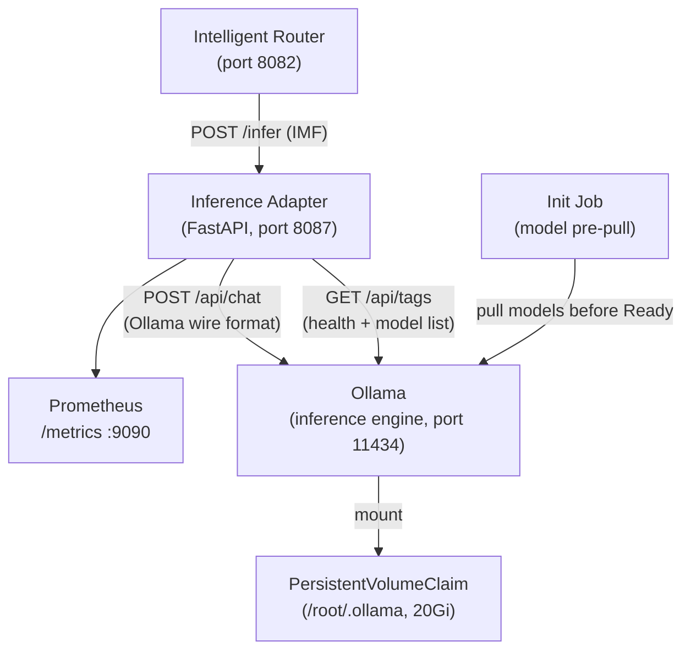
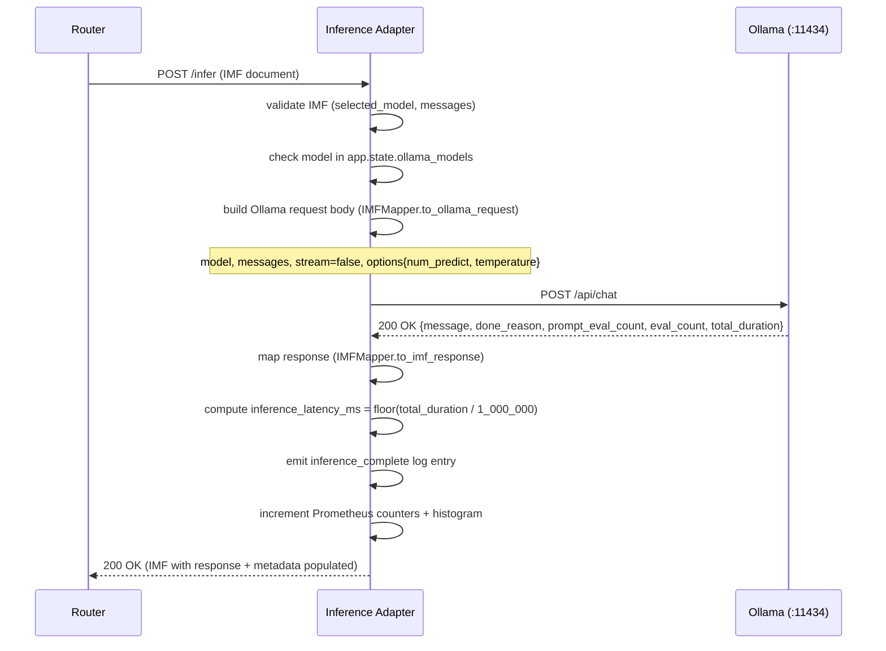

# Design Document: Inference Layer (Layer 5)

## Overview

The Inference Layer is a two-component Kubernetes deployment that provides local LLM inference inside the platform pipeline. It is the only layer that actually executes a language model and produces completions.

**Ollama** (port 11434) is the inference engine: it loads model weights from a PersistentVolumeClaim, exposes its native `/api/chat` HTTP API, and handles all GPU/CPU scheduling internally.

**Inference Adapter** (port 8087) is a lightweight FastAPI service that acts as the translation boundary between the platform's Internal Message Format (IMF) and Ollama's wire format. It receives IMF documents from the Router, constructs the Ollama request, calls Ollama, maps the response back to IMF, and returns it. Prometheus metrics are served on port 9090.

The two components are packaged together in a single Helm chart at `llm-platform/charts/inference-ollama/` and deployed into the `llm-platform` namespace.

### Position in the Request Pipeline

```
Router → POST /infer  (IMF document)
            │
            │  Inference Adapter
            ├─ translate IMF → Ollama /api/chat
            ├─ POST http://inference-ollama:11434/api/chat
            ├─ map Ollama response → IMF response block
            │
            └─ HTTP 200 (IMF with response + metadata populated)
                  └─ Router forwards to Post-Generation Governance
```

### POC Scope

| In Scope | Out of Scope (Phase 2) |
|---|---|
| Ollama backend (CPU-capable) | vLLM (GPU-only, optional) |
| Non-streaming inference only | SSE / chunked streaming |
| Single replica (`replicaCount: 1`) | HPA / multi-replica |
| Plain HTTP inter-service calls | Istio mTLS / service mesh |
| Static API key auth | OIDC / LDAP / SSO |
| Stdout JSON structured logs | OTel distributed tracing |
| `vault.enabled: false` | HashiCorp Vault secret injection |
| `autoscaling.enabled: false` | Horizontal Pod Autoscaling |
| PVC-backed model storage | NFS shared model storage |
| Init container model pre-pull | Air-gapped GGUF pre-load |
| `llama3.2:3b` baseline model | TGI / Triton / llama.cpp |

---

## Architecture

### Component Diagram



### Request Flow — Inference



### Kubernetes / Helm Deployment Architecture

```
llm-platform namespace
┌──────────────────────────────────────────────────────────────────┐
│  Pod: inference-adapter                                          │
│    container: inference-adapter  (port 8087, metrics 9090)      │
│    probes: GET /health  initialDelay=20s period=15s             │
│                                                                  │
│  Pod: inference-ollama                                           │
│    container: ollama             (port 11434)                    │
│    probes: GET /api/tags         initialDelay=30s period=15s    │
│    volume: PVC /root/.ollama     20Gi ReadWriteOnce             │
│                                                                  │
│  Job: inference-ollama-init                                      │
│    Runs before Ollama pod is Ready                               │
│    Pulls llama3.2:3b into the Model_Store             │
│                                                                  │
│  Service: inference-adapter      ClusterIP :8087                │
│  Service: inference-ollama       ClusterIP :11434               │
│                                                                  │
│  NetworkPolicy:                                                  │
│    ingress to Adapter: only from router pods                     │
│    egress from Adapter: only to inference-ollama pods            │
│                                                                  │
│  ServiceMonitor: scrape Adapter /metrics :9090 every 30s        │
└──────────────────────────────────────────────────────────────────┘
```

---

## Components and Interfaces

### Module Structure

```
inference_adapter/
├── main.py                        # FastAPI app factory, lifespan, middleware wiring
├── config.py                      # Pydantic BaseSettings (all env vars)
├── routers/
│   ├── infer.py                   # POST /infer
│   └── health.py                  # GET /health
├── schemas/
│   └── imf.py                     # IMF Pydantic models (request + response)
├── services/
│   ├── ollama_client.py           # OllamaClient (async httpx wrapper)
│   └── imf_mapper.py              # IMFMapper (request translation + response mapping)
└── middleware/
    └── logging.py                 # LoggingMiddleware (one JSON line per request)
```

### `inference_adapter/config.py`

All configuration is read from environment variables via Pydantic `BaseSettings`. No hardcoded values.

| Setting | Env Var | Default | Validation |
|---|---|---|---|
| `ollama_base_url` | `OLLAMA_BASE_URL` | `http://inference-ollama:11434` | non-empty string |
| `default_model` | `DEFAULT_MODEL` | `llama3.2:3b` | non-empty string |
| `default_max_tokens` | `DEFAULT_MAX_TOKENS` | `2048` | positive int |
| `default_temperature` | `DEFAULT_TEMPERATURE` | `0.7` | float in [0.0, 2.0] |
| `ollama_timeout_seconds` | `OLLAMA_TIMEOUT_SECONDS` | `120` | int in [1, 600]; outside range → startup error |
| `log_level` | `LOG_LEVEL` | `INFO` | one of DEBUG/INFO/WARNING/ERROR/CRITICAL; invalid → INFO |
| `port` | `PORT` | `8087` | int in [1, 65535]; outside range → startup error |
| `metrics_port` | `METRICS_PORT` | `9090` | int in [1, 65535]; outside range → startup error |

### `inference_adapter/services/ollama_client.py` — `OllamaClient`

```python
class OllamaClient:
    def __init__(self, base_url: str, timeout: float) -> None: ...
    async def chat(self, payload: dict) -> dict:
        """
        POST {base_url}/api/chat with payload.
        Returns parsed JSON response body.
        Raises OllamaTimeoutError on httpx.TimeoutException.
        Raises OllamaConnectionError on httpx.ConnectError / transport errors.
        Raises OllamaBackendError(status_code) on HTTP 5xx.
        Raises OllamaRequestError(status_code) on HTTP 4xx.
        Raises OllamaInvalidResponseError on JSON parse failure.
        """
        ...
    async def list_models(self) -> list[str]:
        """
        GET {base_url}/api/tags.
        Returns list of model name strings from the 'models' array.
        Raises OllamaTimeoutError / OllamaConnectionError on failure.
        """
        ...
    async def close(self) -> None:
        """Close the underlying httpx.AsyncClient."""
        ...
```

- Wraps `httpx.AsyncClient` with a single shared session stored on `app.state.ollama_client`.
- `stream` is always forced to `False` before the payload is sent.
- Timeout is applied to both connect and read phases via `httpx.Timeout(timeout)`.

### `inference_adapter/services/imf_mapper.py` — `IMFMapper`

```python
class IMFMapper:
    @staticmethod
    def to_ollama_request(imf: IMFDocument, settings: Settings) -> dict:
        """
        Translate IMF fields to Ollama /api/chat wire format.
        - model:    routing.selected_model
        - messages: request.messages (role + content, no other fields)
        - stream:   False (always)
        - options:  {num_predict: resolved_max_tokens, temperature: resolved_temperature}
        resolved_max_tokens:
          - if request.max_tokens is None / 0 / absent → settings.default_max_tokens
          - if request.max_tokens > 4096              → clamp to 4096, log warning
          - else                                       → request.max_tokens as-is
        resolved_temperature:
          - if request.temperature is None / absent → settings.default_temperature
          - else                                     → request.temperature
        """
        ...

    @staticmethod
    def to_imf_response(
        imf_in: IMFDocument,
        ollama_resp: dict,
        wall_clock_ms: int,
    ) -> IMFDocument:
        """
        Map Ollama response fields into the IMF document.
        Sets response.content, response.finish_reason, response.usage.*.
        Sets metadata.inference_backend = "ollama"
        Sets metadata.inference_latency_ms = floor(total_duration / 1_000_000)
                                              or wall_clock_ms if total_duration absent/≤0
        Sets metadata.model_name = routing.selected_model (or null)
        Preserves all other IMF fields unchanged.
        Raises OllamaInvalidResponseError if message or message.content is absent.
        """
        ...

    @staticmethod
    def resolve_finish_reason(done_reason: str | None) -> str | None:
        """Returns "stop", "length", or None."""
        ...

    @staticmethod
    def resolve_token_counts(
        prompt_eval_count: int | None,
        eval_count: int | None,
    ) -> tuple[int, int, int]:
        """
        Returns (prompt_tokens, completion_tokens, total_tokens).
        Missing counts default to 0. total = prompt + completion.
        """
        ...
```

### Routers

#### `inference_adapter/routers/infer.py`

| Endpoint | Method | Request Body | Response |
|---|---|---|---|
| `/infer` | POST | IMF document | IMF document (response + metadata populated) |

- Validates `routing.selected_model` is present and non-null → 422 if absent.
- Validates `request.messages` is present and non-empty → 422 if absent or empty list.
- Checks `routing.selected_model` against `app.state.ollama_models` → 422 `model_not_loaded` if absent.
- Emits `inference_start` log entry before calling `OllamaClient.chat()`.
- Calls `IMFMapper.to_ollama_request()` then `OllamaClient.chat()` then `IMFMapper.to_imf_response()`.
- Emits `inference_complete` or `inference_error` log entry.
- Updates Prometheus metrics before returning.
- If `request.stream` is `true`, logs `streaming_not_supported` warning and proceeds with `stream=false`.

#### `inference_adapter/routers/health.py`

| State | HTTP | Body |
|---|---|---|
| Starting (within 30s of process start) | 503 | `{"status": "starting"}` |
| Ollama reachable, DEFAULT_MODEL in model list | 200 | `{"status": "ok", "backend": "ollama", "model": "<DEFAULT_MODEL>"}` |
| Ollama unreachable or /api/tags returns non-200 | 503 | `{"status": "unavailable", "reason": "ollama_unreachable"}` |
| Ollama reachable but DEFAULT_MODEL not in model list | 503 | `{"status": "unavailable", "reason": "model_not_loaded", "model": "<DEFAULT_MODEL>"}` |

- Issues a live `GET /api/tags` call on every `/health` probe (5-second timeout).
- Does **not** cache the result between probes.

### `inference_adapter/middleware/logging.py` — `LoggingMiddleware`

Follows the same pattern as `cache_service/middleware/logging.py` with inference-specific additions:

- Emits one structured JSON line per HTTP request: `request_id`, `method`, `path`, `status_code`, `latency_ms`.
- `request_id` extracted from IMF body field → `X-Request-ID` header → `"unknown"`.
- Emits `INFO` for 2xx/3xx/4xx; `ERROR` for 5xx.
- **Never** logs any field name present in `governance.pii_fields_detected` or the raw string value of any `request.messages[].content` field.
- Respects `LOG_LEVEL` env var; invalid values fall back to `INFO`.

### `inference_adapter/main.py` — Application Factory

```python
@asynccontextmanager
async def lifespan(app: FastAPI):
    # STARTUP
    # 1. Load settings (fail fast on invalid PORT / OLLAMA_TIMEOUT_SECONDS)
    # 2. Instantiate OllamaClient(base_url, timeout); store on app.state.ollama_client
    # 3. Attempt GET /api/tags to populate app.state.ollama_models (list[str])
    #    — on failure: log structured JSON warning, set app.state.ollama_reachable=False
    #                  store app.state.ollama_models=[]
    #    — on success: set app.state.ollama_reachable=True
    # 4. Set health._startup_complete = True (enables /health to report real state)
    # 5. Register Prometheus metrics app on port METRICS_PORT
    yield
    # SHUTDOWN
    # 6. await app.state.ollama_client.close()
```

Startup failures (Ollama unreachable) do **not** crash the process. The service starts in degraded mode, and the health endpoint reports `503 ollama_unreachable`. This prevents Kubernetes crash-loops while allowing liveness probes to detect and restart unhealthy pods after `failureThreshold` misses.

---

## Data Models

### IMF Fields Read by the Inference Adapter

| Field | Used for |
|---|---|
| `routing.selected_model` | Ollama `model` field; model presence validation; `metadata.model_name` |
| `request.messages` | Ollama `messages` array (passed through unchanged) |
| `request.max_tokens` | Ollama `options.num_predict` (with default/clamp logic) |
| `request.temperature` | Ollama `options.temperature` (with default logic) |
| `request.stream` | Checked for streaming warning; always overridden to `false` |
| `request.task_type` | Prometheus label `task_type` |
| `request_id` | Included in all log entries and error responses |
| `user.department` | Prometheus label `department` |
| `governance.pii_fields_detected` | Log exclusion list |

### IMF Fields Written by the Inference Adapter

| Field | Value |
|---|---|
| `response.content` | `message.content` from Ollama response |
| `response.finish_reason` | `"stop"` / `"length"` / `null` (mapped from `done_reason`) |
| `response.usage.prompt_tokens` | `prompt_eval_count` from Ollama (or `0` if absent) |
| `response.usage.completion_tokens` | `eval_count` from Ollama (or `0` if absent) |
| `response.usage.total_tokens` | `prompt_tokens + completion_tokens` |
| `metadata.inference_backend` | Always `"ollama"` |
| `metadata.inference_latency_ms` | `floor(total_duration / 1_000_000)` or wall-clock ms |
| `metadata.model_name` | Value of `routing.selected_model` (or `null`) |

All other IMF fields (`request_id`, `trace_id`, `user`, `governance`, `routing`, `cache`, `extensions`) are preserved **unchanged**.

### Ollama Request Body Schema

```json
{
  "model":    "<routing.selected_model>",
  "messages": [{"role": "string", "content": "string"}],
  "stream":   false,
  "options": {
    "num_predict": 2048,
    "temperature": 0.7
  }
}
```

Only these four top-level fields are included. No IMF governance, routing, cache, or user fields are forwarded.

### Ollama Response Body Schema (fields consumed)

| Field | Type | Consumed as |
|---|---|---|
| `message.content` | `string` | `response.content` |
| `done_reason` | `string \| null` | mapped to `response.finish_reason` |
| `prompt_eval_count` | `int \| null` | `response.usage.prompt_tokens` |
| `eval_count` | `int \| null` | `response.usage.completion_tokens` |
| `total_duration` | `int` (nanoseconds) | `floor(/ 1_000_000)` → `metadata.inference_latency_ms` |

All other Ollama response fields (`model`, `created_at`, `done`, `load_duration`, `prompt_eval_duration`, `eval_duration`) are ignored.

### Pydantic Settings Class

```python
class Settings(BaseSettings):
    ollama_base_url: str = "http://inference-ollama:11434"
    default_model: str = "llama3.2:3b"
    default_max_tokens: int = Field(2048, gt=0)
    default_temperature: float = Field(0.7, ge=0.0, le=2.0)
    ollama_timeout_seconds: int = Field(120, ge=1, le=600)
    log_level: str = "INFO"
    port: int = Field(8087, ge=1, le=65535)
    metrics_port: int = Field(9090, ge=1, le=65535)

    model_config = {"env_prefix": "", "case_sensitive": False}

@lru_cache
def get_settings() -> Settings: ...
```

### Prometheus Metrics

All metrics are registered at module import time and updated in the infer router handler before returning the response.

| Metric name | Type | Labels | Description |
|---|---|---|---|
| `llm_inference_requests_total` | Counter | `status` (success/error), `model`, `task_type`, `department` | Total completed inference requests |
| `llm_inference_latency_seconds` | Histogram | `model`, `task_type`, `department` | Wall-clock latency from Ollama call dispatch to response receipt |
| `llm_inference_errors_total` | Counter | `error_code`, `model`, `department` | Count per failure type |

Histogram buckets: `[0.5, 1.0, 2.5, 5.0, 10.0, 30.0, 60.0, 120.0]`

`error_code` values: `"ollama_unreachable"`, `"ollama_error_response"`, `"ollama_unparseable_body"`.

Metrics are served on a dedicated port `9090` using `prometheus_client`'s `make_asgi_app()` mounted on a separate Starlette app — isolated from the application port `8087`.

---

## Correctness Properties

*A property is a characteristic or behavior that should hold true across all valid executions of a system — essentially, a formal statement about what the system should do. Properties serve as the bridge between human-readable specifications and machine-verifiable correctness guarantees.*

The Inference Adapter is a translation-and-dispatch service with pure transformation logic at its core (`IMFMapper`). This makes it well-suited for property-based testing: the mapping functions are pure, their input spaces are large (arbitrary message arrays, token counts, model names, Ollama response shapes), and 100 iterations reveal edge cases that 2–3 examples cannot.

**Property Reflection:** After reviewing all testable acceptance criteria, the following consolidations were applied:
- Requirements 1.2, 1.3, 7.1, 7.4, 7.5 all describe the translation function's output shape → consolidated into **Property 1: IMF Request Translation Determinism**.
- Requirements 2.1, 2.2, 2.5, 8.4 all describe the response mapping function's output → consolidated into **Property 2: IMF Response Mapping Round-Trip Integrity**.
- Requirements 2.3, 2.4 describe token arithmetic → **Property 3: Token Count Arithmetic Invariant** (kept separate due to distinct arithmetic invariant).
- Requirements 9.1–9.5 all describe error response shape → **Property 4: Error Response Structural Invariant**.
- Requirements 4.1–4.6 describe health endpoint states → **Property 5: Health Endpoint State Machine**.
- Requirements 3.1–3.5 describe metadata fields → **Property 6: Metadata Completeness Invariant**.
- Requirement 10.6 describes PII exclusion → **Property 7: PII Exclusion from Logs**.
- Requirements 7.2, 14.1–14.3 all describe stream enforcement → **Property 8: Non-Streaming Enforcement**.
- Requirements 11.2–11.5 describe metrics counting → **Property 9: Prometheus Metrics Consistency**.

---

### Property 1: IMF Request Translation Determinism

*For any* valid IMF document, calling `IMFMapper.to_ollama_request()` SHALL produce an Ollama request body that:
- Contains exactly the four top-level keys `model`, `messages`, `stream`, and `options`;
- Sets `model` to the value of `routing.selected_model` (never `request.model`);
- Sets `messages` to the `request.messages` array with `role` and `content` values unchanged;
- Sets `stream` to `False`;
- Sets `options.num_predict` to `request.max_tokens` when it is a positive integer in `[1, 4096]`, to `settings.default_max_tokens` when `request.max_tokens` is null/absent/zero, and to `4096` when `request.max_tokens` exceeds `4096`;
- Sets `options.temperature` to `request.temperature` when present and non-null, otherwise to `settings.default_temperature`;
- And produces **identical output** for two calls with the same input (deterministic, no side-effects).

**Validates: Requirements 1.2, 1.3, 7.1, 7.2, 7.4, 7.5, 7.6, 7.7, 7.8**

---

### Property 2: IMF Response Mapping Round-Trip Integrity

*For any* Ollama `/api/chat` response body containing `message.content`, `done_reason`, `prompt_eval_count`, `eval_count`, and `total_duration`, calling `IMFMapper.to_imf_response()` SHALL produce an IMF document where:
- `response.content` equals the string value of `message.content`;
- `response.finish_reason` is `"stop"` iff `done_reason == "stop"`, `"length"` iff `done_reason == "length"`, and `null` for all other values;
- `response.usage.total_tokens == response.usage.prompt_tokens + response.usage.completion_tokens`;
- All IMF fields outside `response`, `metadata`, and `extensions` are **byte-identical** to the corresponding fields in the input IMF document;
- Calling the function twice with identical inputs produces **identical outputs** (no random fields, no timestamps injected into `response`).

**Validates: Requirements 2.1, 2.2, 2.3, 2.5, 2.6, 8.1, 8.3, 8.4, 8.5**

---

### Property 3: Token Count Arithmetic Invariant

*For any* pair of integers `(prompt_eval_count, completion_eval_count)` where either or both may be null, `IMFMapper.resolve_token_counts()` SHALL return `(prompt_tokens, completion_tokens, total_tokens)` such that:
- Null inputs are replaced by `0`;
- `total_tokens == prompt_tokens + completion_tokens` exactly (no rounding, no off-by-one);
- All three returned values are non-negative integers.

**Validates: Requirements 2.3, 2.4**

---

### Property 4: Error Response Structural Invariant

*For any* Ollama failure mode (timeout, 4xx, 5xx, JSON parse error, missing `message.content`) and any incoming IMF document, the Inference Adapter SHALL return an HTTP error response where:
- The `Content-Type` header is `application/json`;
- The response body is a valid JSON object containing at minimum the key `"event"` (matching the failure event name) and `"request_id"` (matching the `request_id` from the input IMF or `"unknown"` if absent);
- The HTTP status code is exactly `503` for connection timeout/unreachable, `422` for 4xx Ollama responses and model-not-loaded, `502` for 5xx Ollama responses and unparseable body, and `500` for unhandled internal exceptions;
- No partial `response` block is included in the body for any error response.

**Validates: Requirements 1.7, 1.8, 1.9, 1.10, 9.1, 9.2, 9.3, 9.4, 9.5**

---

### Property 5: Health Endpoint State Machine

*For any* combination of adapter startup state (`starting` / `ready`), Ollama reachability (`reachable` / `unreachable`), and model presence (`DEFAULT_MODEL` in model list / absent), the `GET /health` endpoint SHALL return **exactly one** of the four defined response shapes — and the returned HTTP status and body shall be a deterministic function of those three inputs alone:

| `starting` | `ollama_reachable` | `model_present` | HTTP | `status` |
|---|---|---|---|---|
| true | any | any | 503 | `"starting"` |
| false | false | any | 503 | `"unavailable"` + `reason: "ollama_unreachable"` |
| false | true | false | 503 | `"unavailable"` + `reason: "model_not_loaded"` |
| false | true | true | 200 | `"ok"` + `backend: "ollama"` + `model: DEFAULT_MODEL` |

No other response shapes are valid.

**Validates: Requirements 4.1, 4.2, 4.3, 4.4, 4.5, 4.6**

---

### Property 6: Metadata Completeness Invariant

*For any* successful Ollama response (HTTP 200 with valid body), the `metadata` block in the returned IMF document SHALL contain **exactly** the three fields `inference_backend`, `inference_latency_ms`, and `model_name`, where:
- `inference_backend` is always the string `"ollama"`;
- `inference_latency_ms` equals `floor(total_duration / 1_000_000)` when `total_duration > 0`, or the measured wall-clock milliseconds (a non-negative integer) when `total_duration` is absent, zero, or negative;
- `model_name` equals `routing.selected_model` when it is a non-null string, or `null` otherwise;
- No additional `metadata` fields are added.

For any error path (non-200 Ollama response), `inference_backend` and `inference_latency_ms` SHALL still be present with the same rules applied.

**Validates: Requirements 3.1, 3.2, 3.3, 3.4, 3.5, 3.6**

---

### Property 7: PII Exclusion from Logs

*For any* IMF document where `governance.pii_fields_detected` is a non-empty list of field names, and where `request.messages[].content` contains arbitrary text of any length and character set, **no** structured JSON log entry emitted by the Inference Adapter at **any** log level SHALL:
- Contain any key whose name matches any value in `governance.pii_fields_detected`; or
- Contain the raw string value of any `request.messages[].content` field.

This property applies to `LoggingMiddleware` output, `inference_start` log entries, `inference_complete` log entries, `inference_error` log entries, and any other log emission path.

**Validates: Requirements 10.6**

---

### Property 8: Non-Streaming Enforcement

*For any* IMF document — regardless of the value of `request.stream` (true, false, null, or absent) — `IMFMapper.to_ollama_request()` SHALL always produce an Ollama request body where `stream` is `False`. Furthermore, for any IMF where `request.stream` is `true`, the Inference Adapter SHALL additionally:
- Emit a `streaming_not_supported` warning log entry with the `request_id`;
- Still return HTTP 200 with a complete single-object JSON response (non-chunked, non-SSE).

**Validates: Requirements 7.2, 14.1, 14.2, 14.3, 14.4**

---

### Property 9: Prometheus Metrics Consistency

*For any* sequence of inference calls of varying outcome (success, timeout, 4xx error, 5xx error) and varying label combinations (`model`, `task_type`, `department`), the Prometheus counters and histograms exposed on port `9090` SHALL satisfy:
- `llm_inference_requests_total{status="success", model=M, task_type=T, department=D}` equals the exact count of successful completions for that label combination;
- `llm_inference_errors_total{error_code=E, model=M, department=D}` equals the exact count of failures of error type `E` for that label combination;
- `llm_inference_latency_seconds` receives one observation per completed or failed Ollama call;
- All metric updates occur **before** the HTTP response is returned to the caller (no lost counts on response send).

**Validates: Requirements 11.2, 11.3, 11.4, 11.5**

---

## Error Handling

### Error Classification

| Scenario | Behaviour | HTTP Status |
|---|---|---|
| Missing `routing.selected_model` in IMF | Return 422 with structured body listing missing fields; do not call Ollama | 422 |
| Missing or empty `request.messages` in IMF | Return 422 with `{"event": "empty_messages", "request_id": "..."}` | 422 |
| `routing.selected_model` not in Ollama model list | Return 422 with `{"event": "model_not_loaded", "model": "...", "request_id": "..."}` | 422 |
| Ollama unreachable / connection error | Return 503 with `{"event": "ollama_unreachable", "request_id": "..."}` | 503 |
| Ollama timeout (`OLLAMA_TIMEOUT_SECONDS` exceeded) | Return 503 with `{"event": "ollama_unreachable", "request_id": "..."}` | 503 |
| Ollama returns HTTP 4xx | Return 422 with `{"event": "ollama_request_rejected", "ollama_status": <code>, "request_id": "..."}` | 422 |
| Ollama returns HTTP 5xx | Return 502 with `{"event": "ollama_backend_error", "ollama_status": <code>, "request_id": "..."}` | 502 |
| Ollama response body is not valid JSON | Return 502 with `{"event": "ollama_invalid_response", "request_id": "..."}` | 502 |
| Ollama response missing `message` or `message.content` | Return 502 with `{"event": "ollama_invalid_response", "request_id": "..."}` | 502 |
| `request.stream` is `true` | Log warning `streaming_not_supported`, proceed with `stream=false` | — (no error) |
| `request.max_tokens` exceeds 4096 | Clamp to 4096, log warning `max_tokens_clamped` | — (no error) |
| Unhandled Python exception | Return 500 with `{"event": "internal_error", "request_id": "..."}` | 500 |
| Invalid `PORT` env var at startup | Emit structured JSON error log, refuse to start | — |
| Invalid `OLLAMA_TIMEOUT_SECONDS` env var at startup | Emit structured JSON error log, refuse to start | — |
| Port `9090` (metrics) cannot be bound at startup | Emit structured JSON error log, refuse to start | — |

### Startup Failure Handling

Ollama being unreachable at startup does **not** crash the process. The adapter starts with `app.state.ollama_reachable = False` and `app.state.ollama_models = []`. The health endpoint immediately returns `503 ollama_unreachable`, preventing Kubernetes from routing traffic. The liveness probe will restart the pod after `failureThreshold` (3) consecutive failures if Ollama remains down.

Configuration errors (`PORT`, `OLLAMA_TIMEOUT_SECONDS` out of range) **do** crash the process at startup — they indicate a misconfigured deployment that should not run.

### Error Response Body Schema

All error responses use a consistent structured body:

```json
{
  "event":       "<error_event_name>",
  "request_id":  "<uuid from IMF or 'unknown'>",
  "reason":      "<human-readable description>",
  "model":       "<routing.selected_model or omitted>",
  "ollama_status": "<upstream HTTP status code or omitted>"
}
```

Every error path also emits a corresponding structured JSON log entry to stdout with at minimum: `event`, `request_id`, `exception_type`, and `exception_message`.

---

## Testing Strategy

### Overview

Testing follows the dual approach established by the platform: example-based unit tests for specific scenarios and error paths, and property-based tests for universal invariants. The `pytest` + `hypothesis` stack mirrors the pattern established in `tests/cache_service/`. HTTP calls to Ollama are intercepted using `respx` (async `httpx` mock) throughout unit and property tests.

### Unit Tests

Located in `tests/inference_adapter/`. Each module under `inference_adapter/services/` and `inference_adapter/routers/` has a corresponding test file.

**Key example-based tests:**

- `test_ollama_client.py` — successful chat response, 4xx error raises `OllamaRequestError`, 5xx raises `OllamaBackendError`, timeout raises `OllamaTimeoutError`, JSON decode failure raises `OllamaInvalidResponseError`, `list_models()` parses model names correctly
- `test_imf_mapper.py` — `to_ollama_request` with all max_tokens branches (null, 0, valid, >4096), temperature default/override, `to_imf_response` with all done_reason values, missing message.content raises error, `resolve_token_counts` with null inputs
- `test_infer_router.py` — valid IMF → 200, missing `selected_model` → 422, empty messages → 422, model not in list → 422, Ollama timeout → 503, Ollama 5xx → 502, unhandled exception → 500, `stream=true` warning logged + proceeds
- `test_health_router.py` — starting state → 503, ok state → 200 with correct body, ollama_unreachable → 503, model_not_loaded → 503 with model name
- `test_logging_middleware.py` — log entry contains required fields, PII field names excluded, message content excluded, `request_id` extraction priority (body > header > "unknown")
- `test_config.py` — valid settings load, PORT out of range raises error, OLLAMA_TIMEOUT_SECONDS out of range raises error, invalid LOG_LEVEL falls back to INFO

All Ollama HTTP calls are mocked via `respx`. `app.state.ollama_models` is set directly in test fixtures.

### Property-Based Tests

Uses `hypothesis` with `@given` strategies. Each property test runs minimum **100 examples** with a `500 ms` deadline.

Located in `tests/inference_adapter/test_properties.py`:

```python
from hypothesis import given, settings, HealthCheck
from hypothesis import strategies as st

# ── Property 1: IMF Request Translation Determinism ──────────────────────────
# Feature: inference-layer, Property 1: IMF Request Translation Determinism
# For any valid IMF, to_ollama_request produces exactly {model, messages, stream=False, options}
# with correct field sourcing and clamping.
@given(
    selected_model=st.text(min_size=1, max_size=50),
    messages=st.lists(
        st.builds(dict, role=st.sampled_from(["system", "user", "assistant"]),
                  content=st.text()),
        min_size=1, max_size=10,
    ),
    max_tokens=st.one_of(st.none(), st.just(0), st.integers(min_value=1, max_value=8192)),
    temperature=st.one_of(st.none(), st.floats(min_value=0.0, max_value=2.0)),
    request_model=st.one_of(st.none(), st.text(min_size=1)),  # must be ignored
)
@settings(max_examples=100, deadline=500)
def test_imf_request_translation_determinism(
    selected_model, messages, max_tokens, temperature, request_model
): ...

# ── Property 2: IMF Response Mapping Round-Trip Integrity ─────────────────────
# Feature: inference-layer, Property 2: IMF Response Mapping Round-Trip Integrity
# For any Ollama response body, mapping produces correct IMF fields and preserves all others.
@given(
    message_content=st.text(min_size=1),
    done_reason=st.one_of(
        st.just("stop"), st.just("length"), st.text(min_size=1), st.none()
    ),
    prompt_eval_count=st.one_of(st.none(), st.integers(min_value=0, max_value=100_000)),
    eval_count=st.one_of(st.none(), st.integers(min_value=0, max_value=100_000)),
    total_duration=st.integers(min_value=0),
    imf_passthrough_fields=imf_passthrough_strategy(),
)
@settings(max_examples=100, deadline=500)
def test_imf_response_mapping_round_trip(
    message_content, done_reason, prompt_eval_count, eval_count,
    total_duration, imf_passthrough_fields,
): ...

# ── Property 3: Token Count Arithmetic Invariant ──────────────────────────────
# Feature: inference-layer, Property 3: Token Count Arithmetic Invariant
# For any (prompt_eval_count, eval_count) pair including nulls, total == prompt + completion.
@given(
    prompt_eval_count=st.one_of(st.none(), st.integers(min_value=0, max_value=1_000_000)),
    eval_count=st.one_of(st.none(), st.integers(min_value=0, max_value=1_000_000)),
)
@settings(max_examples=100, deadline=500)
def test_token_count_arithmetic_invariant(prompt_eval_count, eval_count): ...

# ── Property 4: Error Response Structural Invariant ───────────────────────────
# Feature: inference-layer, Property 4: Error Response Structural Invariant
# For any error type, response body contains event + request_id and correct HTTP status.
@given(
    error_scenario=st.sampled_from([
        "timeout", "connect_error", "ollama_4xx", "ollama_5xx", "invalid_json",
        "missing_message_content", "missing_selected_model", "empty_messages",
        "model_not_loaded",
    ]),
    request_id=st.one_of(st.none(), st.uuids().map(str)),
    imf=imf_lookup_strategy(),
)
@settings(max_examples=100, deadline=500)
def test_error_response_structural_invariant(error_scenario, request_id, imf): ...

# ── Property 5: Health Endpoint State Machine ─────────────────────────────────
# Feature: inference-layer, Property 5: Health Endpoint State Machine
# For any (starting, ollama_reachable, model_present) combination, exactly one defined state.
@given(
    starting=st.booleans(),
    ollama_reachable=st.booleans(),
    model_present=st.booleans(),
)
@settings(max_examples=100, deadline=500)
def test_health_endpoint_state_machine(starting, ollama_reachable, model_present): ...

# ── Property 6: Metadata Completeness Invariant ───────────────────────────────
# Feature: inference-layer, Property 6: Metadata Completeness Invariant
# For any valid Ollama response, metadata contains exactly inference_backend,
# inference_latency_ms, model_name with correct values.
@given(
    total_duration=st.one_of(st.just(0), st.just(-1), st.integers(min_value=1, max_value=10**12)),
    selected_model=st.one_of(st.none(), st.text(min_size=1, max_size=50)),
    wall_clock_ms=st.integers(min_value=0, max_value=600_000),
)
@settings(max_examples=100, deadline=500)
def test_metadata_completeness_invariant(total_duration, selected_model, wall_clock_ms): ...

# ── Property 7: PII Exclusion from Logs ───────────────────────────────────────
# Feature: inference-layer, Property 7: PII Exclusion from Logs
# For any request with pii_fields_detected, no log entry contains those keys or message content.
@given(
    pii_fields=st.lists(st.text(min_size=1, max_size=30), min_size=1, max_size=10),
    message_contents=st.lists(st.text(min_size=1), min_size=1, max_size=5),
    log_level=st.sampled_from(["DEBUG", "INFO", "WARNING", "ERROR"]),
)
@settings(max_examples=100, deadline=500,
          suppress_health_check=[HealthCheck.too_slow])
def test_pii_exclusion_from_logs(pii_fields, message_contents, log_level): ...

# ── Property 8: Non-Streaming Enforcement ────────────────────────────────────
# Feature: inference-layer, Property 8: Non-Streaming Enforcement
# For any IMF (stream=true/false/null), the Ollama payload always has stream=False.
@given(
    stream_value=st.one_of(st.booleans(), st.none()),
    messages=st.lists(
        st.builds(dict, role=st.just("user"), content=st.text(min_size=1)),
        min_size=1,
    ),
    selected_model=st.text(min_size=1),
)
@settings(max_examples=100, deadline=500)
def test_non_streaming_enforcement(stream_value, messages, selected_model): ...

# ── Property 9: Prometheus Metrics Consistency ───────────────────────────────
# Feature: inference-layer, Property 9: Prometheus Metrics Consistency
# For any sequence of operations, counters match observed outcomes exactly.
@given(
    operations=st.lists(
        st.builds(
            dict,
            outcome=st.sampled_from(["success", "timeout", "ollama_4xx", "ollama_5xx"]),
            model=st.sampled_from(["llama3.2:3b"]),
            task_type=st.sampled_from(["chat", "code", "summarization"]),
            department=st.text(min_size=1, max_size=20),
        ),
        min_size=1, max_size=20,
    )
)
@settings(max_examples=100, deadline=500)
def test_prometheus_metrics_consistency(operations): ...
```

`hypothesis` settings: `@settings(max_examples=100, deadline=500)` — 500 ms deadline is appropriate for pure in-process function calls with mocked HTTP.

### Integration Test

A single `tests/inference_adapter/test_integration.py` (requires a live Ollama instance; skipped in CI without `OLLAMA_BASE_URL` pointing to a real service) validates the full path:

1. `POST /infer` with a valid IMF containing `llama3.2:3b` → verify HTTP 200 and response block populated.
2. `GET /health` → verify `{"status": "ok", "backend": "ollama", "model": "llama3.2:3b"}`.
3. `POST /infer` with a model not in the list → verify 422 `model_not_loaded`.
4. Verify Prometheus `/metrics` endpoint on port 9090 returns `text/plain` with `llm_inference_requests_total` present.

### Test Configuration (`hypothesis` settings profile)

```python
# conftest.py
from hypothesis import settings, HealthCheck
settings.register_profile(
    "ci",
    max_examples=100,
    suppress_health_check=[HealthCheck.too_slow],
)
settings.load_profile("ci")
```
