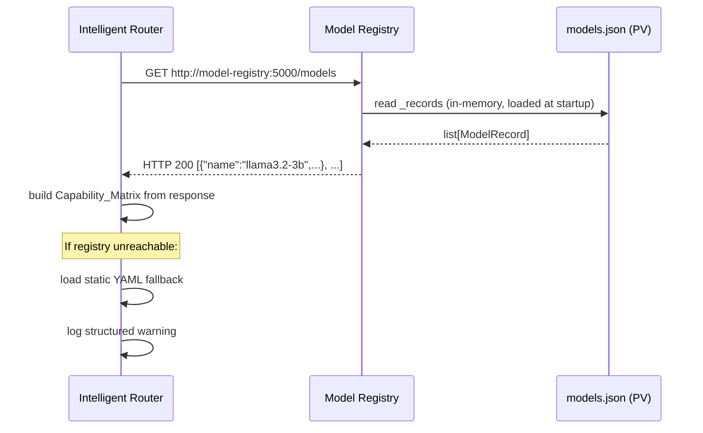
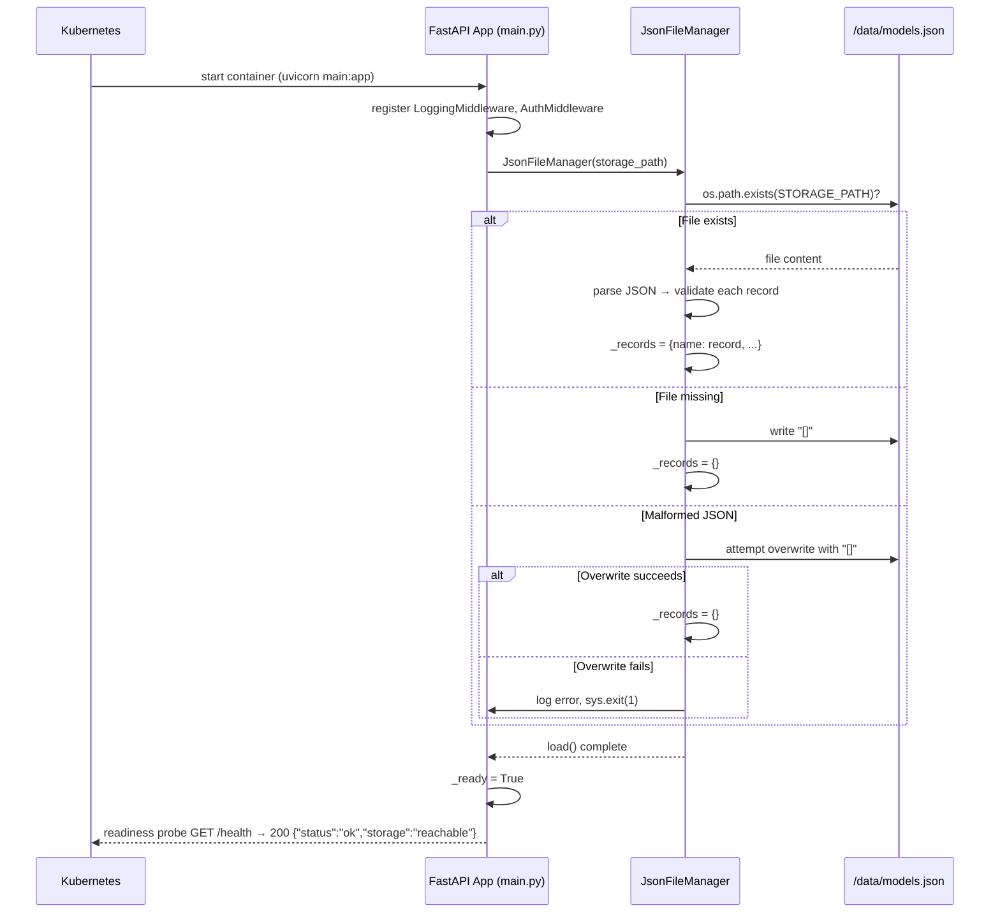
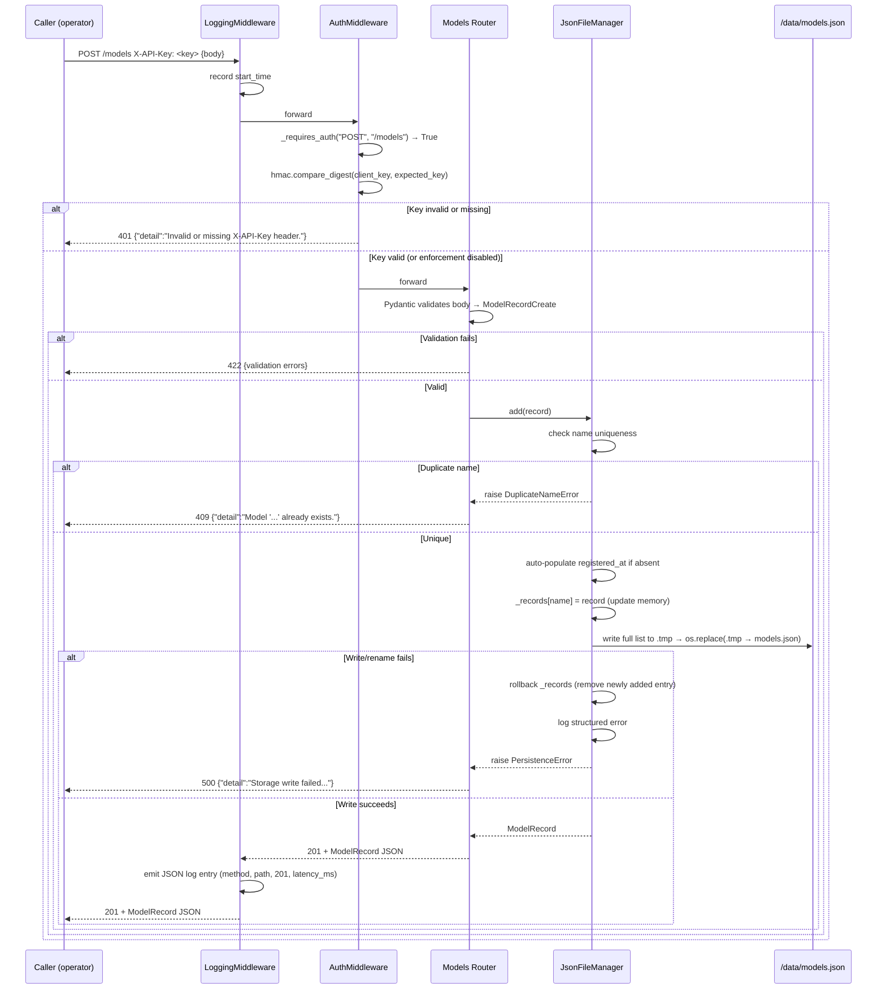
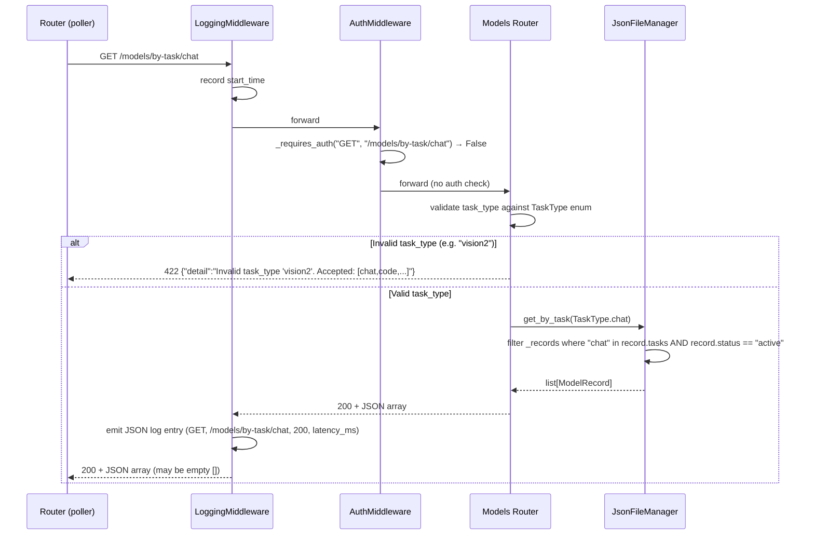

# Design Document — Model Registry

## Overview

The Model Registry is a lightweight, centralised metadata service for the Enterprise On-Prem LLM Platform POC. It stores model descriptors in a JSON file on a PersistentVolume and exposes a REST API so the Intelligent Router and other platform services can discover model capabilities, endpoints, and operational status without hardcoding that information in any individual service.

**Technology choices (POC):**

| Concern | Choice | Rationale |
|---|---|---|
| Web framework | FastAPI | Async, built-in Pydantic validation, OpenAPI generation |
| Storage | JSON file on PersistentVolume (`models.json`) | No external DB dependency; survives pod restart |
| Auth | Static `X-API-Key` header, constant-time compare | POC simplicity; Vault/OIDC deferred to Phase 2 |
| Logging | JSON structured logs to stdout | Platform-wide convention; consumed by log aggregator |
| Container port | 5000 | Platform master contract |
| Service type | ClusterIP | Internal-only; no external exposure needed |

**POC non-goals:** MLflow, MinIO, Vault, HPA, Istio mTLS, Argo Rollouts, A/B testing, health benchmark jobs.

---

## Architecture

The registry is a single-pod FastAPI application. All state lives in one JSON file on a mounted PersistentVolume. There are no external dependencies beyond the filesystem.

```mermaid
graph TD
    Router["Intelligent Router<br/>(polls every 60s)"]
    Operator["Platform Operator<br/>(curl / admin tool)"]

    subgraph K8s Pod — model-registry
        API["FastAPI Application<br/>port 5000"]
        AuthMW["Auth Middleware<br/>(X-API-Key)"]
        LogMW["Logging Middleware<br/>(JSON stdout)"]
        HealthRouter["Health Router<br/>/health"]
        ModelRouter["Models Router<br/>/models"]
        StorageMgr["JsonFileManager<br/>(in-memory + atomic writes)"]
    end

    PV[("PersistentVolume<br/>/data/models.json")]

    Router -->|GET /models, GET /models/by-task/{t}| API
    Operator -->|POST /models, PATCH /models/{n}/status| API
    API --> LogMW --> AuthMW
    AuthMW --> HealthRouter
    AuthMW --> ModelRouter
    ModelRouter --> StorageMgr
    StorageMgr <-->|read / atomic write| PV
```

**Request flow summary:**
1. Request arrives on port 5000.
2. `LoggingMiddleware` records start time.
3. `AuthMiddleware` checks `X-API-Key` for mutating endpoints; passes GETs through.
4. Route handler delegates to `JsonFileManager` for all reads/writes.
5. `JsonFileManager` holds the canonical in-memory list and serialises to disk atomically on every mutation.
6. `LoggingMiddleware` emits a JSON log entry after the response is sent.

---

## Components and Interfaces

### Module / File Structure

```
model_registry/
├── main.py                  # FastAPI app factory, lifespan, middleware wiring
├── config.py                # Settings (pydantic-settings); reads env vars
├── storage/
│   └── json_file_manager.py # In-memory store + atomic write logic
├── routers/
│   ├── models.py            # /models routes
│   └── health.py            # /health route
├── schemas/
│   └── model.py             # Pydantic models (ModelRecord, StatusUpdate, etc.)
├── middleware/
│   ├── auth.py              # X-API-Key middleware
│   └── logging.py           # Structured JSON logging middleware
└── exceptions.py            # Custom exception classes + handlers
```

### Interface Contracts

#### `JsonFileManager`

```python
class JsonFileManager:
    def __init__(self, storage_path: str) -> None: ...
    # Called from app lifespan — loads file or creates empty store
    def load(self) -> None: ...
    # Returns a shallow copy of the in-memory list; never raises
    def get_all(self) -> list[ModelRecord]: ...
    # Returns the record or None; never raises
    def get_by_name(self, name: str) -> ModelRecord | None: ...
    # Returns filtered list; never raises
    def get_by_task(self, task_type: TaskType) -> list[ModelRecord]: ...
    # Raises DuplicateNameError on conflict; raises PersistenceError on write fail
    def add(self, record: ModelRecord) -> ModelRecord: ...
    # Raises ModelNotFoundError if missing; raises PersistenceError on write fail
    def update_status(self, name: str, status: ModelStatus) -> ModelRecord: ...
    # Returns True if file is readable, False otherwise
    def storage_reachable(self) -> bool: ...
```

#### `AuthMiddleware`

```python
class AuthMiddleware(BaseHTTPMiddleware):
    # Enforced on POST /models, PATCH /models/*/status only
    # Passes all GET requests and /health through without checking
    # Uses hmac.compare_digest for constant-time comparison
    # Returns HTTP 401 JSON on failure; HTTP 200 JSON warning if key not configured
```

#### `LoggingMiddleware`

```python
class LoggingMiddleware(BaseHTTPMiddleware):
    # Wraps every request; captures start time
    # After response, emits one JSON line to stdout:
    # { "timestamp": ISO-8601, "level": "INFO"|"ERROR", "method": ...,
    #   "path": ..., "status_code": ..., "latency_ms": float }
    # Never logs X-API-Key header value
```

---

## Data Models

### Pydantic Schemas (`schemas/model.py`)

```python
from enum import Enum
from pydantic import BaseModel, Field, field_validator
import re

class ModelStatus(str, Enum):
    active   = "active"
    staging  = "staging"
    retired  = "retired"

class TaskType(str, Enum):
    chat           = "chat"
    code           = "code"
    reasoning      = "reasoning"
    summarization  = "summarization"
    translation    = "translation"
    vision         = "vision"
    embeddings     = "embeddings"

NAME_PATTERN = re.compile(r'^[a-zA-Z0-9._-]+$')

class ModelRecordCreate(BaseModel):
    """Request body for POST /models. registered_at is auto-populated if absent."""
    model_config = ConfigDict(extra="forbid")   # rejects unknown fields → HTTP 422

    name:               str        = Field(..., pattern=r'^[a-zA-Z0-9._-]+$')
    version:            str
    backend:            str
    endpoint:           str
    tasks:              list[TaskType] = Field(..., min_length=1)
    status:             ModelStatus
    vram_required_gb:   float | None = None
    max_context_length: int   | None = None
    fallback_model:     str   | None = None
    registered_at:      str   | None = None   # ISO-8601; auto-set if absent
    notes:              str   | None = None

class ModelRecord(ModelRecordCreate):
    """Full record as stored and returned. registered_at is always populated."""
    registered_at: str   # overrides Optional above — always present in responses

class StatusUpdateRequest(BaseModel):
    """Request body for PATCH /models/{name}/status."""
    model_config = ConfigDict(extra="forbid")
    status: ModelStatus

class HealthResponse(BaseModel):
    status:  str
    storage: str | None = None
```

### models.json on-disk format

```json
[
  {
    "name": "llama3.2-3b",
    "version": "1.0.0",
    "backend": "ollama",
    "endpoint": "http://inference-ollama:11434",
    "tasks": ["chat", "summarization", "reasoning", "code"],
    "status": "active",
    "vram_required_gb": 3,
    "max_context_length": 8192,
    "fallback_model": null,
    "registered_at": "2026-06-01T00:00:00Z",
    "notes": "POC primary model — small CPU-capable model"
  }
]
```

Optional fields that were not supplied are stored as `null` (not omitted), ensuring GET responses always include every key.

---

## API Layer Design

### Router: `/models` (`routers/models.py`)

| Method | Path | Auth required | Success | Error cases |
|---|---|---|---|---|
| GET | `/models` | No | 200 + `list[ModelRecord]` | — |
| GET | `/models/{name}` | No | 200 + `ModelRecord` | 404 name missing, 422 invalid name chars |
| POST | `/models` | Yes | 201 + `ModelRecord` | 401 bad key, 409 duplicate, 422 validation |
| PATCH | `/models/{name}/status` | Yes | 200 + `ModelRecord` | 401 bad key, 404 not found, 422 invalid status |
| GET | `/models/by-task/{task_type}` | No | 200 + `list[ModelRecord]` | 422 invalid task type |

> Route ordering note: `/models/by-task/{task_type}` must be declared before `/models/{name}` in the router to prevent FastAPI treating `by-task` as a name parameter.

### Router: `/health` (`routers/health.py`)

| Method | Path | Auth required | Response |
|---|---|---|---|
| GET | `/health` | No | 200 `{"status":"ok","storage":"reachable"}` (normal) |
| | | | 503 `{"status":"starting"}` (during startup) |
| | | | 200 `{"status":"degraded","storage":"unreachable"}` (storage lost) |

### Error Response Envelope

All error responses use FastAPI's default `{"detail": "..."}` structure. Validation errors (422) include the standard Pydantic error list under `detail`. Custom errors (404, 409, 401, 500) use a single string `detail` field.

```json
// 409 example
{ "detail": "Model with name 'llama3.2-3b' already exists." }

// 401 example
{ "detail": "Invalid or missing X-API-Key header." }

// 500 example
{ "detail": "Storage write failed. Model 'llama3.2-3b' was not persisted." }
```

---

## Storage Layer Design

### `JsonFileManager` — in-memory cache + atomic write

The manager holds the authoritative list of `ModelRecord` objects in memory. All reads are served from memory (O(1) dict lookup by name); writes go to memory first, then flush the full list to disk atomically.

#### Startup (`load`)

```
1. If STORAGE_PATH does not exist:
     create parent dirs if needed
     write "[]" to STORAGE_PATH
     set _records = {}
     set _storage_ok = True
     return

2. Read STORAGE_PATH:
   - If I/O error or JSON parse error:
       try to overwrite with "[]"
       if that also fails: log structured error, sys.exit(1)
       set _records = {}
   - If success:
       parse list of dicts → validate each as ModelRecord
       set _records = {r.name: r for r in records}
       set _storage_ok = True
```

#### Atomic Write (`_persist`)

```
1. Serialise _records.values() → JSON bytes (indent=2, ensure_ascii=False)
2. Compute temp path: STORAGE_PATH + ".tmp"
3. Write JSON bytes to temp path (O_WRONLY | O_CREAT | O_TRUNC)
4. os.replace(tmp_path, STORAGE_PATH)   ← atomic on POSIX; rename on Windows
5. If step 3 or 4 raises OSError:
     attempt os.unlink(tmp_path) silently
     log structured error (include model name if applicable)
     raise PersistenceError (caught by route handler → HTTP 500)
     do NOT update in-memory state (rollback)
```

`os.replace` is atomic on POSIX filesystems (same mount point). Because the PVC is mounted at `/data` and the temp file is written to `/data/models.json.tmp` on the same filesystem, the rename is a single directory-entry swap — a crash between write and rename leaves the original file intact.

#### Runtime Storage Monitoring (`storage_reachable`)

Checks whether STORAGE_PATH exists and is readable. Called by the health endpoint. Does not attempt any write.

### Custom Exceptions (`exceptions.py`)

```python
class DuplicateNameError(Exception):
    def __init__(self, name: str): ...

class ModelNotFoundError(Exception):
    def __init__(self, name: str): ...

class PersistenceError(Exception):
    def __init__(self, message: str, model_name: str | None = None): ...
```

Exception handlers registered on the FastAPI app translate these to the appropriate HTTP responses.

---

## Authentication Middleware Design

```python
PROTECTED_ROUTES = {
    ("POST", "/models"),
    # PATCH /models/{name}/status matched by prefix check
}

class AuthMiddleware(BaseHTTPMiddleware):
    async def dispatch(self, request: Request, call_next):
        if _requires_auth(request.method, request.url.path):
            if not settings.registry_api_key:
                # Key not configured — POC convenience mode, pass through
                pass
            else:
                client_key = request.headers.get("X-API-Key", "")
                expected   = settings.registry_api_key
                if not hmac.compare_digest(client_key.encode(), expected.encode()):
                    return JSONResponse(
                        status_code=401,
                        content={"detail": "Invalid or missing X-API-Key header."}
                    )
        return await call_next(request)

def _requires_auth(method: str, path: str) -> bool:
    if method == "POST" and path == "/models":
        return True
    if method == "PATCH" and re.match(r"^/models/[^/]+/status$", path):
        return True
    return False
```

Key design decisions:
- Uses `hmac.compare_digest` to prevent timing attacks.
- Auth check runs before FastAPI's own route matching and validation — a 401 is returned even for syntactically invalid request bodies.
- If `REGISTRY_API_KEY` is unset or empty, a structured warning is logged once at startup and enforcement is skipped (POC convenience mode per Req 8.2).

---

## Logging Middleware Design

```python
class LoggingMiddleware(BaseHTTPMiddleware):
    async def dispatch(self, request: Request, call_next):
        start = time.monotonic()
        response = await call_next(request)
        latency_ms = (time.monotonic() - start) * 1000

        level = "ERROR" if response.status_code >= 500 else "INFO"
        # Respect LOG_LEVEL env — suppress DEBUG/INFO entries if level is WARN/ERROR
        if _should_emit(level):
            entry = {
                "timestamp":   datetime.utcnow().isoformat() + "Z",
                "level":       level,
                "method":      request.method,
                "path":        request.url.path,
                "status_code": response.status_code,
                "latency_ms":  round(latency_ms, 2),
            }
            print(json.dumps(entry), flush=True)   # stdout
        return response
```

The `X-API-Key` header is never read inside this middleware; even if it were, it is never included in the `entry` dict.

---

## Startup / Shutdown Lifecycle

```python
# main.py
from contextlib import asynccontextmanager

_ready = False   # used by /health to return 503 during startup

@asynccontextmanager
async def lifespan(app: FastAPI):
    global _ready
    # --- startup ---
    settings = get_settings()
    if not settings.registry_api_key:
        logger.warning({"event": "api_key_not_configured", "message":
                         "REGISTRY_API_KEY unset; auth enforcement disabled."})
    storage = JsonFileManager(settings.storage_path)
    storage.load()           # may sys.exit(1) if unrecoverable
    app.state.storage = storage
    _ready = True
    yield
    # --- shutdown (no-op for POC) ---
    _ready = False

app = FastAPI(title="Model Registry", lifespan=lifespan)
app.add_middleware(LoggingMiddleware)
app.add_middleware(AuthMiddleware)
app.include_router(health_router)
app.include_router(models_router)
```

The `_ready` flag is the bridge between the startup coroutine and the `/health` handler: before `_ready = True` is set, any health probe returns 503, satisfying Req 7.2.

---

## Helm Chart Structure

Location: `llm-platform/charts/model-registry/`

```
model-registry/
├── Chart.yaml
├── values.yaml
├── README.md
└── templates/
    ├── _helpers.tpl
    ├── deployment.yaml
    ├── service.yaml
    ├── pvc.yaml
    ├── networkpolicy.yaml
    └── servicemonitor.yaml
```

> Note: `hpa.yaml` is intentionally omitted per POC constraints (`autoscaling.enabled: false`, `replicaCount: 1`).

### `Chart.yaml` (key fields)

```yaml
apiVersion: v2
name: model-registry
description: Lightweight model metadata registry for the LLM platform POC
type: application
version: 0.1.0
appVersion: "0.1.0"
```

### `values.yaml`

```yaml
replicaCount: 1

image:
  repository: registry.local/model-registry
  tag: ""          # set via CI --set image.tag=<sha>
  pullPolicy: IfNotPresent

service:
  type: ClusterIP
  port: 5000

env:
  LOG_LEVEL: "INFO"
  STORAGE_PATH: "/data/models.json"

# REGISTRY_API_KEY injected from a K8s Secret — never stored in values.yaml
apiKeySecret:
  name: model-registry-secret
  key: registry-api-key

persistence:
  enabled: true       # always true; no ephemeral path supported
  size: 1Gi
  accessMode: ReadWriteOnce
  storageClass: ""    # uses cluster default

resources:
  requests:
    cpu: "100m"
    memory: "128Mi"
  limits:
    cpu: "300m"
    memory: "256Mi"

autoscaling:
  enabled: false      # POC: single replica only

livenessProbe:
  httpGet:
    path: /health
    port: 5000
  initialDelaySeconds: 10
  periodSeconds: 15
  timeoutSeconds: 2
  failureThreshold: 3

readinessProbe:
  httpGet:
    path: /health
    port: 5000
  initialDelaySeconds: 10
  periodSeconds: 15
  timeoutSeconds: 2
  failureThreshold: 3

vault:
  enabled: false      # Phase 2
```

### Key Template Details

**`templates/deployment.yaml`** — relevant excerpts:

```yaml
containers:
  - name: model-registry
    image: "{{ .Values.image.repository }}:{{ .Values.image.tag }}"
    ports:
      - containerPort: 5000
    env:
      - name: LOG_LEVEL
        value: {{ .Values.env.LOG_LEVEL | quote }}
      - name: STORAGE_PATH
        value: {{ .Values.env.STORAGE_PATH | quote }}
      - name: REGISTRY_API_KEY
        valueFrom:
          secretKeyRef:
            name: {{ .Values.apiKeySecret.name }}
            key: {{ .Values.apiKeySecret.key }}
    volumeMounts:
      - name: data
        mountPath: /data
    livenessProbe:  {{- toYaml .Values.livenessProbe | nindent 12 }}
    readinessProbe: {{- toYaml .Values.readinessProbe | nindent 12 }}
    resources:      {{- toYaml .Values.resources | nindent 12 }}
volumes:
  - name: data
    persistentVolumeClaim:
      claimName: {{ include "model-registry.fullname" . }}-data
```

**`templates/pvc.yaml`**:

```yaml
apiVersion: v1
kind: PersistentVolumeClaim
metadata:
  name: {{ include "model-registry.fullname" . }}-data
spec:
  accessModes:
    - {{ .Values.persistence.accessMode }}
  resources:
    requests:
      storage: {{ .Values.persistence.size }}
  {{- if .Values.persistence.storageClass }}
  storageClassName: {{ .Values.persistence.storageClass }}
  {{- end }}
```

**`templates/networkpolicy.yaml`** — allow ingress from router namespace only:

```yaml
spec:
  podSelector:
    matchLabels: {{- include "model-registry.selectorLabels" . | nindent 6 }}
  ingress:
    - from:
        - namespaceSelector:
            matchLabels:
              kubernetes.io/metadata.name: llm-platform
      ports:
        - port: 5000
```

**`templates/servicemonitor.yaml`** — Prometheus scrape (POC: scrape the `/health` endpoint; a `/metrics` endpoint can be added in Phase 2):

```yaml
spec:
  selector:
    matchLabels: {{- include "model-registry.selectorLabels" . | nindent 6 }}
  endpoints:
    - port: http
      path: /health
      interval: 30s
```

---

## Router Integration Contract

The Intelligent Router (Layer 3) integrates with the Registry via this contract:

| Contract point | Value |
|---|---|
| Endpoint | `http://model-registry:5000/models` |
| Protocol | Plain HTTP (mTLS deferred to Phase 2) |
| Method | GET |
| Authentication | None required on GET endpoints |
| Poll interval | 60 seconds |
| Startup behaviour | Poll before accepting inference requests; on failure load static YAML fallback |
| Refresh behaviour | On poll failure retain current in-memory Capability_Matrix; log warning |
| Response contract | JSON array of `ModelRecord` objects; no pagination; all required fields present; optional fields as `null` (never omitted) |
| Max records (POC) | 100 (response within 200 ms) |

The Router should deserialise the response using the same `ModelRecord` schema. The `tasks` array on each record maps directly to the Capability_Matrix keyed by `TaskType`. The Router filters to `status == "active"` locally, or may use `GET /models/by-task/{task_type}` for targeted queries.

**Sequence diagram — Router startup poll:**



---

## Sequence Diagrams for Key Flows

### Flow 1 — Service Startup



### Flow 2 — POST /models (register a new model)



### Flow 3 — GET /models/by-task/{task_type}



---

## Correctness Properties

*A property is a characteristic or behavior that should hold true across all valid executions of a system — essentially, a formal statement about what the system should do. Properties serve as the bridge between human-readable specifications and machine-verifiable correctness guarantees.*

The registry contains pure functions (validation, serialisation, filtering, atomic write) whose correctness holds for all valid inputs, making it well-suited to property-based testing (PBT) with [Hypothesis](https://hypothesis.readthedocs.io/).

---

### Property 1: Atomic write round-trip

*For any* non-empty list of valid `ModelRecord` objects, writing that list to `STORAGE_PATH` via `JsonFileManager._persist` and then re-loading the file produces a list that is equal (same records, same field values) to the original list.

**Validates: Requirements 1.1, 12.1, 12.3**

---

### Property 2: Required field validation

*For any* model registration request body where at least one required field (`name`, `version`, `backend`, `endpoint`, `tasks`, `status`) is absent, the `POST /models` endpoint SHALL return HTTP 422 and the response body SHALL identify each missing field.

**Validates: Requirements 1.6, 4.2**

---

### Property 3: Status and task enum enforcement

*For any* model registration request body containing a `status` value not in `{active, staging, retired}` OR a `tasks` array containing any element not in the valid task type set OR an empty `tasks` array, the `POST /models` endpoint SHALL return HTTP 422.

*For any* `PATCH /models/{name}/status` request body containing a `status` value not in `{active, staging, retired}`, the endpoint SHALL return HTTP 422.

**Validates: Requirements 1.8, 1.9, 4.4, 4.5, 5.3**

---

### Property 4: Name uniqueness on registration

*For any* model name already present in the store, a subsequent `POST /models` request with the same `name` (regardless of all other field values) SHALL return HTTP 409, and the total number of records in the store SHALL remain unchanged.

**Validates: Requirements 1.10, 4.3**

---

### Property 5: registered_at auto-population

*For any* valid `ModelRecordCreate` body that does not include a `registered_at` field, the record returned by `POST /models` SHALL include a `registered_at` value that is a valid ISO-8601 UTC datetime string.

**Validates: Requirements 1.11**

---

### Property 6: GET /models completeness and null serialisation

*For any* set of `N` registered models (including models with some optional fields absent), `GET /models` SHALL return exactly `N` records, every record SHALL include all required fields with non-null values, and every optional field that was not supplied at registration SHALL be present with a `null` value (not omitted).

**Validates: Requirements 2.1, 2.2, 2.3**

---

### Property 7: GET /models/{name} case-sensitive exact match

*For any* stored model with name `X`, a `GET /models/{name}` request where `name == X` SHALL return HTTP 200 with the correct record, and a request where `name` differs from `X` only in character casing SHALL return HTTP 404.

**Validates: Requirements 3.1, 3.3**

---

### Property 8: Invalid name characters → 422

*For any* string that contains at least one character outside `[a-zA-Z0-9._-]` used as the `{name}` path parameter in `GET /models/{name}`, the endpoint SHALL return HTTP 422.

**Validates: Requirements 3.4**

---

### Property 9: Mutating endpoints require valid API key

*For any* request to `POST /models` or `PATCH /models/{name}/status` — regardless of the request body content — when the `X-API-Key` header is absent or contains any value that does not equal `REGISTRY_API_KEY`, the registry SHALL return HTTP 401, the response body SHALL NOT contain the value of `REGISTRY_API_KEY`, and no modification to the store SHALL occur.

**Validates: Requirements 4.6, 5.4, 8.3, 8.6**

---

### Property 10: PATCH status preserves all other fields

*For any* registered model and any valid `status` value supplied via `PATCH /models/{name}/status`, all fields of the returned `ModelRecord` other than `status` SHALL be identical to the values those fields held before the PATCH was applied.

**Validates: Requirements 5.5**

---

### Property 11: by-task returns only active models for the queried task

*For any* valid `task_type` value and any state of the model store, `GET /models/by-task/{task_type}` SHALL return a JSON array where every element has `status == "active"` AND the `task_type` (normalised to lowercase) appears in the element's `tasks` array; no record that is `staging` or `retired`, or that does not include the task, SHALL appear in the result.

**Validates: Requirements 6.1, 6.2**

---

### Property 12: Structured log completeness and key non-disclosure

*For any* HTTP request processed by the registry (any method, any path, any response status), exactly one JSON log entry SHALL be emitted to stdout containing the fields `timestamp`, `level`, `method`, `path`, `status_code`, and `latency_ms`; the `level` field SHALL be `"INFO"` for 2xx responses and `"ERROR"` for 5xx responses; the entry SHALL NOT contain the value of `REGISTRY_API_KEY` regardless of whether that header was present in the request.

**Validates: Requirements 9.1, 9.2, 9.3, 9.4, 9.6**

---

## Error Handling

| Scenario | HTTP status | Body | Side effect |
|---|---|---|---|
| Missing required field | 422 | Pydantic error list | No store change |
| Unknown extra field | 422 | Pydantic error list | No store change |
| Invalid `status` enum | 422 | Field + accepted values | No store change |
| Invalid / empty `tasks` | 422 | Field + accepted values | No store change |
| Duplicate `name` | 409 | `{"detail":"Model '...' already exists."}` | No store change |
| Name not found (GET/PATCH) | 404 | `{"detail":"Model '...' not found."}` | No store change |
| Invalid name characters | 422 | `{"detail":"Invalid name format."}` | No store change |
| Invalid task_type path param | 422 | Accepted values listed | No store change |
| Missing/wrong API key | 401 | `{"detail":"Invalid or missing X-API-Key header."}` | No store change |
| Storage write failure | 500 | `{"detail":"Storage write failed. ..."}` | Disk unchanged; memory unchanged (rollback) |
| Startup storage unrecoverable | — | Structured log + `sys.exit(1)` | Pod restarts; probe returns 503 |
| Storage unreachable post-startup | 200 (degraded) on /health; 500 on mutations | See above | In-memory reads continue |

**Degraded-mode behaviour:** If `models.json` becomes unreadable after a successful startup:
- GET reads continue to work (served from memory).
- POST and PATCH return HTTP 500 (write fails).
- `/health` returns `{"status":"degraded","storage":"unreachable"}`.
- The error is logged on each failed write attempt.
- The service does not exit — it remains queryable.

---

## Testing Strategy

### Dual Testing Approach

**Unit / example tests** cover specific scenarios and edge cases using `pytest` + ASGI test client (`httpx.AsyncClient` via `anyio`):
- Startup with missing file (creates empty store)
- Startup with malformed JSON (recovery or exit)
- Duplicate name returns 409
- Non-existent name returns 404 with `detail`
- PATCH with invalid key returns 401 before 404
- Health returns 200/503/200-degraded in each state
- LOG_LEVEL suppression of DEBUG entries

**Property-based tests** (Hypothesis) cover universal correctness properties. Each test runs a minimum of **100 iterations** and is tagged with its corresponding design property.

### Property-Based Testing Library

Library: [**Hypothesis**](https://hypothesis.readthedocs.io/) (Python)

Tag format for each test:
```python
# Feature: model-registry, Property N: <property text>
```

### Property Test Sketch

```python
from hypothesis import given, settings as h_settings
from hypothesis import strategies as st

# Feature: model-registry, Property 1: Atomic write round-trip
@given(records=st.lists(model_record_strategy(), min_size=1, max_size=20))
@h_settings(max_examples=100)
def test_atomic_write_round_trip(tmp_path, records):
    manager = JsonFileManager(str(tmp_path / "models.json"))
    manager._records = {r.name: r for r in records}
    manager._persist()
    manager2 = JsonFileManager(str(tmp_path / "models.json"))
    manager2.load()
    assert manager2.get_all() == records  # field-for-field equality

# Feature: model-registry, Property 3: Status enum enforcement
@given(bad_status=st.text().filter(lambda s: s not in ("active","staging","retired")))
@h_settings(max_examples=100)
def test_invalid_status_returns_422(client, bad_status, valid_model_dict):
    body = {**valid_model_dict, "status": bad_status}
    resp = client.post("/models", json=body, headers={"X-API-Key": TEST_KEY})
    assert resp.status_code == 422

# Feature: model-registry, Property 11: by-task returns only active models for queried task
@given(models=st.lists(model_record_strategy(), min_size=0, max_size=30),
       task=st.sampled_from(list(TaskType)))
@h_settings(max_examples=100)
def test_by_task_active_only(seeded_client, models, task):
    resp = seeded_client.get(f"/models/by-task/{task.value}")
    assert resp.status_code == 200
    for record in resp.json():
        assert record["status"] == "active"
        assert task.value in record["tasks"]
```

### Test Coverage Targets

| Area | Test type | Properties covered |
|---|---|---|
| Atomic write / round-trip | PBT | P1 |
| Validation (missing fields) | PBT | P2 |
| Enum enforcement (status, tasks) | PBT | P3 |
| Name uniqueness | PBT | P4 |
| `registered_at` auto-population | PBT | P5 |
| GET /models completeness | PBT | P6 |
| Case-sensitive name lookup | PBT | P7 |
| Invalid name chars → 422 | PBT | P8 |
| Auth enforcement + key non-disclosure | PBT | P9 |
| PATCH field immutability | PBT | P10 |
| by-task active-only filter | PBT | P11 |
| Log completeness + key non-disclosure | PBT | P12 |
| Startup: missing file | Unit example | Req 1.3 |
| Startup: malformed file | Unit example | Req 1.4 |
| Storage write failure → 500 | Unit example | Req 1.12, 12.2 |
| Health states (ok / starting / degraded) | Unit example | Req 7.1–7.3 |
| PATCH on non-existent model (auth first) | Unit example | Req 5.6 |
| `/health` never requires auth | Unit example | Req 7.4, 8.4 |
| Helm chart manifest validation | Snapshot (helm template) | Req 10.1–10.7 |
