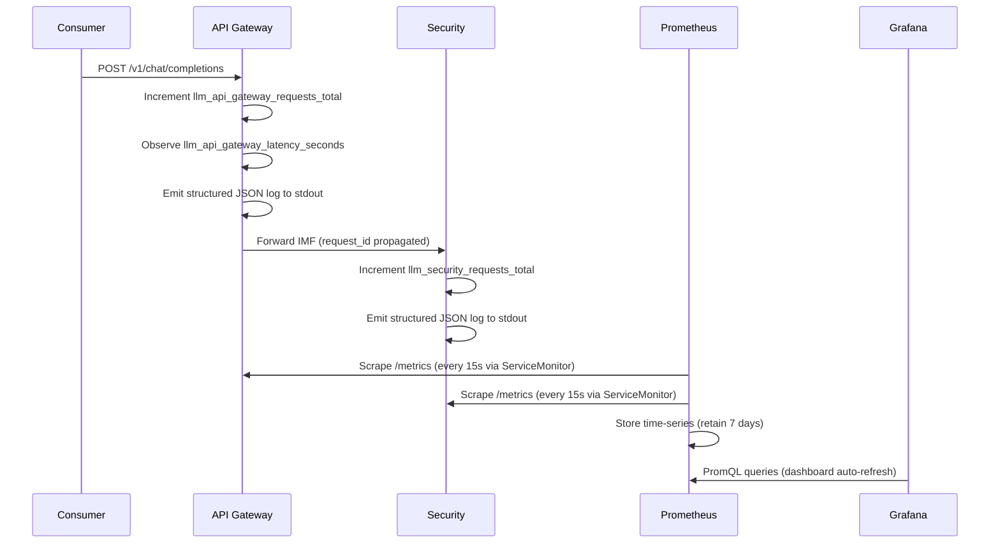

# Design Document — Observability Layer

## Overview

The Observability Layer is a cross-cutting platform service that gives operators real-time
visibility into the Enterprise On-Premises LLM Platform POC. It is not a standalone
application; it is a composition of deployed infrastructure (Prometheus, Grafana) plus
shared instrumentation patterns that every platform layer embeds in its own code.

### Scope and Goals (POC)

The POC delivers three observable signals across all six platform layers
(`api_gateway`, `security`, `router`, `cache`, `inference`, `agent`):

| Signal | Technology | Delivery mechanism |
|---|---|---|
| Metrics | Prometheus + `prometheus_client` | `/metrics` on port 9090 per service; scraped via ServiceMonitor |
| Logs | stdout JSON | `structlog` or JSON formatter; viewed via `kubectl logs` |
| Traces | OTel + Jaeger | **Disabled by default**; opt-in via `values.yaml` override |


### Out of Scope for POC

The following are explicitly excluded and must not be implemented:

- Elasticsearch / Kibana log aggregation
- DCGM GPU metrics exporter
- Alertmanager notification routing (PagerDuty, Slack, email)
- OTel sensitive data filtering pipelines
- Custom alert rules
- Prometheus remote storage backends (retention beyond 7 days)
- High-availability or sharded Prometheus / Grafana (single replica each)

---

## Architecture

### Component Diagram

```
┌───────────────────────────────────────────────────────────────────┐
│  Kubernetes Cluster  (namespace: llm-poc)                         │
│                                                                   │
│  ┌─────────────────┐   scrape /metrics   ┌─────────────────────┐ │
│  │  api-gateway    │◄────────────────────│                     │ │
│  │  :9090/metrics  │                     │   Prometheus         │ │
│  ├─────────────────┤   ServiceMonitor    │   (kube-prometheus- │ │
│  │  security-layer │◄────────────────────│    stack)            │ │
│  │  :9090/metrics  │                     │   ClusterIP :9090   │ │
│  ├─────────────────┤                     │   Retention: 7d     │ │
│  │  router         │◄────────────────────│   PVC: 10Gi         │ │
│  │  :9090/metrics  │                     └──────────┬──────────┘ │
│  ├─────────────────┤                                │             │
│  │  cache          │◄────────────────────           │ datasource  │
│  │  :9090/metrics  │                     ┌──────────▼──────────┐ │
│  ├─────────────────┤                     │   Grafana            │ │
│  │  inference      │◄────────────────────│   ClusterIP :3000   │ │
│  │  :9090/metrics  │                     │   Dashboard: POC     │ │
│  ├─────────────────┤                     │   Overview (7 panels)│ │
│  │  agent          │◄────────────────────└─────────────────────┘ │
│  │  :9090/metrics  │                                              │
│  └─────────────────┘                                              │
│                                                                   │
│  stdout ──► kubectl logs (structured JSON per service)            │
│                                                                   │
│  ┌ ─ ─ ─ ─ ─ ─ ─ ─ ─ ─ ─ ─ ─ ─ ─ ─ ─ ─ ─ ─ ─ ─ ─ ─ ─ ─ ─ ─ ┐  │
│    OTel Collector :4317  ──►  Jaeger UI :16686    (disabled)      │
│  └ ─ ─ ─ ─ ─ ─ ─ ─ ─ ─ ─ ─ ─ ─ ─ ─ ─ ─ ─ ─ ─ ─ ─ ─ ─ ─ ─ ─ ┘  │
└───────────────────────────────────────────────────────────────────┘
```


### Request Flow Through Observability Signals



### Key Design Decisions

**Why `kube-prometheus-stack` rather than standalone Prometheus?**
It bundles Prometheus Operator, Grafana, and the CRD stack in a single chart, giving
us ServiceMonitor auto-discovery out of the box. The operator manages the Prometheus
StatefulSet, so we declare intent (ServiceMonitor selectors) rather than writing raw
scrape configs. This is the de-facto standard for Kubernetes Prometheus deployments.

**Why a shared Python instrumentation module instead of per-layer ad-hoc metrics?**
The existing codebase has per-layer `metrics.py` files (api_gateway, security, cache, etc.)
with inconsistent label sets. The requirements mandate a precise label taxonomy
(`status`, `department`, `model` on request counters; `department` on latency histograms;
`error_code`, `department` on error counters). A shared module
`shared/observability/metrics.py` provides factory functions that enforce these labels
at construction time, making it impossible for a layer to register a metric with the
wrong label set.

**Why `structlog` over the stdlib `logging` module with JSON formatter?**
`structlog` natively outputs structured dicts, makes log field injection (e.g.
`request_id`) trivially composable via context variables, and its `JSONRenderer`
produces single-line JSON conforming to the schema without additional formatting glue.
The existing `api_gateway/middleware/logging.py` uses `print(json.dumps(...))` which
works but is fragile. The shared module standardises on `structlog`.


---

## Components and Interfaces

### Component 1: Observability Helm Chart (`llm-platform/charts/observability/`)

The chart is a thin wrapper around `kube-prometheus-stack`. Its only authored
Kubernetes resources are:

- `templates/configmap.yaml` — the `grafana-poc-dashboards` ConfigMap that mounts
  `poc-overview.json` into Grafana's sidecar provisioner
- `templates/jaeger-deployment.yaml` — Jaeger all-in-one Deployment (conditional)
- `templates/jaeger-service.yaml` — Jaeger ClusterIP Service (conditional)
- `templates/ingress.yaml` — optional ingress for Grafana (disabled by default)
- `templates/_helpers.tpl` — chart name helpers
- `dashboards/poc-overview.json` — the Grafana dashboard definition

All Prometheus and Grafana resources are rendered by the `kube-prometheus-stack`
sub-chart dependency. The wrapper only sets values.

### Component 2: Shared Python Instrumentation (`shared/observability/`)

A new shared package providing:

- `metrics.py` — factory functions that create correctly-labelled Prometheus metrics
- `logging.py` — `structlog` configuration function and log schema enforcement
- `middleware.py` — reusable FastAPI/Starlette middleware classes

Each platform layer imports from `shared.observability` instead of defining its own
metric objects. Existing per-layer `metrics.py` files are refactored to use the factory.

### Component 3: ServiceMonitor Template (per-layer charts)

Each of the six platform layer Helm charts includes
`templates/servicemonitor.yaml` with the mandatory `release: observability` label.
This is a copy-paste template — small enough that a shared library is not warranted.

### Component 4: OTel + Jaeger (optional)

When `jaeger.enabled: true` and `opentelemetry-collector.enabled: true` are set:

- OTel Collector receives OTLP spans on gRPC port 4317
- Forwards spans to `jaeger-collector:14250` with TLS disabled
- Each layer instruments its FastAPI app with `opentelemetry-instrumentation-fastapi`
- `traceparent` header propagated on all outbound inter-service HTTP calls

This is fully disabled in the default `values.yaml`.


---

## Helm Chart Structure

### File Layout

```
llm-platform/charts/observability/
├── Chart.yaml                        # pinned kube-prometheus-stack dependency
├── Chart.lock                        # locked dependency hash
├── values.yaml                       # default POC values
├── README.md                         # deployment instructions
├── dashboards/
│   └── poc-overview.json             # Grafana dashboard JSON (7 panels)
└── templates/
    ├── _helpers.tpl                  # chart name helpers
    ├── configmap.yaml                # grafana-poc-dashboards ConfigMap
    ├── jaeger-deployment.yaml        # Jaeger all-in-one (conditional)
    ├── jaeger-service.yaml           # Jaeger ClusterIP service (conditional)
    └── ingress.yaml                  # Grafana ingress (disabled by default)
```

### `Chart.yaml`

```yaml
apiVersion: v2
name: observability
description: "Observability stack — kube-prometheus-stack + optional Jaeger/OTel"
type: application
version: 0.1.0
appVersion: "0.1.0"
dependencies:
  - name: kube-prometheus-stack
    version: "58.3.3"                 # pinned — no wildcards or ranges
    repository: "https://prometheus-community.github.io/helm-charts"
    condition: kubePrometheusStack.enabled
```

The `~58.x` range in the existing chart must be replaced with a pinned version
per Requirement 8.4. Version `58.3.3` is the latest stable at time of writing;
update via `helm dep update` and commit the resulting `Chart.lock`.


### `values.yaml` (complete default)

```yaml
# POC — single replica, no HA, no alerting, tracing opt-in only

replicaCount: 1

kubePrometheusStack:
  enabled: true

kube-prometheus-stack:
  # ── Prometheus ──────────────────────────────────────────────────
  prometheus:
    prometheusSpec:
      retention: "7d"
      replicas: 1                     # POC: single replica
      serviceMonitorSelector:
        matchLabels:
          release: observability      # discovers all layers' ServiceMonitors
      serviceMonitorNamespaceSelector: {}  # all namespaces
      storageSpec:
        volumeClaimTemplate:
          spec:
            accessModes: [ReadWriteOnce]
            resources:
              requests:
                storage: 10Gi

  # ── Grafana ──────────────────────────────────────────────────────
  grafana:
    enabled: true
    replicas: 1                       # POC: single replica
    adminPassword: "poc-admin"        # override in cluster secret for real deploys
    service:
      type: ClusterIP
      port: 3000
    sidecar:
      datasources:
        enabled: true                 # auto-provision Prometheus datasource
      dashboards:
        enabled: true
        label: grafana_dashboard
        labelValue: "1"
    dashboardsConfigMaps:
      - configMapName: grafana-poc-dashboards
        folder: "LLM Platform POC"

  # ── Alertmanager (disabled for POC) ─────────────────────────────
  alertmanager:
    enabled: false

# ── Optional distributed tracing (opt-in) ────────────────────────
opentelemetry-collector:
  enabled: false

jaeger:
  enabled: false

# ── Ingress (disabled for POC — use kubectl port-forward) ─────────
ingress:
  enabled: false
  host: "grafana-poc.local"
  servicePort: 3000

observability:
  metrics:
    port: 9090
```


### `templates/configmap.yaml`

```yaml
{{- if .Values.kubePrometheusStack.enabled }}
apiVersion: v1
kind: ConfigMap
metadata:
  name: grafana-poc-dashboards
  namespace: {{ .Release.Namespace }}
  labels:
    {{- include "observability.labels" . | nindent 4 }}
    grafana_dashboard: "1"            # sidecar discovers ConfigMaps with this label
data:
  poc-overview.json: |
    {{- .Files.Get "dashboards/poc-overview.json" | nindent 4 }}
{{- end }}
```

The `grafana_dashboard: "1"` label is required for the Grafana sidecar provisioner to
discover the ConfigMap. The `dashboardsConfigMaps` entry in `values.yaml` connects
the ConfigMap name to the `LLM Platform POC` folder in the UI.

### ServiceMonitor Template (reusable — add to each layer chart)

Each platform layer chart includes `templates/servicemonitor.yaml`:

```yaml
{{- if .Values.observability.metrics.enabled }}
apiVersion: monitoring.coreos.com/v1
kind: ServiceMonitor
metadata:
  name: {{ include "<chart>.fullname" . }}
  labels:
    {{- include "<chart>.labels" . | nindent 4 }}
    release: observability            # MUST match kube-prometheus-stack release name
spec:
  selector:
    matchLabels:
      {{- include "<chart>.selectorLabels" . | nindent 6 }}
  namespaceSelector:
    matchNames:
      - {{ .Release.Namespace }}
  endpoints:
    - port: metrics                   # named port — matches service.yaml
      path: /metrics
      interval: {{ .Values.observability.metrics.scrapeInterval | default "15s" }}
{{- end }}
```

The `service.yaml` in each layer chart must declare the metrics port by name:

```yaml
ports:
  - name: metrics
    port: 9090
    targetPort: 9090
    protocol: TCP
```

**Validation note on scrape interval:** Values must be in the range `[5s, 300s]`.
This constraint is enforced at the application layer in the ServiceMonitor validation
logic (see Error Handling section), not by Helm itself.


---

## Data Models

### Metric Label Taxonomy

All mandatory platform metrics follow this label schema, derived from the
IMF (Internal Message Format):

| Metric family | Labels | Value constraints |
|---|---|---|
| `llm_{layer}_requests_total` | `status`, `department`, `model` | `status` ∈ `{success, error, blocked}` |
| `llm_{layer}_latency_seconds` | `department` | histogram; buckets `[0.1, 0.5, 1.0, 2.0, 5.0, 10.0, 30.0]` |
| `llm_{layer}_errors_total` | `error_code`, `department` | `error_code` from audit record schema |
| `llm_cache_requests_total` | `status`, `department`, `model`, `outcome` | `outcome` ∈ `{hit, miss}` |

The `department` label maps to `imf.user.department`. The `model` label maps to
`imf.routing.selected_model` (or `imf.request.model` at the gateway before routing).
The `error_code` label maps to `audit_record.error_code`.

**Label cardinality budget:** `department` and `model` are the highest-cardinality
labels. For the POC, both are expected to have low cardinality (< 20 departments,
< 10 models). If cardinality grows in production, these labels should be reviewed.

### Structured Log Schema

Every log entry written to stdout must conform to this schema:

```python
class LogEntry(TypedDict):
    timestamp: str      # ISO-8601 UTC, e.g. "2024-06-01T12:00:00.000Z"
    level: str          # "DEBUG" | "INFO" | "WARN" | "ERROR"
    service: str        # layer name, e.g. "api_gateway"
    request_id: str     # UUID-v4 | "none" (for non-request-scoped entries)
    event: str          # snake_case machine-readable event, e.g. "request_received"
    message: str        # human-readable string, max 256 chars
    latency_ms: int     # milliseconds; OMITTED for non-request events
    data: dict          # additional structured context (never contains sensitive data)
```

`latency_ms` is present only for request processing events; it is omitted entirely
(not set to null) for startup, shutdown, and configuration events.

### IMF Fields Used by Observability

The observability layer reads but never writes these IMF fields:

| IMF field | Used for |
|---|---|
| `request_id` | Log correlation, span attribute `llm.request_id` |
| `user.department` | Metric label `department` |
| `user.user_id` | Span attribute `llm.user_id` (opaque form only; never logged) |
| `routing.selected_model` | Metric label `model` |
| `request.task_type` | Span attribute `llm.task_type` |
| `governance.pii_fields_detected` | Determines fields to exclude from logs |

**Sensitive fields NEVER written to any observability signal:**
`request.messages[].content`, `response.content`, `governance.pii_fields_detected`
values (the actual PII strings), `user.user_id` (beyond opaque identifier),
any auth header or API key value.


### Shared Instrumentation Module Interface

The shared module exposes these public interfaces:

```python
# shared/observability/metrics.py

def make_layer_metrics(layer: str) -> LayerMetrics:
    """
    Create and register the three mandatory Prometheus metric families for
    a platform layer. Returns a dataclass holding the three metric objects.

    Args:
        layer: One of "api_gateway", "security", "router", "cache",
               "inference", "agent".

    Returns:
        LayerMetrics(
            requests_total: Counter,   # llm_{layer}_requests_total
            latency_seconds: Histogram, # llm_{layer}_latency_seconds
            errors_total: Counter,     # llm_{layer}_errors_total
        )

    Raises:
        ValueError: If layer is not one of the six valid values.
    """

@dataclass
class LayerMetrics:
    requests_total: Counter
    latency_seconds: Histogram
    errors_total: Counter

    def record_request(
        self,
        status: Literal["success", "error", "blocked"],
        department: str,
        model: str,
        latency_s: float,
    ) -> None:
        """Increment requests_total and observe latency in one call."""

    def record_error(self, error_code: str, department: str) -> None:
        """Increment errors_total with the given error_code and department."""
```

```python
# shared/observability/logging.py

def configure_structlog(service: str, log_level: str = "INFO") -> None:
    """
    Configure structlog globally for a platform service.
    Reads LOG_LEVEL from environment if log_level not provided.
    Falls back to INFO for unrecognised values and emits a WARN.

    Args:
        service: The service/layer name written into every log entry.
        log_level: One of "DEBUG", "INFO", "WARN", "ERROR".
    """

def get_logger(request_id: str = "none") -> structlog.BoundLogger:
    """
    Return a structlog logger pre-bound with request_id and timestamp.

    Args:
        request_id: The UUID-v4 request identifier, or "none" for
                    non-request-scoped events (startup, config load, etc.).
    """

def emit(
    logger: structlog.BoundLogger,
    level: str,
    event: str,
    message: str,
    latency_ms: int | None = None,
    **data: Any,
) -> None:
    """
    Emit a single structured log entry conforming to the Log_Schema.
    Validates that message is <= 256 characters.
    Omits latency_ms from output when None.
    Never includes sensitive fields — callers must not pass them in **data.
    """
```


### Grafana Dashboard Panel Definitions

The `poc-overview.json` defines seven panels in a 12-column grid:

| # | Title | Type | PromQL |
|---|---|---|---|
| 1 | Request Rate | graph | `rate(llm_api_gateway_requests_total[1m])` |
| 2 | Error Rate | graph | `sum(rate(llm_{layer}_requests_total{status="error"}[1m]))` across all 6 layers |
| 3 | End-to-End Latency P95 | graph | `histogram_quantile(0.95, sum(rate(llm_{layer}_latency_seconds_bucket[1m])) by (le))` per layer |
| 4 | Cache Hit Rate | gauge | `rate(llm_cache_requests_total{outcome="hit"}[1m]) / rate(llm_cache_requests_total[1m])` |
| 5 | Security Blocks | graph | `rate(llm_security_requests_total{outcome="block"}[1m])` |
| 6 | Inference Requests | graph | `rate(llm_inference_requests_total[1m])` with `by (model)` |
| 7 | Active Agent Sessions | stat | gauge metric if available; fallback `llm_agent_requests_total` |

The dashboard JSON is stored in the repository at
`llm-platform/charts/observability/dashboards/poc-overview.json`.
It is embedded in the `grafana-poc-dashboards` ConfigMap at deploy time via
`{{ .Files.Get "dashboards/poc-overview.json" }}` in `templates/configmap.yaml`.

### Health Check Endpoints

| Service | Endpoint | Ready: HTTP | Not-ready: HTTP |
|---|---|---|---|
| Prometheus | `GET /-/healthy` | `200` | `503` |
| Grafana | `GET /api/health` | `200` | non-200 |

Kubernetes probe configuration (applied via `kube-prometheus-stack` values):

```yaml
# Prometheus liveness / readiness (via prometheusSpec)
livenessProbe:
  httpGet:
    path: /-/healthy
    port: 9090
  initialDelaySeconds: 30
  periodSeconds: 10
  timeoutSeconds: 5
  failureThreshold: 3

readinessProbe:
  httpGet:
    path: /-/ready
    port: 9090
  initialDelaySeconds: 30
  periodSeconds: 10
  timeoutSeconds: 5
  failureThreshold: 3
```

```yaml
# Grafana liveness / readiness (via grafana.livenessProbe / readinessProbe)
livenessProbe:
  httpGet:
    path: /api/health
    port: 3000
  initialDelaySeconds: 30
  periodSeconds: 10
  timeoutSeconds: 5
  failureThreshold: 3

readinessProbe:
  httpGet:
    path: /api/health
    port: 3000
  initialDelaySeconds: 30
  periodSeconds: 10
  timeoutSeconds: 5
  failureThreshold: 3
```


### Optional OTel + Jaeger Design

When tracing is enabled (`jaeger.enabled: true`, `opentelemetry-collector.enabled: true`):

**OTel Collector configuration:**

```yaml
receivers:
  otlp:
    protocols:
      grpc:
        endpoint: "0.0.0.0:4317"   # any other port fails Helm validation

exporters:
  jaeger:
    endpoint: "jaeger-collector:14250"
    tls:
      insecure: true               # plaintext gRPC to Jaeger

service:
  pipelines:
    traces:
      receivers: [otlp]
      exporters: [jaeger]
      # NOTE: no filter processor — OTel sensitive data filtering is out of POC scope
```

**Mandatory span attributes** (from `opentelemetry-instrumentation-fastapi`):

```python
span.set_attribute("llm.request_id",   imf.request_id)
span.set_attribute("llm.user_id",      imf.user.user_id)   # opaque form only
span.set_attribute("llm.department",   imf.user.department)
span.set_attribute("llm.layer",        LAYER_NAME)
span.set_attribute("llm.model",        imf.routing.selected_model or "")
span.set_attribute("llm.task_type",    imf.request.task_type or "")
span.set_attribute("http.status_code", response.status_code)
span.set_attribute("llm.latency_ms",   latency_ms)
```

**Header propagation:** All outbound `httpx` / `requests` calls must pass
the `traceparent` header from the incoming request's trace context.

Jaeger all-in-one is deployed by `templates/jaeger-deployment.yaml` (already
exists in the chart). It exposes the UI on `ClusterIP` port `16686` and the
collector on port `14268` / `14250`.


---

## Correctness Properties

*A property is a characteristic or behavior that should hold true across all valid
executions of a system — essentially, a formal statement about what the system should do.
Properties serve as the bridge between human-readable specifications and
machine-verifiable correctness guarantees.*

This feature includes a mix of pure Python logic (metrics recording, log schema
enforcement, log level filtering, sensitive data exclusion) and declarative Helm
configuration (chart structure, label invariants). Property-based testing applies
to the Python code. Helm chart structural invariants are tested with parameterised
and property-based tests using Hypothesis + `helm template` (matching the existing
`llm-platform/tests/helm/test_properties.py` pattern). Infrastructure operational
behavior (Prometheus scraping, Grafana loading) is covered by integration tests.

---

### Property 1: Metric Registration Correctness

*For any* valid platform layer name, calling `make_layer_metrics(layer)` must
return a `LayerMetrics` instance where each of the three metric families is
registered with the correct metric name following `llm_{layer}_{family}` convention,
the correct label names, and the correct histogram buckets.

**Validates: Requirements 2.1–2.18**

---

### Property 2: Metric Recording Invariant

*For any* valid combination of `(status, department, model, latency_s)` where
`status ∈ {success, error, blocked}`, `department` is a non-empty string,
`model` is a non-empty string, and `latency_s ≥ 0`, calling
`LayerMetrics.record_request(status, department, model, latency_s)` must:
- Increment `llm_{layer}_requests_total` by exactly `1.0`
- Increase the `_sum` of `llm_{layer}_latency_seconds` by exactly `latency_s`
- Increase the `_count` of `llm_{layer}_latency_seconds` by exactly `1`

**Validates: Requirements 2.19, 2.20**

---

### Property 3: ServiceMonitor Structural Invariant

*For any* platform layer Helm chart in `{api-gateway, security-layer, router,
cache, inference-ollama, agent-framework}`, when rendered with
`observability.metrics.enabled=true`, the rendered Kubernetes manifests must
contain exactly one `ServiceMonitor` resource with:
- Label `release: observability`
- `spec.endpoints[0].path == "/metrics"`
- `spec.endpoints[0].port == "metrics"`
- `spec.endpoints[0].interval` is a valid duration string between `5s` and `300s`

**Validates: Requirements 3.1, 3.2, 3.3**

---

### Property 4: Scrape Interval Validation

*For any* integer `n`, the scrape interval string `"{n}s"` must be accepted
(no error) when `5 ≤ n ≤ 300`, and must be rejected with a validation error
when `n < 5` or `n > 300`.

**Validates: Requirement 3.4**

---

### Property 5: Log Schema Completeness

*For any* valid combination of `(level, service, request_id, event, message, data)`
where `level ∈ {DEBUG, INFO, WARN, ERROR}`, `service` is a non-empty string,
`request_id` is a UUID-v4 string or `"none"`, `event` is a non-empty snake_case string,
`message` has length ≤ 256, and `data` is a dict, calling `emit()` must produce
a string that:
- Parses as valid JSON
- Contains no newline character within the JSON value (single-line)
- Has all required fields: `timestamp`, `level`, `service`, `request_id`,
  `event`, `message`, `data`
- Has `timestamp` matching ISO-8601 UTC format
- Has `level` equal to the input `level`

**Validates: Requirements 6.1, 6.2, 6.3**

---

### Property 6: Log Level Filtering

*For any* `LOG_LEVEL` configuration value in `{DEBUG, INFO, WARN, ERROR}` and any
log entry with level `entry_level ∈ {DEBUG, INFO, WARN, ERROR}`, the log entry
is emitted (output is non-empty) if and only if `numeric(entry_level) ≥ numeric(LOG_LEVEL)`,
where `numeric` is the standard syslog ordering `DEBUG < INFO < WARN < ERROR`.

**Validates: Requirement 6.4**

---

### Property 7: Sensitive Data Exclusion

*For any* request containing sensitive content — where sensitive content is any
non-empty string value representing a prompt message body, a PII field value,
or a credential/API key — the serialised output of any call to `emit()` processing
that request must not contain the sensitive string as a substring in any field,
including nested fields within `data`.

**Validates: Requirements 7.1, 7.2, 7.3, 7.4**

---

### Property 8: Dependency Version Pinning

*For any* Helm chart under `llm-platform/charts/` that declares chart dependencies,
every dependency version string in `Chart.yaml` must be a valid semver string that
does not contain wildcard characters (`*`, `x`, `X`) and does not start with
a comparison operator (`>`, `<`, `>=`, `<=`, `^`, `~` followed by `.x`).

**Validates: Requirements 8.1, 8.4**

---

### Property 9: Dashboard Panel Structural Invariant

*For any* panel object in the `panels` array of `poc-overview.json`,
the panel must have:
- A non-empty `title` string
- A non-empty `type` string
- A non-empty `targets` array where every target has a non-empty `expr` string

Additionally, the dashboard root object must have `title == "LLM Platform POC Overview"`.

**Validates: Requirements 5.1–5.8**

---

### Property 10: POC Scope Enforcement

*For any* rendering of the observability Helm chart with default `values.yaml`
(no overrides), the rendered Kubernetes resource list must not contain:
- Any resource referencing a container image from `docker.elastic.co`
- Any container with image name containing `dcgm-exporter`
- Any resource of kind `Alertmanager`
- Any `ConfigMap` containing an OTel `filter` processor definition
- Any `Deployment` or `StatefulSet` with `replicas > 1` for Prometheus or Grafana
- Any resource of kind `Deployment` with name containing `jaeger` or `otel`
  (tracing components must be absent in the default render)

**Validates: Requirements 11.1–11.7**


---

## Error Handling

### Helm Deployment Errors

| Failure scenario | Behaviour |
|---|---|
| Prometheus pod not `Running` within 5 min | Kubernetes restarts pod; liveness probe (`/-/healthy`, threshold 3 × 10s) triggers restart |
| ServiceMonitor selector misconfigured | Prometheus Operator logs a warning; no scrape targets discovered. Mitigated by smoke test in CI. |
| `kube-prometheus-stack` dependency not fetched | `helm install` fails with `Error: found in Chart.yaml, but missing in charts/ directory`. Fix: `helm dep update`. |
| Grafana dashboard ConfigMap missing | Grafana sidecar logs `dashboard not found`; dashboard absent from UI. Mitigated by integration test. |
| Dashboard JSON invalid | Grafana sidecar silently skips invalid JSON. `poc-overview.json` is validated in CI. |
| OTel port ≠ 4317 when tracing enabled | Helm template must fail with `Error: port must be 4317`. Implemented via `{{- fail "..." }}` in the OTel values template. |
| Scrape interval outside `[5s, 300s]` | Validated in the `validate_scrape_interval(s: str) -> None` function in `shared/observability/metrics.py`; raises `ValueError`. Helm chart CI tests exercise this via property test. |

### Python Instrumentation Errors

| Error | Behaviour |
|---|---|
| `LOG_LEVEL` env var set to unrecognised value | Falls back to `INFO`; emits a `WARN` log entry with `event="invalid_log_level"` and the bad value in `data`. |
| `message` > 256 characters passed to `emit()` | Truncated to 256 characters with `...` suffix; no exception raised (logging must never crash a service). |
| `structlog` not importable | Raise `ImportError` at module load; service startup fails fast with a clear error. |
| Prometheus registry collision (duplicate metric name) | `prometheus_client` raises `ValueError: Duplicated timeseries`. Avoid by importing `LayerMetrics` once at module level via `make_layer_metrics()`. |
| Sensitive field accidentally passed to `emit()` via `**data` | The `emit()` function does not scan for sensitive values — it is the caller's responsibility to never pass them. The sensitive data exclusion is enforced structurally by never reading `imf.request.messages[].content` in any observability code path. |

### Grafana Health Errors

Grafana's `/api/health` endpoint returns non-200 when:
- Its internal SQLite database connection is broken
- The backend goroutine is not responsive

Both cases trigger the Kubernetes liveness probe restart after 3 × 10s failures,
surfacing the issue via `kubectl describe pod` events.


---

## Testing Strategy

### Overview

| Test type | Target | Tool | Location |
|---|---|---|---|
| Property-based | Python metrics, logging, log filtering, sensitive exclusion | `pytest` + `hypothesis` | `tests/property/test_observability.py` |
| Unit (example-based) | Log schema edge cases, error_code mapping, invalid log levels | `pytest` | `tests/unit/test_observability_logging.py` |
| Helm structural (property) | ServiceMonitor labels, chart files, dependency pinning, dashboard panels | `pytest` + `hypothesis` + `helm template` | `llm-platform/tests/helm/test_observability.py` |
| Integration | Rendered ConfigMap content, Grafana datasource config, Prometheus Service | `pytest` + `helm template` | `llm-platform/tests/helm/test_observability.py` |
| Smoke | Grafana dashboard JSON is valid JSON, values.yaml POC scope guards | `pytest` | `llm-platform/tests/helm/test_observability.py` |

### Property-Based Tests

The property-based testing library is **Hypothesis** (`hypothesis` PyPI package),
consistent with the existing test suite (`test_properties.py` already uses it).
Each property test runs a minimum of **100 iterations** per the PBT configuration
in `pytest.ini`.

Each test is tagged with a comment referencing the design property:

```python
# Feature: observability-layer, Property 2: Metric recording invariant
@settings(max_examples=100, deadline=None)
@given(
    status=st.sampled_from(["success", "error", "blocked"]),
    department=st.text(min_size=1, max_size=32, alphabet=st.characters(whitelist_categories=("Ll", "Lu", "Nd", "Pc"))),
    model=st.text(min_size=1, max_size=64),
    latency_s=st.floats(min_value=0.0, max_value=120.0, allow_nan=False, allow_infinity=False),
)
def test_metric_recording_invariant(status, department, model, latency_s):
    ...
```

### Property Test Implementations

**Property 1 — Metric registration** (`test_metric_registration`):
Generate all 6 valid layer names. For each, assert `make_layer_metrics(layer)` produces
a `LayerMetrics` where `requests_total._name == f"llm_{layer}_requests_total"`,
`latency_seconds._name == f"llm_{layer}_latency_seconds"`,
`errors_total._name == f"llm_{layer}_errors_total"`,
and histogram buckets equal `[0.1, 0.5, 1.0, 2.0, 5.0, 10.0, 30.0, math.inf]`.
Use `st.sampled_from(VALID_LAYERS)` as the generator (100 examples, each picks a layer).

**Property 2 — Metric recording invariant** (`test_metric_recording_invariant`):
For each generated `(status, department, model, latency_s)`, snapshot counter and
histogram values before and after `record_request()`. Assert delta equals exactly 1
for the counter and `latency_s` for the histogram sum. Use a fresh Prometheus
`CollectorRegistry` per test to avoid cross-test pollution.

**Property 3 — ServiceMonitor structural invariant** (`test_servicemonitor_invariant`):
`st.sampled_from(LAYER_CHARTS)` over 100 examples. For each chart, render with
`helm template` and parse the YAML. Assert the ServiceMonitor exists and has the
required labels, path, port name, and a valid interval.

**Property 4 — Scrape interval validation** (`test_scrape_interval_validation`):
Generate integers via `st.integers(min_value=-1000, max_value=1000)`. Assert
`validate_scrape_interval(f"{n}s")` succeeds for `5 ≤ n ≤ 300` and raises
`ValueError` otherwise.

**Property 5 — Log schema completeness** (`test_log_schema_completeness`):
Generate `(level, service, request_id, event, message, data)` tuples. Call `emit()`.
Parse the output as JSON. Assert all required fields are present with correct types.
Assert no `\n` in the raw string (excluding the final newline terminator).

**Property 6 — Log level filtering** (`test_log_level_filtering`):
Generate pairs `(configured_level, entry_level)` from
`st.sampled_from(["DEBUG", "INFO", "WARN", "ERROR"])`. Configure `structlog` with
`configured_level`. Emit a log at `entry_level`. Assert output is non-empty iff
`numeric(entry_level) >= numeric(configured_level)`.

**Property 7 — Sensitive data exclusion** (`test_sensitive_data_exclusion`):
Generate random `sensitive_string` values using
`st.text(min_size=5, max_size=200)`. Simulate calling `emit()` with a `data` dict
that must NOT contain the sensitive string. The test verifies that even if a caller
accidentally passes a field named something innocuous (e.g., `request_summary`),
the `emit()` function strips known sensitive key patterns. More importantly, test
that the `LoggingMiddleware` never extracts `imf.request.messages[].content` to
pass to `emit()` — this is tested by parsing the middleware source for any
attribute access on `.messages` items' `.content` field.

**Property 8 — Dependency pinning** (`test_dependency_version_pinning`):
Parse every `Chart.yaml` under `llm-platform/charts/`. For each `dependencies`
entry, assert the `version` string matches `^\d+\.\d+\.\d+$` (exact semver) or
a tilde range like `~58.3.3` is absent. Use `st.sampled_from(CHARTS)` over 100 examples.

**Property 9 — Dashboard structural invariant** (`test_dashboard_panel_invariant`):
Load `poc-overview.json` once. Use `st.sampled_from(panels)` to vary over panels
across 100 examples. Assert each panel has non-empty `title`, `type`, and `targets`,
and every target has a non-empty `expr`.

**Property 10 — POC scope enforcement** (`test_poc_scope_enforcement`):
Render the observability chart with default values (kubePrometheusStack disabled to
avoid external dep). Assert none of the rendered resources match the excluded
patterns. Since this is a deterministic check (no Hypothesis input variation needed),
use `@pytest.mark.unit` rather than `@settings`.

### Unit Tests (Example-Based)

| Test | Description |
|---|---|
| `test_invalid_log_level_falls_back_to_info` | `LOG_LEVEL=VERBOSE` → INFO used, WARN emitted |
| `test_log_level_case_insensitive` | `LOG_LEVEL=warn` accepted as WARN |
| `test_message_truncated_at_256_chars` | 300-char message is truncated |
| `test_request_scoped_latency_ms_present` | Request log has `latency_ms` field |
| `test_non_request_log_omits_latency_ms` | Startup log has no `latency_ms` field |
| `test_request_id_none_for_startup` | `request_id == "none"` for startup event |
| `test_error_code_label_matches_audit_schema` | Known audit `error_code` values round-trip |
| `test_dashboard_json_is_valid` | `poc-overview.json` parses as JSON |
| `test_dashboard_title` | Dashboard title == "LLM Platform POC Overview" |
| `test_seven_panels_present` | Dashboard has exactly 7 panels |

### Integration Tests

| Test | Description |
|---|---|
| `test_grafana_poc_dashboards_configmap_rendered` | `helm template` output contains ConfigMap `grafana-poc-dashboards` with `data.poc-overview.json` |
| `test_prometheus_service_clusterip_port_9090` | Rendered manifests contain a ClusterIP Service on port 9090 for Prometheus |
| `test_grafana_datasource_sidecar_enabled` | `values.yaml` has `grafana.sidecar.datasources.enabled: true` |
| `test_jaeger_enabled_renders_deployment` | With `jaeger.enabled=true`, a Deployment with `jaeger` in the name is rendered |
| `test_otel_wrong_port_fails` | Rendering with `otlp.grpc.port=4318` produces a Helm error |


### Per-Layer Instrumentation Adoption

Each platform layer must:

1. Replace ad-hoc metric definitions in its `metrics.py` with a call to
   `make_layer_metrics(LAYER_NAME)` from `shared.observability.metrics`.
2. Replace `print(json.dumps(...))` logging with `structlog` via `get_logger()` and
   `emit()` from `shared.observability.logging`.
3. Call `configure_structlog(service=LAYER_NAME)` in its `main.py` startup.
4. Ensure its Helm chart's `templates/servicemonitor.yaml` uses the standard template
   with `release: observability` label.

The existing `api_gateway/metrics.py` and `api_gateway/middleware/logging.py`
serve as reference implementations that will be refactored. The labels in the
existing `api_gateway/metrics.py` (`status_code`, `path`) differ from the mandatory
label taxonomy in the requirements (`status`, `department`, `model`). The refactoring
must align these label names with the contract.

### Hypothesis Configuration

Add to `llm-platform/pytest.ini` (or create if absent):

```ini
[pytest]
addopts = --tb=short
markers =
    pbt: property-based test
    unit: unit test
    integration: integration test
    smoke: smoke test
```

Add to `llm-platform/tests/helm/conftest.py` the `settings` profile:

```python
from hypothesis import settings, HealthCheck
settings.register_profile("ci", max_examples=100, deadline=None,
                           suppress_health_check=[HealthCheck.too_slow])
settings.load_profile("ci")
```

