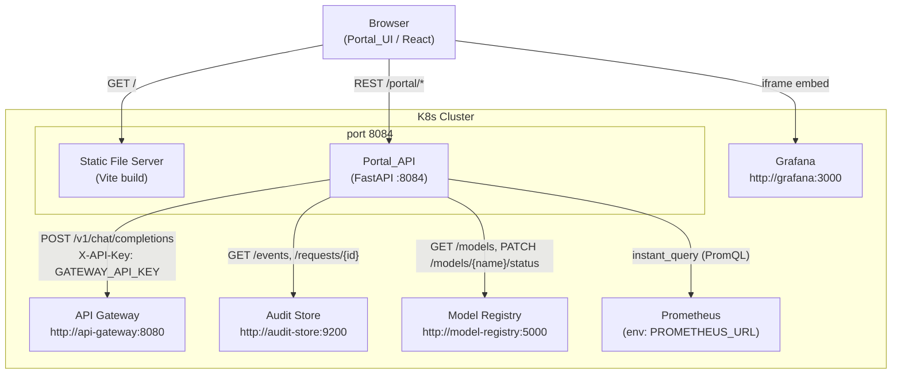

# Design Document — Platform Portals (Layer 10)

## Overview

The Platform Portal is Layer 10 of the Enterprise On-Premises LLM Platform. For the POC it is a single combined service that merges the Admin Portal and Developer Portal roles into one lightweight application. It gives platform operators and developers three core capabilities:

1. **Playground** — send test chat requests through the API Gateway and inspect responses.
2. **Audit Viewer** — browse and filter audit event records from the Audit Store.
3. **Model Viewer** — inspect registered models and toggle their lifecycle status (active/retired/staging).
4. **Metrics** — an embedded Grafana dashboard plus a JSON summary endpoint that queries Prometheus directly.

The service is split into two sub-components that are built and deployed together:

- **Portal_API** — a FastAPI application that acts as a thin reverse proxy, validating requests from the browser and forwarding them to the appropriate downstream service (API Gateway, Audit Store, Model Registry, Prometheus). It also owns observability (structured JSON logs, Prometheus metrics) and Kubernetes health probes.
- **Portal_UI** — a React (Vite) single-page application. It is served as static files and communicates exclusively with Portal_API; it never calls downstream services directly.

### POC Constraints

| Constraint | Detail |
|---|---|
| Transport | Plain HTTP between all services |
| Auth | Static `X-API-Key` header to API Gateway only; all other downstream calls are unauthenticated |
| Replicas | Single instance (`replicaCount: 1`), autoscaling disabled |
| Streaming | Not implemented (optional for POC) |
| OIDC / RBAC | Explicitly out of scope |
| Vault | Disabled (`vault.enabled: false`) |

---

## Architecture

### High-Level Component Diagram



### Request Flow — Playground

```
Browser → POST /portal/playground/chat
        → Portal_API validates body (model, messages, temperature)
        → Portal_API adds X-API-Key header
        → POST http://api-gateway:8080/v1/chat/completions  (30 s timeout)
        → Portal_API propagates response unchanged
        → Browser displays assistant reply + request_id
```

### Request Flow — Audit Viewer

```
Browser → GET /portal/audit/events?from=&to=&limit=
        → Portal_API validates query params
        → GET http://audit-store:9200/... (proxied)
        → Portal_API returns Audit_Record list as JSON
        → Browser renders table

Browser → GET /portal/audit/requests/{request_id}
        → Portal_API validates UUID v4 format
        → GET http://audit-store:9200/... (proxied)
        → Portal_API returns list (may be empty)
```

### Request Flow — Model Viewer

```
Browser → GET /portal/models
        → Portal_API → GET http://model-registry:5000  (5 s timeout)
        → Portal_API returns model list

Browser → PATCH /portal/models/{name}/status  {"status": "active"}
        → Portal_API validates status enum
        → PATCH http://model-registry:5000/models/{name}/status
        → Portal_API propagates response unchanged
```

---

## Components and Interfaces

### Portal_API (FastAPI)

The Portal_API is the sole backend process. It exposes all `/portal/*` routes on port 8084 and a Prometheus metrics scrape endpoint on port 9090.

#### Route Table

| Method | Path | Upstream | Timeout |
|---|---|---|---|
| `GET` | `/portal/health` | — (local) | — |
| `GET` | `/portal/config` | — (local env) | — |
| `POST` | `/portal/playground/chat` | `http://api-gateway:8080/v1/chat/completions` | 30 s |
| `GET` | `/portal/audit/events` | `http://audit-store:9200` | 10 s |
| `GET` | `/portal/audit/requests/{request_id}` | `http://audit-store:9200` | 10 s |
| `GET` | `/portal/models` | `http://model-registry:5000` | 5 s |
| `PATCH` | `/portal/models/{name}/status` | `http://model-registry:5000` | 5 s |
| `GET` | `/portal/metrics/summary` | Prometheus (env `PROMETHEUS_URL`) | 5 s |
| `GET` | `/metrics` | — (local Prometheus registry) | — |

#### Internal Module Layout

```
admin_portal/
├── main.py                  # FastAPI app factory, middleware registration
├── config.py                # Settings (pydantic-settings, env-var loading, startup validation)
├── metrics.py               # prometheus_client counters/histograms, /metrics mount
├── middleware/
│   ├── logging.py           # JSON stdout logger middleware (endpoint, status_code, latency_ms)
│   └── __init__.py
├── routers/
│   ├── health.py            # GET /portal/health
│   ├── config.py            # GET /portal/config
│   ├── playground.py        # POST /portal/playground/chat
│   ├── audit.py             # GET /portal/audit/events, /audit/requests/{id}
│   ├── models.py            # GET /portal/models, PATCH /portal/models/{name}/status
│   ├── metrics_summary.py   # GET /portal/metrics/summary
│   └── __init__.py
├── schemas/
│   ├── playground.py        # ChatRequest, ChatResponse Pydantic models
│   ├── audit.py             # AuditEvent, AuditEventList Pydantic models
│   ├── models.py            # ModelRecord, ModelStatusPatch Pydantic models
│   ├── metrics.py           # MetricsSummary Pydantic model
│   └── __init__.py
├── services/
│   ├── proxy.py             # Generic async HTTP proxy helper (httpx.AsyncClient)
│   └── __init__.py
├── Dockerfile
└── requirements.txt
```

#### Environment Variables

| Variable | Required | Default | Description |
|---|---|---|---|
| `API_GATEWAY_URL` | No | `http://api-gateway:8080` | Base URL for API Gateway |
| `GATEWAY_API_KEY` | **Yes** | — | API key forwarded as `X-API-Key` to API Gateway. Portal_API exits with non-zero code if absent at startup. |
| `AUDIT_STORE_URL` | No | `http://audit-store:9200` | Base URL for Audit Store |
| `MODEL_REGISTRY_URL` | No | `http://model-registry:5000` | Base URL for Model Registry |
| `PROMETHEUS_URL` | No | `http://prometheus:9090` | Base URL for Prometheus |
| `GRAFANA_URL` | No | `http://grafana:3000` | Base URL for Grafana (returned by `/portal/config`) |
| `LOG_LEVEL` | No | `INFO` | Logging verbosity (`DEBUG`, `INFO`, `WARNING`, `ERROR`) |

### Portal_UI (React + Vite)

The UI is a single-page application built with React 18 and Vite. It is served as pre-built static assets (see Dockerfile).

#### View Structure

```
src/
├── main.tsx                 # React app entry, router setup (react-router-dom)
├── App.tsx                  # Shell: nav bar + <Outlet>
├── views/
│   ├── PlaygroundView.tsx
│   ├── AuditView.tsx
│   ├── ModelView.tsx
│   └── MetricsView.tsx
├── components/
│   ├── ErrorBanner.tsx      # Dismissible error banner (shared)
│   ├── LoadingSpinner.tsx
│   ├── playground/
│   │   ├── ModelSelector.tsx
│   │   ├── ChatWindow.tsx
│   │   └── TemperatureInput.tsx
│   ├── audit/
│   │   ├── AuditTable.tsx
│   │   ├── AuditFilters.tsx
│   │   └── AuditDetailPanel.tsx
│   └── models/
│       ├── ModelTable.tsx
│       └── StatusBadge.tsx
├── api/
│   └── portalClient.ts      # fetch wrapper for all Portal_API calls
└── types/
    └── index.ts             # TypeScript interfaces matching backend schemas
```

#### Navigation Routes

| URL Path | View |
|---|---|
| `/` or `/playground` | `PlaygroundView` |
| `/audit` | `AuditView` |
| `/models` | `ModelView` |
| `/metrics` | `MetricsView` |

#### Key UI Behaviours

- All Portal_API calls go through `portalClient.ts`. Non-2xx responses trigger the shared `ErrorBanner` with HTTP status and `message` field from the response body.
- The Playground's Send button is disabled while a request is in-flight or while the model list has not yet loaded.
- The Audit Viewer deep-links to a request overlay via URL query parameter `?request_id=<uuid>` so that the Playground "View Audit Trail" button can navigate directly.
- Status badge colours: `active` → green, `staging` → yellow, `retired` → grey.
- The Metrics view embeds the Grafana dashboard in an `<iframe>`; if the iframe fires an `error` event or Grafana URL is unreachable, a static fallback message replaces the iframe area.

### Downstream Service Contracts

#### API Gateway (`http://api-gateway:8080`)

- `POST /v1/chat/completions` — OpenAI-compatible chat completions body. Portal_API adds `X-API-Key: <GATEWAY_API_KEY>` header. Response body includes `request_id` at top level (platform extension).

#### Audit Store (`http://audit-store:9200`)

- `GET /events?from=&to=&limit=` — returns `{"events": [AuditRecord, ...]}`.
- `GET /requests/{request_id}` — returns `{"events": [AuditRecord, ...]}` (may be empty list).

#### Model Registry (`http://model-registry:5000`)

- `GET /` (models list) — returns `{"models": [ModelRecord, ...]}`.
- `PATCH /models/{name}/status` — body `{"status": "active"|"retired"|"staging"}`. Returns updated `ModelRecord` or 404.

#### Prometheus

Portal_API uses the Prometheus HTTP API:
- `GET /api/v1/query?query=<PromQL>` to compute instant values for `request_rate`, `error_rate`, and `cache_hit_rate`.

---

## Data Models

### Pydantic Schemas (Portal_API)

#### `ChatRequest`

```python
class ChatRequest(BaseModel):
    model: str                          # required, non-empty
    messages: List[Message]             # required, min length 1
    temperature: float = Field(0.7, ge=0.0, le=2.0)

class Message(BaseModel):
    role: Literal["system", "user", "assistant"]
    content: str
```

#### `AuditEvent`

```python
class AuditEvent(BaseModel):
    audit_id: str
    request_id: str
    timestamp_utc: str          # ISO-8601
    user_id: str
    department: Optional[str]
    model_used: Optional[str]
    layer: str
    event_type: str
    prompt_tokens: Optional[int]
    completion_tokens: Optional[int]
    latency_ms: Optional[int]
    pii_actions: List[str] = []
    policy_decisions: List[str] = []
    outcome: str                # pass | block | flag | fallback
    error_code: Optional[str]

class AuditEventList(BaseModel):
    events: List[AuditEvent]
```

#### `ModelRecord`

```python
class ModelRecord(BaseModel):
    name: str
    version: str
    backend: str
    tasks: List[str]
    status: Literal["active", "retired", "staging"]

class ModelStatusPatch(BaseModel):
    status: Literal["active", "retired", "staging"]
```

#### `MetricsSummary`

```python
class MetricsSummary(BaseModel):
    request_rate: Optional[float]    # requests/sec; null if no data
    error_rate: Optional[float]      # fraction 0.0–1.0; null if denominator = 0
    cache_hit_rate: Optional[float]  # fraction 0.0–1.0; null if denominator = 0
```

#### `PortalConfig`

```python
class PortalConfig(BaseModel):
    grafana_url: str    # value of GRAFANA_URL env var (default: http://grafana:3000)
```

#### `HealthResponse`

```python
class HealthResponse(BaseModel):
    status: Literal["ok", "degraded"]
    reason: Optional[str] = None   # present only when status = "degraded"
```

### Error Response Envelope

All Portal_API error responses (4xx / 5xx) use a consistent shape:

```python
class ErrorResponse(BaseModel):
    error: str          # machine-readable code: "validation_error" | "not_found" |
                        #   "upstream_unavailable" | "internal_error"
    message: str        # human-readable description
    upstream: Optional[str] = None   # "api-gateway" | "audit-store" |
                                     # "model-registry" | "prometheus"
    allowed_values: Optional[List[str]] = None  # for enum validation errors
```

### TypeScript Interfaces (Portal_UI)

The `src/types/index.ts` file mirrors the Pydantic schemas above. Key interfaces:

```typescript
interface Message   { role: "system" | "user" | "assistant"; content: string; }
interface ChatReq   { model: string; messages: Message[]; temperature: number; }
interface AuditEvent { audit_id: string; request_id: string; timestamp_utc: string;
                       layer: string; event_type: string; user_id: string;
                       outcome: string; latency_ms: number | null; }
interface ModelRecord { name: string; version: string; backend: string;
                        tasks: string[]; status: "active" | "retired" | "staging"; }
interface MetricsSummary { request_rate: number | null; error_rate: number | null;
                           cache_hit_rate: number | null; }
interface PortalConfig  { grafana_url: string; }
interface ErrorResponse { error: string; message: string;
                          upstream?: string; allowed_values?: string[]; }
```

---

## Correctness Properties

*A property is a characteristic or behavior that should hold true across all valid executions of a system — essentially, a formal statement about what the system should do. Properties serve as the bridge between human-readable specifications and machine-verifiable correctness guarantees.*


### Property 1: ChatRequest field validation

*For any* combination of `model` (string), `messages` (list), and `temperature` (float) submitted to `POST /portal/playground/chat`, the Portal_API SHALL accept the request (forward to upstream) if and only if: `model` is a non-empty string, `messages` contains at least one element, and `temperature` is in the closed interval [0.0, 2.0]. Any request that violates at least one constraint SHALL be rejected with HTTP 422 before touching the upstream.

**Validates: Requirements 2.2, 2.3, 3.1**

### Property 2: Playground proxy faithfully forwards with API key

*For any* valid `ChatRequest` body submitted to `POST /portal/playground/chat`, the Portal_API SHALL forward the body to `POST http://api-gateway:8080/v1/chat/completions` with the `X-API-Key` header equal to the value of the `GATEWAY_API_KEY` environment variable, and the forwarded body SHALL be byte-for-byte identical to the received body. This invariant holds for every valid request regardless of `model`, `messages` content, or `temperature` value.

**Validates: Requirements 2.4, 3.2, 3.5**

### Property 3: Upstream response status and body are propagated unchanged

*For any* HTTP status code (2xx, 4xx, or 5xx) and body returned by the API Gateway in response to a chat request, the Portal_API SHALL return that exact same status code and body to the original caller without modification.

**Validates: Requirements 3.3**

### Property 4: Every completed API request emits a valid structured log entry

*For any* request received by the Portal_API — regardless of endpoint, outcome (success or error), or upstream availability — exactly one single-line JSON log entry SHALL be emitted to stdout upon completion, containing at minimum the fields `endpoint` (string), `status_code` (integer), and `latency_ms` (non-negative number). The entry SHALL contain no embedded newlines.

**Validates: Requirements 3.6, 10.1**

### Property 5: Audit event results are always sorted descending by timestamp_utc

*For any* combination of filter parameters (`from`, `to`, `limit`, `layer`, `outcome`) passed to `GET /portal/audit/events`, the returned list of audit events SHALL be sorted in descending order by `timestamp_utc`. This invariant holds regardless of which records match the filter or how many records are returned (including single-element and empty lists).

**Validates: Requirements 4.4**

### Property 6: Audit limit parameter is validated in [1, 200]

*For any* integer value of the `limit` query parameter passed to `GET /portal/audit/events`, the Portal_API SHALL accept values in the inclusive range [1, 200] and SHALL return HTTP 400 with a JSON body describing the error and the allowed bounds for any value strictly outside that range.

**Validates: Requirements 5.1, 5.3**

### Property 7: Audit request_id validated as UUID v4 format

*For any* string passed as `{request_id}` to `GET /portal/audit/requests/{request_id}`, the Portal_API SHALL forward the request to the Audit Store if and only if the string conforms to UUID v4 format (8-4-4-4-12 hexadecimal, version bits 4 and variant bits 8-b). Any non-conforming string SHALL be rejected with HTTP 400 before contacting the upstream.

**Validates: Requirements 5.2, 5.4**

### Property 8: Date range parameters are validated for format and ordering

*For any* combination of `from` and `to` query parameters passed to `GET /portal/audit/events`, the Portal_API SHALL return HTTP 400 if either parameter is present but does not conform to ISO-8601 datetime format, or if both are present and `from` is strictly later than `to`. Requests where both parameters are valid and correctly ordered (or absent) SHALL be forwarded to the Audit Store.

**Validates: Requirements 5.6**

### Property 9: Model proxy round-trip preserves request and response

*For any* model name string passed as `{name}` and valid status value (`active`, `retired`, or `staging`) passed in the `PATCH /portal/models/{name}/status` body, the Portal_API SHALL forward the status update to `http://model-registry:5000/models/{name}/status` with the body unchanged, and SHALL propagate the Model Registry's response (status code and body) back to the caller without modification. Similarly, for `GET /portal/models`, the model list returned by the Model Registry SHALL be returned to the caller unchanged.

**Validates: Requirements 6.4, 7.1, 7.2, 7.3**

### Property 10: Model status action buttons follow lifecycle rules

*For any* `ModelRecord` with a `status` field, the Model_Viewer component SHALL render action buttons according to these rules: if `status` is `active` or `staging`, a [Retire] button SHALL be shown; if `status` is `retired` or `staging`, an [Activate] button SHALL be shown; if `status` is `active`, no [Activate] button SHALL be shown; if `status` is `retired`, no [Retire] button SHALL be shown. This invariant holds for any model name, version, backend, or tasks value.

**Validates: Requirements 6.5, 6.6**

### Property 11: Model status PATCH rejects invalid enum values

*For any* string passed as the `status` field in `PATCH /portal/models/{name}/status`, the Portal_API SHALL forward the request if and only if the value is exactly one of `active`, `retired`, or `staging`. Any other string SHALL be rejected with HTTP 422, and the response body SHALL include the list of allowed values.

**Validates: Requirements 7.5**

### Property 12: Metrics summary computes rates correctly from Prometheus values

*For any* set of Prometheus instant query responses for `llm_api_gateway_requests_total`, `llm_api_gateway_errors_total`, and `llm_cache_requests_total`, the Portal_API SHALL compute `request_rate` as the per-second rate value from the requests query, `error_rate` as the ratio of errors to requests (returning `null` when the denominator is zero), and `cache_hit_rate` as the ratio of cache hits to total cache lookups (returning `null` when the denominator is zero). All non-null fractional values SHALL be in the range [0.0, 1.0].

**Validates: Requirements 8.1, 8.2**

### Property 13: Grafana iframe src is constructed from Portal config value

*For any* URL value configured as `GRAFANA_URL`, the `GET /portal/config` endpoint SHALL return that URL as `grafana_url`, and the Portal_UI SHALL construct the iframe `src` as `{grafana_url}/d/poc-overview/llm-platform-poc?orgId=1&kiosk` exactly. This property holds for any syntactically valid URL value set as `GRAFANA_URL`, including the default `http://grafana:3000`.

**Validates: Requirements 9.1, 9.4**

### Property 14: llm_portal_requests_total counter accurately reflects request counts

*For any* sequence of requests to Portal_API endpoints, the value of the `llm_portal_requests_total` counter labeled by `endpoint` and `status` (where status is one of `2xx`, `4xx`, `5xx`) SHALL equal the number of completed requests to that endpoint with a status code in the corresponding class. The counter is monotonically non-decreasing and never decrements.

**Validates: Requirements 10.3**

### Property 15: llm_portal_latency_seconds histogram records non-negative observations

*For any* request completed by the Portal_API, the elapsed time from request receipt to response sent SHALL be recorded as a non-negative observation in the `llm_portal_latency_seconds` histogram labeled with the request's `endpoint`. The observation count for each endpoint SHALL equal the total number of completed requests to that endpoint.

**Validates: Requirements 10.4**

### Property 16: llm_portal_errors_total counter accurately reflects error events

*For any* sequence of error-producing requests to Portal_API endpoints, the `llm_portal_errors_total` counter labeled by `endpoint` and `error_code` SHALL increment by exactly one for each error, with the `error_code` label matching the error type: `validation_error` for HTTP 422, `not_found` for HTTP 404, `upstream_unavailable` for HTTP 502, and `internal_error` for HTTP 500. Non-error responses SHALL NOT increment this counter.

**Validates: Requirements 10.5**

### Property 17: Non-2xx Portal_API responses always trigger the error banner

*For any* Portal_API response with an HTTP status code outside the 2xx range, the Portal_UI SHALL display a dismissible error banner containing the HTTP status code and the `message` field from the response body (falling back to the full body if no `message` field is present). The banner SHALL remain visible until explicitly dismissed, and SHALL correctly reflect the status code and message for every distinct error response regardless of which view triggered the request.

**Validates: Requirements 12.3**

---

## Error Handling

### Upstream Unavailability

All proxy routes use `httpx.AsyncClient` with explicit per-route timeouts. On `httpx.ConnectError`, `httpx.TimeoutException`, or any network-level failure, the Portal_API returns:

```json
HTTP 502
{
  "error": "upstream_unavailable",
  "message": "<upstream-name> is unreachable or timed out",
  "upstream": "<api-gateway|audit-store|model-registry|prometheus>"
}
```

Timeout values per upstream:

| Upstream | Timeout |
|---|---|
| API Gateway | 30 s |
| Audit Store | 10 s |
| Model Registry | 5 s |
| Prometheus | 5 s |

### Input Validation Errors

FastAPI + Pydantic handle request body and query parameter validation. Validation errors return HTTP 422 with the standard FastAPI `detail` list augmented with the `ErrorResponse` envelope for consistent client parsing.

Special cases:
- `limit` out of range [1, 200]: HTTP 400 (not 422) with `allowed_values: ["1", "200"]`
- `request_id` not UUID v4: HTTP 400 with `error: "validation_error"`
- `from` / `to` not ISO-8601 or `from > to`: HTTP 400 with descriptive `message`
- `status` not in enum: HTTP 422 with `allowed_values: ["active", "retired", "staging"]`

### Startup Validation

`config.py` runs at import time (FastAPI lifespan startup event). If `GATEWAY_API_KEY` is not set:

```python
logger.error("GATEWAY_API_KEY environment variable is not set. Exiting.")
sys.exit(1)
```

This surfaces clearly in Kubernetes pod logs before the readiness probe ever fires.

### Log Level Fallback

If `LOG_LEVEL` is absent or not one of `DEBUG`, `INFO`, `WARNING`, `ERROR`, the logger is configured at `INFO` level with a warning message indicating the fallback.

### Error Isolation

Each view's error state is local. A 502 from the Audit Store does not affect the Model Viewer or Playground. The shared `ErrorBanner` is scoped per view and does not bubble across route boundaries.

---

## Testing Strategy

### Approach

This feature is a Python/React proxy service. The Portal_API contains pure validation and proxy logic that is well-suited to property-based testing. The Portal_UI has specific component behaviors tested with example-based React component tests. Helm chart manifests are verified with `helm lint` and snapshot assertions.

### Property-Based Testing (Portal_API)

**Library:** [Hypothesis](https://hypothesis.readthedocs.io/) (Python)

Each property test is configured with `@settings(max_examples=100)` and tagged with a comment referencing the design property.

Properties 1–4 and 6–16 map directly to the Correctness Properties section above. Property test tags use the format:

```python
# Feature: platform-portals, Property N: <property_text>
@given(...)
@settings(max_examples=100)
def test_property_N_name(...):
    ...
```

**Key test patterns:**

- **Properties 1, 6, 7, 8, 11** (validation): use `st.from_regex`, `st.text`, `st.floats`, `st.integers` to generate both valid and invalid inputs; assert 200/forward vs 400/422.
- **Properties 2, 3, 9** (proxy faithfulness): mock `httpx.AsyncClient` with `respx`; generate random request bodies; assert forwarded request matches input exactly.
- **Property 4** (logging): capture stdout; generate requests; assert each produces exactly one valid JSON line.
- **Property 5** (sort order): generate lists of `AuditEvent` objects with random timestamps; assert returned list is sorted descending.
- **Property 12** (metrics computation): generate `(numerator, denominator)` float pairs including zero denominators; assert computed rates match expected formulas.
- **Property 13** (Grafana config): generate random URL strings; assert iframe src is constructed correctly.
- **Properties 14–16** (Prometheus metrics): use a test Prometheus registry; generate request sequences; assert counter/histogram values match expected counts.
- **Property 17** (error banner): use React Testing Library; generate mock error responses with random status codes and message payloads; assert banner content.

### Unit / Example Tests

Example-based tests cover:
- Health endpoint returns 200 / 503 (Requirements 1.1, 1.3)
- 502 responses for all three upstream failure modes (Requirements 3.4, 4.6, 5.7, 6.4, 7.7, 8.3)
- Empty list returns 200 with `{events:[]}` (Requirement 5.5)
- 404 propagation from Model Registry (Requirement 7.6)
- `GATEWAY_API_KEY` absent → non-zero exit (Requirement 2.9)
- `GRAFANA_URL` absent → defaults to `http://grafana:3000` (Requirement 9.3)
- `LOG_LEVEL` absent or invalid → defaults to `INFO` (Requirements 10.6, 10.7)
- UI component tests (React Testing Library): status badge colors, filter controls present, empty-state messages, loading spinner, Grafana fallback

### Integration Tests

- Full round-trip: mount Portal_API with live (test) downstream stubs using `docker-compose` or `testcontainers-python`; assert Playground → API Gateway stub → response displayed
- Verify `/metrics` on port 9090 returns Prometheus text format and contains all three metric names
- `helm lint llm-platform/charts/admin-portal/`
- `helm template` output assertions: service port 8084, ingress host `llm-portal.local`, resource limits, securityContext, liveness/readiness probe paths, ServiceMonitor target port 9090

### Frontend Tests

- **Framework:** Vitest + React Testing Library
- Component tests for `PlaygroundView`, `AuditView`, `ModelView`, `MetricsView`
- Property 17 implemented in JavaScript using `fast-check` (property-based testing for TypeScript/JavaScript)
