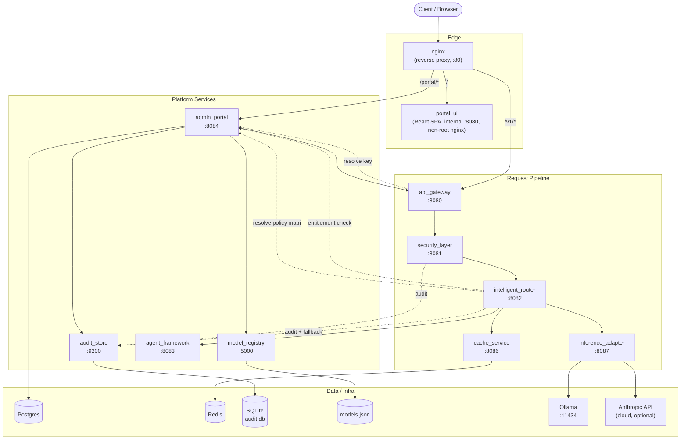
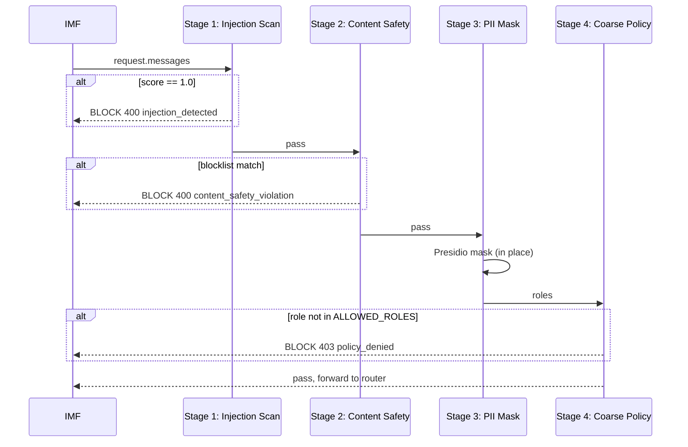
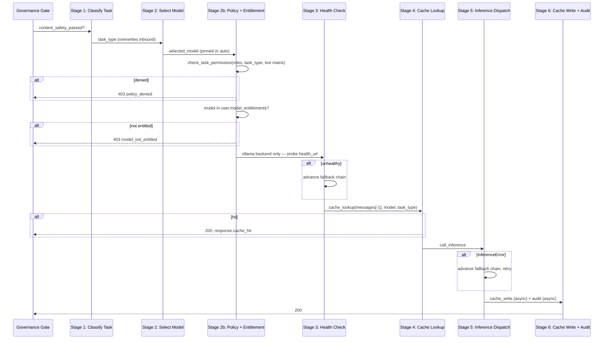
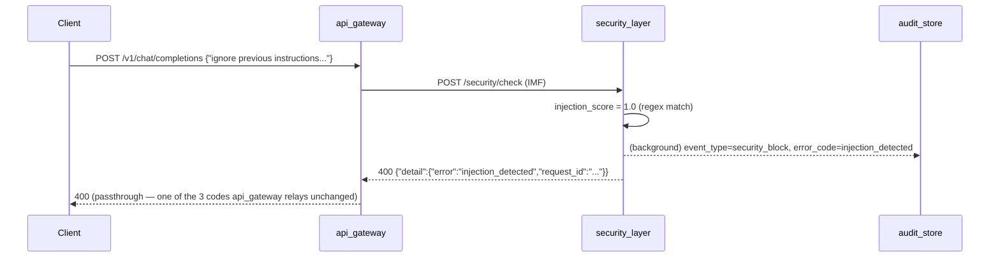
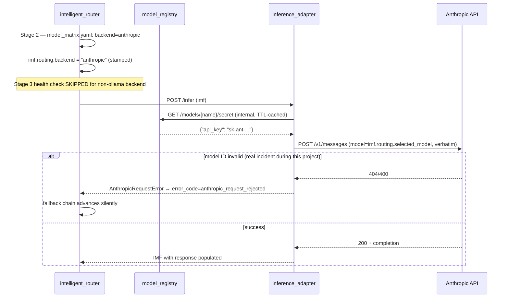

# Low-Level Design (LLD) — Enterprise On-Prem LLM Platform

**Audience:** engineers implementing, extending, reviewing, or operating this platform.
**Companion documents** (this LLD cross-references rather than duplicates):
- `CLAUDE.md` — the authoritative, continuously-updated architecture memo; if this LLD and `CLAUDE.md` ever disagree, trust `CLAUDE.md` and flag the drift.
- `docs/API_INTEGRATION_GUIDE.md` — full endpoint-by-endpoint request/response contracts.
- `docs/DEPLOYMENT.md` — the Docker Compose production deployment this LLD's architecture actually maps to.
- `NEXT_FEATURES_PLAN.md` — the original design record for RBAC/DB/Chat (implemented, not aspirational).

---

## 1. Purpose & Scope

This document describes the internal design of a chain of FastAPI
microservices that together implement a governed, on-prem LLM gateway: every
chat request is normalized into a shared JSON envelope (the **IMF —
Internal Message Format**), passed through security screening, RBAC
enforcement, semantic caching, and model dispatch (local Ollama or a cloud
provider), with every decision recorded to a durable audit trail. A React
admin/chat portal and a Helm/Docker deployment layer sit around this core.

Out of scope here: business justification, product requirements (see
`NEXT_FEATURES_PLAN.md` for that), and anything already fully specified in
the companion docs above (full API contracts, deployment steps).

---

## 2. System Architecture

### 2.1 Component diagram



### 2.2 Technology stack

| Layer | Technology |
|---|---|
| Service framework | FastAPI (Python 3.12), Uvicorn (+ uvloop) |
| Frontend | React + Vite + TypeScript |
| Relational DB | PostgreSQL 16 (`admin_portal` only) |
| Audit store | SQLite (file-based, one DB per deployment) |
| Cache | Redis 7 (exact + semantic/embedding cache) |
| Model catalog | Flat JSON file (`model_registry`) |
| Local inference | Ollama (`llama3.2:3b`, `qwen2.5:3b` by default) |
| Cloud inference | Anthropic Messages API (optional, per-model opt-in) |
| PII detection | Microsoft Presidio (analyzer + anonymizer), spaCy `en_core_web_sm` |
| Embeddings | `sentence-transformers/all-MiniLM-L6-v2` |
| Observability | `structlog` (JSON logs), `prometheus_client`, optional OTel tracing |
| Orchestration (agent) | LangGraph |
| Containerization | Docker; Compose (validated, current) + Helm/K8s (stale, see §9.2) |

### 2.3 Request flow (strict order)

```
Client
  → api_gateway        resolves X-Api-Key → RBAC profile, rate limit, OpenAI-shaped I/O → IMF
  → security_layer      pre-pipeline: injection scan → content safety → PII mask (request) → coarse role gate
  → intelligent_router   task classify → model select → policy/entitlement check → health check → cache lookup → dispatch
      → cache_service     exact + semantic cache (Redis)
      → inference_adapter  Ollama OR cloud provider, per imf.routing.backend
  → security_layer (post-pipeline: PII mask response.content)
  → api_gateway → client (+ audit)
```

Every service on this path reads/writes the **same IMF document** — see §3. This is a deliberate, duplicated-per-service schema (not a shared library import) — see §3.3 for why, and the sharp edge it creates.

---

## 3. The Internal Message Format (IMF)

### 3.1 Purpose

A single JSON envelope that accumulates state as it passes through every
layer, so each service only needs to read/write its own concerns without a
central orchestrator. Defined independently in each service's
`schemas/imf.py` (or `models.py`) — **not** a shared package import.

### 3.2 Schema (canonical shape, from `api_gateway/schemas/imf.py`)

```python
IMFDocument
├── request_id: str                  # UUIDv4, generated at api_gateway
├── trace_id: str
├── span_id: str
├── timestamp_utc: str
├── user: IMFUser
│   ├── user_id: str
│   ├── department: str
│   ├── roles: list[str]             # server-resolved, NEVER client-supplied
│   ├── auth_method: str
│   ├── key_id: str | None
│   ├── model_entitlements: list[str]  # [] = unrestricted (backward-compat rule)
│   └── rate_limit_override: int | None
├── request: IMFRequest
│   ├── model: str | None            # client's pin, if any
│   ├── task_type: str | None        # overwritten by intelligent_router Stage 1
│   ├── messages: list[IMFMessage]   # {role, content}
│   ├── stream: bool                 # always false in practice — see §8.3
│   ├── max_tokens: int
│   └── temperature: float
├── governance: IMFGovernance
│   ├── pii_masked: bool
│   ├── pii_fields_detected: list[str]
│   ├── injection_score: float       # 0.0 or 1.0 — binary, not graduated (§8.1)
│   ├── content_safety_passed: bool
│   ├── human_approval_required/status  # POC: always bypassed
│   └── policy_decisions: list
├── routing: IMFRouting
│   ├── selected_model: str | None
│   ├── routing_mode: str            # "auto" | "pinned"
│   ├── fallback_level: int
│   └── backend: str                 # "ollama" | "anthropic" — added downstream, see §3.3
├── cache: IMFCache
│   ├── lookup_hit: bool
│   └── cache_key: str | None
├── response: IMFResponse
│   ├── content: str | None
│   ├── finish_reason: str | None
│   └── usage: IMFUsage {prompt_tokens, completion_tokens, total_tokens}
├── metadata: dict
└── extensions: dict
```

### 3.3 The duplication hazard

Because each service defines its own copy of this schema, **a field missing
from any one service's local Pydantic model is silently stripped by
FastAPI at that service's inbound-parse boundary** — it never reaches the
next hop, with no error raised anywhere. This has caused at least one real
bug this project (the `routing.backend` field had to be added to every
service's copy on the request's actual path — `intelligent_router` and
`inference_adapter` — before cloud-model dispatch worked at all). **Rule
for any new IMF field: add it to every service between where it's set and
where it's read, not just the "owning" service.**

---

## 4. Component-Level Design

### 4.1 `api_gateway` (:8080) — Public entry point

**Responsibility:** OpenAI-compatible public API surface; the only service
a raw API-key holder talks to directly.

**Middleware chain** (registered in reverse — Starlette wraps last-added-outermost):
```
PrometheusMiddleware → LoggingMiddleware → AuthMiddleware → RateLimitMiddleware → Router
```

**Key modules:**
| Module | Responsibility |
|---|---|
| `middleware/auth.py` | Resolves `X-Api-Key` via `services/key_resolver.py` → `admin_portal`'s `/portal/keys/resolve` (internal-key-gated, TTL-cached in-process). 401/403/503 on failure — **fails closed**, never bypasses auth on an unreachable identity service. |
| `middleware/rate_limit.py` | Per-key fixed-window limiter, in-memory `dict[key, list[timestamp]]`. Not distributed — a multi-replica deployment would need this externalized (Redis) to be correct; today it's process-local by design (single replica per compose file). |
| `services/normalizer.py` | Builds the IMF from `OpenAIChatRequest` + the resolved key profile. Sets `routing_mode="pinned"` iff `payload.model` is non-empty (a real bug, fixed — previously always `"auto"`). |
| `routers/chat.py` | `POST /v1/chat/completions`. Only passes through `400/403/429` from downstream unchanged; anything else (422, 503, 500) collapses to a generic `502` — **a deliberate simplification with a real cost**: callers never see `invalid_pinned_model` or `all_backends_exhausted` as such on this endpoint (see `docs/API_INTEGRATION_GUIDE.md` §8 for the full implication). |
| `services/audit.py` | **stdout-only** JSON-line audit emitter — `auth_fail`/`auth_pass`/`rate_limited`/`request_received`/`response_sent` never reach `audit_store`. Known, documented, unfixed gap (§9.1). |

### 4.2 `security_layer` (:8081) — Pre/post-generation guardrails

**Pipeline** (`pipeline.py`, strict order, short-circuit on block):



- **Injection scoring is binary** (`injection.py`: regex match → `1.0`, else `0.0`) — no partial/graduated confidence exists in this system.
- **`ALLOWED_ROLES`** (Stage 4) is a **hardcoded Python `frozenset`** (`{"developer", "analyst", "admin"}`) — `viewer` is permanently excluded here regardless of anything set in the DB-backed fine-grained matrix (§4.3). Changing this set requires a code change + service restart, unlike §4.3's matrix.
- **Post-pipeline** (`run_post_pipeline`) does exactly one thing: mask PII in `response.content`. **It has no response-blocking capability at all** — there is no "response blocked for safety" outcome anywhere in this system; don't design a feature assuming one exists.
- Audit dispatch bug (fixed): the block-response handler used to `raise HTTPException(...)`, which causes FastAPI/Starlette to silently drop any `BackgroundTasks` already scheduled on that request — every security block was therefore **never actually reaching `audit_store`**, ever, despite the code appearing to schedule it. Fixed by returning a `JSONResponse(..., background=background_tasks)` instead of raising.

### 4.3 `intelligent_router` (:8082) — Model selection, RBAC, fallback

**Six-stage pipeline** (`pipeline.py`):



- **Stage 2b policy check is live, not startup-static** — `services/policy_resolver.py::get_policy_matrix()` polls `admin_portal`'s `GET /portal/policy/matrix` on a 15s TTL cache, falling back to the static `policy_matrix.yaml` on any failure. This is what makes `PATCH /portal/roles/{role}/permissions` take effect within ~15s, no restart — **except `viewer`**, which is blocked earlier by §4.2's static gate and never reaches this stage.
- **Model dispatch is from `model_matrix.yaml`, not `model_registry`** — the single biggest dual-source-of-truth gap in this system (§9.2). Registering a model via the Portal UI does nothing to routing until this file is hand-edited and the service restarted.
- **`health_url` is environment-sensitive** — the file must literally say `ollama:11434` in Docker Compose and `localhost:11434` for the native/`run-local.ps1` deployment; using the wrong one produces `503`s with an otherwise-healthy Ollama and a confusing debugging trail (real incident, see `docs/DEPLOYMENT.md` bug log). Solved via a separate `model_matrix.docker.yaml`, not a single shared file.
- **Cloud dispatch**: Stage 2 stamps `imf.routing.backend` from the model's `model_matrix.yaml` entry. Stage 3's live health probe is **skipped entirely** for `backend != "ollama"` — cloud models are assumed healthy and only actually fail at real dispatch time (Stage 5). The model name is sent **verbatim** to the provider — it must be the literal Anthropic API model ID, no alias layer exists.
- **`classify_task()` and cache key generation both had a "joins full conversation history" bug** — the cache-key version is fixed (`cache_service/routers/cache.py::make_cache_key` now uses only `messages[-1]`); `task_classifier.py::classify_task()` has the **same shape of bug, not yet fixed** — flagged but not actioned.

### 4.4 `cache_service` (:8086) — Exact + semantic cache

| Mechanism | Storage | Key | TTL |
|---|---|---|---|
| Exact match | Redis string, native TTL | `exact:{sha256(last_message + model + task_type)}` | `CACHE_TTL_SECONDS` (60s uniform, all task types) |
| Semantic match | Redis List per task type | `semantic_cache:{task_type}` | App-level, since Redis Lists have no per-element TTL — entries carry a `timestamp` field, lazily evicted (`LREM`) on lookup if stale; legacy entries with no `timestamp` are treated as always-fresh |

- Similarity computed via cosine distance over `all-MiniLM-L6-v2` embeddings, threshold `SIMILARITY_THRESHOLD` (default 0.90).
- Embedding model is **pre-baked into the Docker image at build time** and forced offline (`HF_HUB_OFFLINE=1`) — a genuinely air-gapped runtime requirement, not just an optimization; without the offline flags it silently phones home to the HF Hub on every startup.
- **Fixed bug**: cache key used to join *all* messages in a conversation, causing false-positive hits/collisions across unrelated follow-up questions in the same session (e.g., "hi" → cached response → "do you know the time?" incorrectly served the same cached answer). Now keys only on the final user turn.

### 4.5 `inference_adapter` (:8087) — Model dispatch

Two dispatch paths selected by `imf.routing.backend`:

| Backend | Client | Auth | Notes |
|---|---|---|---|
| `ollama` (default) | `OllamaClient` → `OLLAMA_BASE_URL` | none | Local, on-prem, no outbound internet needed at runtime |
| `anthropic` (opt-in per model) | `AnthropicClient` → `ANTHROPIC_BASE_URL` | provider API key, resolved via `services/model_secret_resolver.py` → `model_registry`'s internal `GET /models/{name}/secret` (TTL-cached) | Needs real outbound internet; the one exception to this platform's air-gapped design |

Both clients share a typed exception hierarchy (`*TimeoutError`, `*ConnectionError`, `*BackendError` for 5xx, `*RequestError` for 4xx, `*InvalidResponseError`) so `routers/infer.py` handles both uniformly. `imf_mapper.py` translates the IMF ↔ each provider's wire format (Anthropic needs `system` pulled out of `messages` into its own top-level field, and a required `max_tokens`).

### 4.6 `audit_store` (:9200) — Durable audit trail

SQLite, single file (`DB_PATH`, `/data/audit.db` in containers), one table:

```sql
CREATE TABLE audit_events (
    audit_id          TEXT PRIMARY KEY,
    request_id        TEXT NOT NULL,
    timestamp_utc     TEXT NOT NULL,
    user_id           TEXT,
    department        TEXT,
    layer             TEXT,   -- api_gateway | security | router | cache | inference | agent
    event_type        TEXT,   -- see EventTypeEnum below
    model_used        TEXT,
    prompt_tokens     INTEGER DEFAULT 0,
    completion_tokens INTEGER DEFAULT 0,
    latency_ms        INTEGER DEFAULT 0,
    outcome           TEXT,   -- pass | block | flag | fallback | error
    error_code        TEXT,
    pii_actions       TEXT,   -- JSON array, stored as text
    policy_decisions  TEXT    -- JSON array, stored as text
);
-- indexes: request_id, user_id, timestamp_utc
```

`EventTypeEnum`: `request_received, auth_pass, auth_fail, security_block, cache_hit, inference_start, inference_complete, response_sent, policy_denied, model_not_entitled` (the last two were **missing from the enum until fixed this project** — every `policy_denied`/`model_not_entitled` audit write from `intelligent_router` was silently rejected with a 422 and swallowed by the fire-and-forget writer, meaning those denials never reached the trail at all).

**Only `security_layer` and `intelligent_router` actually POST here.** `api_gateway`'s own audit events (§4.1) are stdout-only — a real, documented, unfixed coverage gap.

Key endpoints beyond CRUD:
- `GET /audit/summary` — counts by outcome/layer.
- `GET /audit/governance/summary` — the aggregation this platform's Governance tab is built on (blocked-by-reason, injection-flagged, PII count, token totals, per-model usage) — computed live from this table, no caching layer, no Prometheus dependency.

### 4.7 `model_registry` (:5000/5001) — Model catalog

Flat JSON file (`STORAGE_PATH`, `/data/models.json` in containers) — **not a database**, no transactions, no locking beyond whatever the file-manager layer provides. Each record:

```json
{
  "name": "...", "version": "...", "backend": "ollama"|"anthropic"|...,
  "endpoint": "...", "tasks": [...], "status": "active"|"retired"|"staging",
  "vram_required_gb": null, "max_context_length": null, "fallback_model": null,
  "registered_at": "...", "notes": null,
  "api_key": "..."   // write-only — never returned by any read endpoint, only `api_key_set: bool`
}
```

`GET /models/{name}/secret` is an **internal-only** endpoint (separate from the public list/get routes) — the only way the raw `api_key` value is ever read back, and only by `inference_adapter`, guarded by `REGISTRY_API_KEY`.

**Not auto-loaded on deploy** — starts as `[]` unless `seed/models.json` is manually placed, and (Docker Compose path) unless `POST /portal/models/sync-ollama` is called to auto-register whatever Ollama already has pulled (§4.8).

### 4.8 `admin_portal` (:8084) — The aggregation/management layer

Owns the only relational database in the system. Everything else in this
platform that isn't audit/model data lives here.

**Postgres schema (ER diagram):**

```mermaid
erDiagram
    USERS ||--o{ USER_ROLES : has
    USERS ||--o{ API_KEYS : owns
    ROLES ||--o{ USER_ROLES : "assigned via"
    ROLES ||--o{ ROLE_PERMISSIONS : defines
    API_KEYS ||--o{ KEY_MODEL_ENTITLEMENTS : scopes
    USERS ||--o{ SESSIONS : "logs in via"
    API_KEYS ||--o| SESSIONS : "backs (1 key : 1 session)"

    USERS {
        string user_id PK
        string username UK
        string email UK
        string department
        string status
        string password_hash "nullable"
        datetime created_at
        datetime updated_at
    }
    ROLES {
        string role_name PK
        string description
    }
    USER_ROLES {
        string user_id PK_FK
        string role_name PK_FK
        datetime assigned_at
    }
    API_KEYS {
        string key_id PK
        string user_id FK
        string key_hash UK "sha256 hex"
        string key_prefix
        string label
        string status "active|revoked|expired"
        datetime expires_at
        int rate_limit_rpm
        datetime created_at
        datetime last_used_at
    }
    KEY_MODEL_ENTITLEMENTS {
        string key_id PK_FK
        string model_name PK
        datetime granted_at
    }
    SESSIONS {
        string session_id PK "the cookie value itself"
        string user_id FK
        string api_key_id FK
        string api_key_raw "raw value — scoped exception to never-store-raw-keys"
        datetime created_at
        datetime expires_at
    }
    ROLE_PERMISSIONS {
        string role_name PK_FK
        string task_type PK
        boolean allowed
    }
```

**Auth model — two mechanisms, deliberately layered** (see §5 for the full design):

1. **Session cookie** (`SESSION_COOKIE_NAME`, httpOnly) for the browser UI — `POST /portal/auth/login` verifies password, then **mints a brand-new `ApiKey` row** (label `"Login session key"`) so the session resolves through the *exact same* `/portal/keys/resolve` path a manually-created key does — zero changes needed to `api_gateway`/`intelligent_router` to support interactive login.
2. **Raw API key** (`X-Api-Key`) for direct/programmatic `api_gateway` access — admin-issued via `POST /portal/users/{id}/keys`, shown exactly once.

**Known architectural cost of mechanism 1:** every login mints a new, permanent `ApiKey` row; `POST /auth/logout` only sets `status="revoked"` (never deletes); an **expired** session (no explicit logout) deletes only the `Session` row and leaves its `ApiKey` row `active` forever, orphaned, with no cleanup job anywhere in the codebase. Functionally harmless (the raw value dies with the session row) but an unbounded, un-auditable accumulation of dead rows over the system's lifetime. Not fixed as of this writing — a deliberate scope decision, not an oversight (see conversation record / `docs/API_INTEGRATION_GUIDE.md` for the full discussion).

**Router inventory** (`admin_portal/routers/`):

| Router | Endpoints (see `docs/API_INTEGRATION_GUIDE.md` for full contracts) | Auth |
|---|---|---|
| `auth.py` | login, logout, me | login: none; others: session |
| `users.py` | user CRUD, per-user key CRUD | admin-only |
| `roles.py` | list roles, get/patch permission matrix | read: any session; patch: admin |
| `keys.py` | internal key-resolve (service-to-service), admin-wide key listing | internal-key / admin |
| `models.py` | proxy to `model_registry` (list/register/status/api-key) | session / admin |
| `ollama_admin.py` | pull + auto-register from Ollama (`sync-ollama`) | admin |
| `chat.py` | session-based chat proxy + entitlement-annotated model list | session |
| `playground.py` | single-shot chat proxy (portal's own fixed key, not per-user) | none (matches pre-login posture) |
| `audit.py` | proxy to `audit_store` events/requests | admin |
| `governance.py` | proxy to `audit_store`'s governance summary | admin |
| `metrics_summary.py` | Prometheus-backed live rates (degrades to `502` without Prometheus) | admin |
| `policy.py` | internal-only: full policy matrix (consumed by `intelligent_router`) | internal-key |
| `config.py` | `{grafana_url}` | none |

### 4.9 `agent_framework` (:8083) — Tool-calling agent (stub/POC)

LangGraph-based. **Known duplication**: a flat legacy copy exists directly
under `services/agent-framework/`, but only the nested
`agent_framework/` package (`agent_framework.main:app`) is actually run and
tested — treat the flat top-level files as dead code.

### 4.10 `portal_ui` — React/Vite SPA

Internal developer/reference UI, not assumed to be the real product
frontend (see `docs/API_INTEGRATION_GUIDE.md`, written specifically for a
team building a separate real frontend). Talks only to `admin_portal`
(`/portal/*`, relative paths, proxied) — never calls `api_gateway`
(`/v1/*`) directly from the browser. Served by its own `nginx:alpine`
container with a plain SPA-fallback config, deliberately decoupled from the
platform's actual reverse-proxy (§9.3).

---

## 5. Authentication & Authorization Design

### 5.1 Two authentication mechanisms

```mermaid
sequenceDiagram
    participant B as Browser
    participant N as nginx
    participant AP as admin_portal
    participant GW as api_gateway

    Note over B,GW: Path A — Interactive session (browser UI)
    B->>N: POST /portal/auth/login {username,password}
    N->>AP: (proxied)
    AP->>AP: verify_password; mint ApiKey(label="Login session key")
    AP->>AP: mint Session row {session_id, api_key_raw}
    AP-->>B: Set-Cookie: portal_session=<session_id> (httpOnly)
    B->>N: POST /portal/chat/completions (cookie auto-attached)
    N->>AP: (proxied)
    AP->>AP: get_current_session() looks up Session by cookie
    AP->>GW: POST /v1/chat/completions, X-Api-Key: <session's api_key_raw>
    GW-->>AP: response
    AP-->>B: response

    Note over B,GW: Path B — Direct API-key access (Postman/external system)
    B->>N: POST /v1/chat/completions, X-Api-Key: <admin-issued key>
    N->>GW: (proxied)
    GW->>AP: GET /portal/keys/resolve?key=... (internal-key-gated)
    AP-->>GW: {roles, model_entitlements, ...}
    GW-->>B: response
```

The raw API key **never reaches the browser** in Path A — only the opaque
`session_id` does, and it's httpOnly (unreadable by page JS). The key's raw
value lives only in the `sessions.api_key_raw` column, used purely
server-side by `admin_portal`'s own proxy call.

### 5.2 Authorization — two independently-dynamic gates

| Gate | Where | Backing | Update latency | Covers |
|---|---|---|---|---|
| Coarse role gate | `security_layer` Stage 4 | Hardcoded Python `frozenset` (`ALLOWED_ROLES`) | Code change + restart | "Can this identity call the platform at all" — `viewer` always excluded |
| Fine-grained matrix | `intelligent_router` Stage 2b | Postgres `role_permissions`, polled via `admin_portal`'s `/portal/policy/matrix` | ~15s (TTL cache) | `(role, task_type)` — every role except `viewer` (blocked earlier) |
| Model entitlement | `intelligent_router` Stage 2b | `api_keys.key_id → key_model_entitlements`, resolved at auth time into `imf.user.model_entitlements` | Per-request (resolved fresh each time key is used) | Which specific models a key may use; empty = unrestricted |

Both denial types return `403` with visually similar-but-differently-shaped
bodies — `security_layer`'s nests under `"detail"` (FastAPI's default
`HTTPException` shape); `intelligent_router`'s is flat. See
`docs/API_INTEGRATION_GUIDE.md` §8 for exact shapes.

### 5.3 Enterprise-readiness assessment (recorded from architecture review)

Current design is functionally sound for a POC/internal tool but **not
sufficient as the sole auth mechanism for an enterprise deployment**:
- No SSO/OIDC — local username/password is the only interactive login path; no centralized identity, no IdP-enforced MFA, no automatic deprovisioning.
- No explicit CSRF token — relies on `SameSite=Lax` alone.
- Fixed 8-hour session TTL with no refresh mechanism.
- Session-key-per-login pattern (§4.8) conflates two trust models (interactive session vs. long-lived credential) that most platforms keep architecturally separate.

The per-user, per-model-entitled, revocable API key design (for
programmatic access) is sound and matches industry norms — no change
recommended there.

---

## 6. Cross-Cutting Concerns

### 6.1 Observability

- **Structured logging**: every service calls `configure_structlog(<service_name>, log_level)` at import time (`shared/observability/logging.py`); JSON lines to stdout.
- **Metrics**: `prometheus_client`, mandatory per-layer metrics via `make_layer_metrics(layer_name)` — `requests_total{status,department,model}`, `latency_seconds{department}`, `errors_total{error_code,department}`. Exposed at `/metrics` per service (separate `metrics_app` process on `METRICS_PORT` for services with heavier startup — `security_layer`, `intelligent_router`, `audit_store`).
- **Distributed tracing**: optional OTel, no-ops if packages absent (`shared/observability/middleware.py`).
- **Audit trail vs. live metrics — two independent data sources, not redundant**: `GET /portal/governance/summary` (audit-store-based) is always populated; `GET /portal/metrics/summary` (Prometheus-based) returns `502` whenever no Prometheus is reachable — the default in the Docker Compose deployment path. Build dashboards around the former; treat the latter as progressive enhancement.

### 6.2 Resilience patterns

- **Fallback chains**: `intelligent_router`'s `fallback_manager.py` — on a health-check failure or `InferenceError`, advances to the model's configured `fallback` (from `model_matrix.yaml`) and retries, up to chain exhaustion (`503 all_backends_exhausted`).
- **TTL-cached resolver pattern**, used identically in three places (`key_resolver.py`, `policy_resolver.py`, `model_secret_resolver.py`): in-process dict cache, fetch-on-stale, fall back to last-known-good or a static seed file on failure, mark the attempt timestamp even on failure to avoid retry storms.
- **Fail-fast startup**: every service validates required config at import time and `sys.exit(1)` with a structured JSON error on missing settings — never starts in a half-configured state.
- **Fire-and-forget side effects**: audit posts and cache writes go through FastAPI `BackgroundTasks`, never awaited inline on the request path — **caveat**: `BackgroundTasks` scheduled before a route `raise`s an `HTTPException` are silently dropped by Starlette (the exact bug fixed in `security_layer`, §4.2) — always `return` a `Response` with `background=` set instead of raising, if the response path needs to carry scheduled tasks.

### 6.3 Rate limiting

Fixed-window, per-API-key, in-memory at `api_gateway` (`RATE_LIMIT_REQUESTS`/`RATE_LIMIT_WINDOW_SECONDS`, default 60/60s). Not distributed — correct only for a single `api_gateway` replica, which matches every deployment path documented today (`replicaCount: 1` everywhere).

---

## 7. Data Flow — Key Sequences

### 7.1 Chat completion, cache miss, local model (happy path)

Already fully covered by §2.3 and §4.3's diagram — summarized: `api_gateway` → `security_layer` (pass) → `intelligent_router` (classify → select → policy/entitlement pass → health OK → cache miss) → `inference_adapter` → `ollama` → cache write (async) + audit (async) → response flows back, PII-masked on the way out by `security_layer`'s post-pipeline.

### 7.2 Injection block



### 7.3 Cloud model dispatch (Anthropic)



---

## 8. Notable Design Decisions & Their Rationale

| # | Decision | Why | Trade-off accepted |
|---|---|---|---|
| 8.1 | Injection scoring is binary (1.0/0.0), not graduated | Simplicity for a POC-scope guardrail | No "flagged but not blocked" state exists; can't tune sensitivity |
| 8.2 | IMF schema duplicated per service, not a shared package | Each service stays independently deployable/versioned | Silent field-stripping hazard (§3.3) — must manually sync schema changes |
| 8.3 | No streaming (SSE) anywhere in the pipeline | Would require touching every hop (gateway → security → router → cache/inference); explicit MVP scope cut | UI must show a "thinking…" state, not token-by-token; documented in `docs/API_INTEGRATION_GUIDE.md` |
| 8.4 | `security_layer`'s coarse gate is hardcoded, not DB-backed | Predates the RBAC/Postgres work; never migrated | `viewer` role permanently unreachable without a code change, inconsistent with the otherwise-live fine-grained matrix |
| 8.5 | Session login mints a full API-key row | Reuse the existing key-resolve contract with zero downstream changes | Unbounded dead-row accumulation (§4.8), conflated trust models (§5.3) |
| 8.6 | `model_matrix.yaml` (not `model_registry`) drives routing | Static file = simple, no runtime DB dependency for the hot path | Registering a model via the UI doesn't make it routable (§9.2) |
| 8.7 | `nginx` and `portal_ui` are separate services/images | Decouples "is the API reachable" from "is the reference UI deployed" — a real frontend team may not deploy `portal_ui` at all | One extra container; `location /` must be repointed manually if `portal_ui` is dropped |

---

## 9. Known Architectural Gaps (as of this writing)

### 9.1 `api_gateway` audit events never reach the durable trail — RESOLVED
`auth_fail`, `auth_pass`, `rate_limited`, `request_received`, `response_sent` used to be stdout-only (`api_gateway/services/audit.py`), with only `security_layer` and `intelligent_router` POSTing to `audit_store` — meaning 401/403/429 gateway-layer rejections were invisible to `GET /portal/governance/summary` and `GET /portal/audit/events`. Fixed via `api_gateway/services/audit_client.py::post_audit_event`, the same fire-and-forget pattern the other two layers use — `chat.py`'s route handler uses FastAPI's injected `BackgroundTasks`; `AuthMiddleware`/`RateLimitMiddleware` (no such injection, being middleware) attach one via `response.background` instead (`schedule_audit_post()`). Also required fixing two supporting bugs that would have silently swallowed the new POSTs the same way `policy_denied`/`model_not_entitled` were originally swallowed (§9.2's sibling bug): `audit_store`'s `EventTypeEnum` was missing `rate_limited` and `OutcomeEnum` was missing `error`, and `api_gateway/middleware/logging.py` defaulted `request_id` to the literal string `"none"` (not a valid UUID-v4, and uncorrelated with the real id `chat.py` mints) when no `X-Request-ID` header was sent — i.e. virtually always.

### 9.2 Two dual-source-of-truth pairs
- **`model_matrix.yaml` vs. `model_registry`** — unresolved. The registry is admin-CRUD-only; the router reads a static file loaded once at startup. Registering ≠ routable.
- **`policy_matrix.yaml` vs. `role_permissions` table** — **resolved** (this project) via the live-polling `policy_resolver.py`, with the YAML retained only as a fail-fast startup baseline / offline fallback.

### 9.3 Helm/Kubernetes deployment path is stale
Predates RBAC/Postgres/policy-matrix/governance work entirely — `router`'s chart has `env: {}` (none of `MODEL_MATRIX_PATH`, `ADMIN_PORTAL_INTERNAL_KEY`, `POLICY_MATRIX_PATH` wired), no Postgres dependency anywhere in the chart tree, and no `portal_ui` chart despite a working Dockerfile. It would crash-loop most pods if deployed as-is; the scripts that used to automate it (`scripts/deploy.sh` and others) have been removed since there was no working target to deploy to. **The Docker Compose path (`docker-compose.prod.yml`, `docs/DEPLOYMENT.md`, automated by `scripts/deploy-onprem.sh`) is the current, validated deployment path** — built, deployed, and end-to-end tested (chat completion, injection block, cache hit, governance data) against the current codebase, including catching and fixing four real bugs in the process (see `docs/DEPLOYMENT.md`'s "Bugs found and fixed" section).

### 9.4 `intelligent_router::classify_task()` has the same "joins full history" bug the cache key had
**Partially fixed.** The specific real-world instance found and fixed: GitHub Copilot Chat's agent-mode harness appends a near-constant `<context>`/`<reminderinstructions>` tool block to every request, full of code-editing language — `classify_task()` was matching "code" on that boilerplate regardless of the actual question (confirmed live: "tell me a joke" classified as `task_type="code"`). Fixed by excluding messages that start with those known wrapper tags from the classification text.

The broader design gap remains open, though: unlike `cache_service`'s `make_cache_key()` (`cache_service/routers/cache.py`, scoped to just the current turn via `_find_current_turn_content()`), `classify_task()` still concatenates the *entire* conversation history for keyword matching. A keyword mentioned once early in a long conversation (e.g. "python" in turn 1) will still cause every later, unrelated turn in that same conversation to classify as `task_type="code"` — not yet fixed, flagged but not actioned.

### 9.5 Enterprise auth gaps
See §5.3 — no SSO/OIDC, no CSRF token, no MFA, session-key accumulation.

---

## 10. Appendix

### 10.1 Port reference

| Service | Port | Metrics port (local dev override) |
|---|---|---|
| `api_gateway` | 8080 | 9090 |
| `security_layer` | 8081 | 9090 |
| `intelligent_router` | 8082 | 9090 |
| `agent_framework` | 8083 | 9092 |
| `admin_portal` | 8084 | 9090 |
| `cache_service` | 8086 | 9091 |
| `inference_adapter` | 8087 | 9090 |
| `audit_store` | 9200 | 9090 |
| `model_registry` | 5000 (5001 externally in local dev — 5000 reserved by Docker Desktop) | — |
| Postgres | 5432 | — |
| Redis | 6379 | — |
| Ollama | 11434 | — |

**Docker Compose host-published ports** (`docker-compose.prod.yml` — no in-stack reverse proxy; see `docs/DEPLOYMENT.md`'s "Fronting with your own existing nginx"):

| Service | Host port |
|---|---|
| `api-gateway` | 8080 (fixed) |
| `admin-portal` | 8084 (fixed) |
| `portal-ui` | `${PORTAL_UI_PORT:-18080}` |

Every other service in the Compose deployment is internal-only, reachable
only from other containers on that compose network.

### 10.2 Full API contracts
See `docs/API_INTEGRATION_GUIDE.md` — every endpoint, request/response shape, and error envelope, verified against current router/schema code.

### 10.3 Full deployment procedure
See `docs/DEPLOYMENT.md` — prerequisites, secret generation, build, start, verification, troubleshooting, and the real bugs found/fixed while validating it end-to-end.
